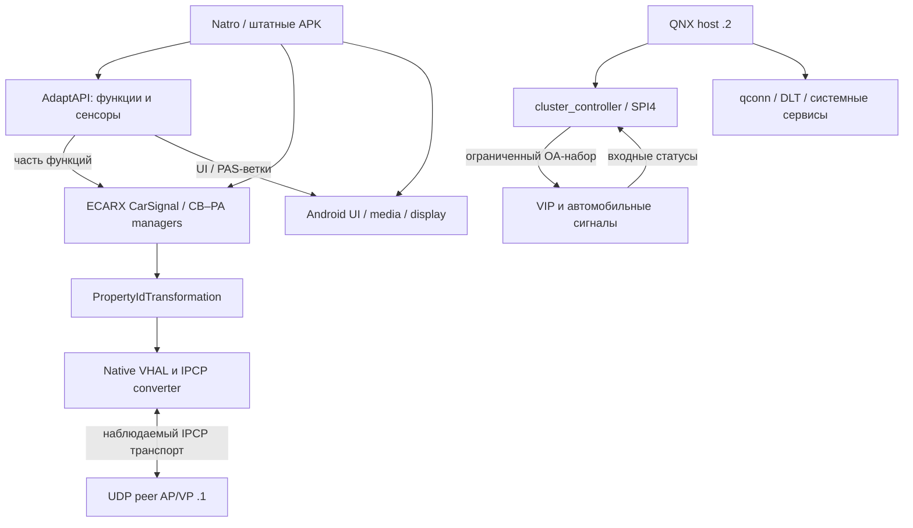

# Geely KX11 / ECARX — техническая база управления

Постоянная база проекта по REL-016. Связанные материалы:
[единый реестр требований](PROJECT_REQUIREMENTS_RU.md),
[каталоги и локальный поиск](docs/geely-kx11/README.md),
[расширенная очередь вопросов](docs/geely-kx11/open_questions.json),
[матрица покрытия систем](docs/geely-kx11/research-2026-09-05/COVERAGE_RU.md).

Публичная редакция следует REL-008: полные чужие декомпиляты и дизассемблирования
не опубликованы. Ссылки ниже на внутренние файлы относятся к структуре комплекта;
исключённые файлы и их исходные хэши перечислены в
[манифесте публикации](docs/geely-kx11/PUBLICATION_MANIFEST.json).


Версия 1.2 • расширенный разбор 5 сентября 2026 года • автомобиль и прошивка из переданных пользователем материалов. Исходные разделы и публичный ZIP 1.0 сохраняют результаты 4 сентября.
Дополнение после сборки Natro 2.7.7: парковочная политика и её аппаратные ограничения актуализированы ниже; исходный публичный ZIP 1.0 сохраняется как снимок исследования до этого дополнения.

Назначение: постоянная инструкция для дальнейшей разработки Natro и разбора неизвестных функций автомобиля. Документ объединяет схемы интерфейсов, подтверждённые наблюдения, реальные вызовы приложений, отрицательные результаты опытов и задачи, которые остаются открытыми. Это не эксплуатационная инструкция водителя и не исполнитель команд.

## Продолжение 1.2: разбор до конкретных файловых пробелов

Итог этого этапа — [готовый комплект досбора для macOS](tools/geely-macos-collector/README_RU.md),
а также [новые доказательства и границы](docs/geely-kx11/research-2026-09-05-next/README_RU.md).
Все 158 зарегистрированных источников теперь доступны и проверены по размеру/SHA;
это не означает полного понимания каждого ECU. Точная глубина анализа указана по направлениям.

- **Климат:** пять runtime-источников подтверждают штатный ряд LO — 16…28°C — HI.
  Изучены validator/grid/NaN, consumer подсветки, press/release сиденья, ключи и профили.
  Отсутствующий production consumer — `XCHvac.apk`, пакет `ecarx.hvac.app`.
- **Bluetooth:** разобраны все шесть архивов. Ошибки GPS client5 отделены от local teardown
  Natro client6. `ts-dm-service.apk` найден в старом архиве и разобран; нужны восемь других
  native/extension файлов. Причина внутреннего решения Natro ещё не установлена.
- **Круиз:** проверены конечные Android/QNX handlers, 42 выбранных DEX, 32 PCAP и LV initramfs.
  Поддержанный MAIN/SET/RES не найден в этой области; статусы и парковочные buttons не становятся
  командами круиза. Досбор OTA привязан к шести точным условным путям производителя.
- **SDK:** структурно обработаны все 621 уникальных DEX; опубликован типизированный каталог
  с вариантами источников и исправлением signed/floating initializers. Отдельно сохранена
  аномалия внутренних SHA1 75 исходных DEX. Это не аппаратная приёмка API.

Читать новые отчёты до исторических чисел/вопросов ниже. Старые версии и 50 постоянных ID
вопросов сохранены; закрытые статические звенья заменены конкретными остаточными вопросами.
Сборщик имеет hash-baseline, отчёт каждого отказа и офлайн-проверки; реальный запуск Mac/KX11
ещё нужен. `GATE-046`, `GATE-048` и `GATE-049` остаются открытыми.

## Расширение 1.1: охват систем и новые доказательства

Прежние 14 вопросов были приоритетной очередью, а не исчерпывающим перечнем неизвестного. Теперь [матрица 94 областей](docs/geely-kx11/research-2026-09-05/COVERAGE_RU.md) отдельно фиксирует установленное, наличие оборудования, границы управления, неизвестное, источники и следующий шаг. Это 86 карточек нового разбора и 8 продолжений прежних направлений; области пересекаются и не означают 94 ECU. Неизвестная комплектация и неизученные функции остаются явными.

[Журнал исследования](docs/geely-kx11/research-2026-09-05/RESEARCH_LOG_RU.md) содержит новые выводы по MCU, архитектуре, климату, ключам, профилям, телеметрии, питанию, аудио, телефонии и шторке. [План следующих проверок](docs/geely-kx11/research-2026-09-05/DATA_PLAN_RU.md) объясняет, что ещё можно извлечь из уже имеющихся файлов и какие конкретные данные нужны после этого.

Главные поправки к интерпретации прежних каталогов:

- [Аудит неявных нулей](docs/geely-kx11/research-2026-09-05/interfaces/ZERO_CONSTANTS_AUDIT_RU.md) выявил пропущенные статические поля. `OnOff2.On=0`, `Off=1`; отсутствие нуля в старом JSON не доказывает недопустимость нулевого enum. Поля с присваиванием в `<clinit>` учитываются отдельно.
- [4440 исходных записей](docs/geely-kx11/research-2026-09-05/interfaces/README.md) сохранены с поиском, provenance и SHA страниц. Это замороженный набор v1.0. Числа 909 Adapt-деклараций и 16082 извлечённых констант/вариантов не являются полным количеством независимых функций или значений прошивки. Старые 110 route summaries — ограниченная выборка; поздние маршруты и пропущенные поля учтены отдельно.
- [Семантические исправления](docs/geely-kx11/research-2026-09-05/interfaces/SEMANTIC_ERRATA_RU.md) отделяют 20 значений состояний цифрового ключа от идентификаторов функций. Одинаковые числа в разных контекстах не обязательно алиасы; поиск по индексу применяет поправки автоматически.
- `EPB_SWITCH` в исследованном публичном API относится к настройке PEB; прямое применение/отпускание EPB через него не доказано. Имена CB/PA не заменяют проверку обработчика.
- Hvac валидирует 15.5–28.5°C в выбранном системном JAR, тогда как текущий Natro объявляет 16–30°C. Это установленное расхождение, требующее runtime provenance и сверки штатного клиента; runtime LO/HI уточнены в продолжении 1.2; физический эффект крайних режимов этим не подтверждён.
- Восстановлен входящий [канал MCU-журналов](docs/geely-kx11/research-2026-09-05/mcu_log_route/report.md), повторно разобраны 45 сообщений из исходного PCAP. Это новый подтверждённый путь чтения; владелец peer `.1` и физический источник версии MCU остаются открытыми.
- Найдены реальные штатные механизмы питания Bluetooth/Wi-Fi/mute, Binder управления PSD и компонент шторки. Права клиента, условия исполнения и конкретные физические результаты рассматриваются отдельно.

Исторический снимок 1.1 фиксировал 33 материализованных источника и 29 архивов. В продолжении 1.2 [проверены все158 зарегистрированных источников](docs/geely-kx11/research-2026-09-05-next/CORPUS_CHECK.json), завершён целевой разбор всех шести Bluetooth архивов и расширен SDK/consumer/native pass. Инвентаризация и полный аппаратный состав остаются разными задачами.

В нижележащих исходных разделах обозначения `N1`/`HEAD` относятся к закреплённому историческому снимку `c3f83a07…`, а не автоматически к текущему Natro 2.7.7. Дополнение парковочной политики 2.7.7 сохранено: реальная видимость `com.ecarx.parking`, два свежих снимка закрытия, без TTL; GATE-046 открыт. Новая матрица не закрывает GATE-048. Найденные статические команды не являются готовым перечнем разрешённых автомобильных действий.

## Как использовать эту базу в следующей работе

1. Начать с этого документа, затем открыть карточку нужной подсистемы в матрице94 областей, её доказательства и каталог. Проверить дополнения неявных нулей и новые route IDs вместе со старым каталогом. Для новой команды проверить файл `firmware/conflicts.json` и происхождение используемого класса.
2. Сверить версию устройства/прошивки и хэш исходной библиотеки. Дата выгрузки архива не является версией прошивки. Код Natro, штатный APK и системный SDK — разные источники.
3. Установить пространство идентификатора: AdaptAPI, CarSignal, CB/PA manager, native VHAL, IPCP/SOME-IP, QNX SPI либо CAN. Совпадение названия или младших байтов не разрешает перенос ID между слоями.
4. Проверить точный тип, зону, допустимые значения, единицы, поддержку и направление доступа. Пустой ответ, `invalid`, `notavailable` и ошибка соединения не превращаются в OFF или 0.
5. Различать отправку, принятие API, изменение обратного статуса и физический результат. При `SUCCEED` без независимого feedback записывать «API принял», а не «функция работает».
6. Для нового результата приложить источник: исходный файл и SHA-256; строка/JSON pointer; для ELF — символ и виртуальный адрес; для PCAP — поток, номер пакета, время и декодирование. Отрицательный опыт записать с его точной областью, не как абсолютный запрет для всего автомобиля.
7. После sleep, переподключения Binder или смены владельца подписки заново проверить готовность. Не воспроизводить старую очередь команд и не использовать значения от прошлого сеанса как актуальные.
8. Исследовательский сбор развивать в существующем KX11 Research Agent; найденная более поздняя версия — 1.5.6. Пакет обновления агента не доказывает, что именно эта версия сейчас установлена у пользователя.

Эта база должна быть прочитана заново при продолжении разработки: её сохранение не означает, что содержимое всех каталогов автоматически находится в контексте каждого будущего разговора.

## Главные результаты повторного разбора

| Результат | Практическое значение |
|---|---|
| Три ECARX-архива 26–27 июля имеют одинаковые общие бинарники | Полный архив 27 июля содержит 181 файл и покрывает состав ранних выгрузок из 25 и 81 файла. Все общие бинарные файлы побайтно совпадают; отличается `report.txt`. Это расширение выгрузки, а не доказательство трёх прошивок |
| Системный и встроенные в APK SDK содержат 759 конфликтов значений для одинаковых имён (758 CB/PA ID и один DEBUG-флаг) | Слепое копирование чисел из другого APK ненадёжно. Нужно фиксировать runtime classloader и конкретный источник константы |
| Извлечены 2355 CarSignal ID, 1176 manager ID, 909 записей AdaptAPI и 3532 vendor native property config плюс отдельное стандартное свойство | Это статические каталоги схем; категории частично описывают одни и те же сущности на разных уровнях |
| Восстановлен точный Java→VHAL мост, а не предполагаемая формула | 3531 уникальное native-свойство, сопоставленное 3531 SDK ID, из таблиц преобразования найдено в native конфигурации. Единственное дополнение native таблицы — `VgmRxSignals` `0x21707E00` |
| Повторно обработаны 14 экспортов журнала действий | Во всех вместе 1906 уникальных числовых SignalId; 55 менялись хотя бы в одном экспорте. 998 в полных сессиях имели только raw=-1; смысл -1 определяется типом |
| Шесть известных свойств круиза не кодируются исходящим native converter | Нельзя реализовать MAIN/SET/RES через запись в эти статусы. Возврат SDK и наличие setter не заменяют проверку конвертера |
| Штатный MAIN виден в UDP как переход состояния ASDM | Состояние 2→3 и 3→2 подтверждено PCAP; это feedback, не запись сырого нажатия и не шаблон для replay |
| QNX доступ через qconn уже успешно работал | В архиве 15 августа есть QCONN greeting, версия агента, успешные файловые чтения. Старое «доступ не найден» больше не отражает весь корпус |
| QNX host .2 и сетевой peer .1 ранее смешивались | QNX startup подтверждает 198.18.34.2. Peer 198.18.34.1 в Android трактуется как AP/VP; его ОС нельзя объявлять QNX по одному адресу |
| `cluster_controller` содержит реальный SPI/vehicle bridge | Восстановлена структура 125 байт/89 полей. Имя процесса не доказывает, что он только рисует приборку или принимает команды круиза |
| Старый эксперимент с остановкой dimmenu не изолировал результат | Отметка о крыльях сделана после восстановления приложения; вопрос владельца графики остаётся открытым |
| В свежем Natro-логе выявлены три остановки main thread более 8 секунд | Есть конкретные программные причины задержек; преждевременно объяснять всё скоростью автомобильной шины нельзя |

Числа описывают объём извлечённых данных. Они не являются количеством проверенных исполнительных функций и не должны складываться между разными слоями.

## Архитектура и границы управления



Диаграмма не утверждает, что peer .1 и QNX .2 — один узел, и не добавляет недоказанную цепочку исполнительного управления круизом. DIM/LVDS, Android display, SPI и UDP являются разными каналами. Их подробные связи и ограничения приведены в разделах ниже.

### Пространства ID

| Пространство | Пример | Что это |
|---|---|---|
| AdaptAPI function | PAC_ACTIVATION `0x23030100` | Высокоуровневая функция автомобильного API |
| CarSignal | `AsyALatIndcr` 28916 | SignalId Java API |
| Manager CB/PA | `CB_HudDispModSetgReq` 33278 | Вызов/состояние manager; значение зависит от точного SDK |
| Native VHAL | `0x214070F4` | Property с типом, зоной, доступом и конфигурацией |
| Сетевое сообщение | service `0x001F`, method `0x0056` | Идентификаторы наблюдаемого IPCP потока |
| QNX сообщение / структура | type `0x96`, opcode `1`, payload 125 байт | Конкретный формат SPI bridge |
| CAN arbitration ID | не восстановлен для управления круизом | Нельзя получить арифметикой из любого номера выше |

Общая документация Android также разделяет access, availability и результат записи. Она полезна для терминологии, но не доказывает реализацию vendor ECARX Android 9. [AOSP: конфигурации свойств](https://source.android.com/docs/automotive/vhal/property-configuration), [AOSP: VHAL interface](https://source.android.com/docs/automotive/vhal/vhal-interface).

## Уровни доказательности

| Метка | Основание | Допустимая формулировка |
|---|---|---|
| STATIC | Извлечён код, enum, ABI, таблица или сигнатура | «Присутствует в данном бинарнике» |
| IMPLEMENTED | Вызывается в Natro/MConfig/штатном приложении | «Так реализован вызов» |
| OBSERVED | Есть валидный runtime callback или raw-запись | «Такое значение/событие наблюдалось» |
| ACCEPTED | API ответил true/SUCCEED | «Запрос принят на данном уровне» |
| EFFECT | Есть независимый физический результат с временной привязкой | «Действие подтверждено в данном опыте» |
| NEGATIVE | Конкретный опыт/ветвь не дали нужного результата | «Этот проверенный путь не сработал при данных условиях» |
| OPEN | Не хватает конкретного звена доказательства | «Доступность/механизм ещё не установлен» |

Метки не обязаны образовывать одну линейную шкалу. Например, отрицательная ветвь нативного конвертера доказана лучше, чем положительная надпись в прежнем отчёте. Для новых сведений хранить несколько независимых признаков: `sdk_present`, `native_access`, `runtime_support`, `request_accepted`, `feedback_changed`, `physical_effect_verified`.

## Что нельзя снова принимать за доказанный путь

- `Carmod/Tr15=0/0` не означает выключенный двигатель: в том же опыте есть `EngSpdDispd` около 1500.
- Наличие значения в `allowed[]` при `notavailable` не делает функцию доступной.
- Getter/Setter, объявленные в SDK, не гарантируют наличие сетевого кодирования в этой сборке.
- Изменение счётчика `ZZZ...SignalEnd` не является нажатием кнопки. Source `steering_key` в исследовательском логе охватывает и обычные автомобильные свойства.
- Статус парковочного ассистента, включение 360 и видимость окна — разные состояния.
- `force-stop` одного Android-пакета не отключает весь физический HUD и не устанавливает владельца всех пикселей.
- `qconn ONLINE` в журнале — не успешное подключение; `QCONN` greeting плюс файловые результаты — существенно более сильное доказательство.
- Чтение любого псевдофайла не обязательно без побочных эффектов. В старом сборе чтение `/proc/net/can/reset_stats` реально сбросило статистику. Новая инструкция использует явный список источников; универсальный `cat /proc/net/can/*` исключён.
- Название `cluster_controller` или `sc_qnx_vip_proxy` не определяет функциональную роль без разбора кода.
- Метка результата после автоматического отката не описывает состояние во время воздействия.

## Объём и пределы этой редакции

Повторно получены все три найденных системных ECARX-архива, 27 уникальных архивов Cruise Trace (дубликаты имён не считались новыми опытами), ключевые QNX/VP архивы 15 августа, восемь HUD Lab журналов, 14 экспортов Action Recorder, KNOWN_FINDINGS, MConfig v45/0.103 и текущие исходники Natro. Для 25 Cruise Trace дополнительно построен индекс 1768 внешних файлов и выполнен текстовый поиск по всем 1069 внешним текстовым файлам; два контрольных архива 09:37 и 10:14 разобраны по пакетам отдельно. Вложенные двоичные архивы и все функции прошивки не объявляются полностью расшифрованными. Список полученных исходников и глубина проверки сохранены в реестрах.

Здесь нет нового испытания на автомобиле. Не отправлялись команды в ECU, не менялась прошивка, не собирался APK. Открытые вопросы имеют конкретные недостающие доказательства и следующий шаг; для них не подставлены выдуманные номера или значения.

Последовательность дальнейшей инженерной работы: устранить доказанные блокировки UI; закрепить runtime происхождение SDK/ID; разделить модель camera/PAS/visibility; затем продолжать узкий разбор отсутствующей команды круиза и графических владельцев приборки по плану открытых вопросов. Изменения приложения и испытания являются отдельной работой, а не результатом составления этой инструкции.

---


---

# ECARX KX11: системный каталог и правила использования

Дата анализа: 2026-09-04. Основание — статический разбор оригинальных файлов из `ecarx-hud-system-20260727-010640.zip`; исполняемые файлы автомобиля не запускались, подключений к автомобилю и отправки команд не было.

## Главное установленное

Получена проверяемая цепочка **3531 SDK ID → точная таблица штатного Java-сервиса → native VHAL property**. Это 2355 CarSignal ID и 1176 ID менеджеров CB/PA. Все 3531 ID уникальны, для каждого есть ровно одна запись направления в Java bridge, и все они найдены в native-конфигурации. Среди них 966 маршрутов записи и 2565 маршрутов чтения. Это характеристика скомпилированного интерфейса, а не 966 проверенных работающих действий автомобиля.

В native обнаружены 3532 vendor-конфигурации: **2563 READ, 969 READ_WRITE**, из них 2668 INT32 и 864 BYTES. Дополнительно зарегистрирована стандартная конфигурация `0x11410A01`, INT32_VEC, WRITE. Одно vendor-свойство `VgmRxSignals = 0x21707E00` отсутствует в Java-таблицах. Поэтому перечень native-свойств и перечень методов SDK закономерно не совпадают.

Обнаружена причина, способная ломать дальнейший reverse engineering: **759 совпадающих имён class+field имеют разные значения в разных копиях SDK внутри одного архива прошивки**. Например:

| Поле | System framework | Копия в DimMenu APK |
|---|---:|---:|
| `ECarXCarActivesafetyManager.ManagerId_paasyaccandtsr` | 33287 / `0x8207` | 33280 / `0x8200` |

Разные библиотеки внутри этого архива нельзя трактовать как разные версии автомобиля. Нельзя брать имя из одного SDK, числовой ID из второго и маршрут из третьего. Основной каталог выбирает один точный DEX-источник на класс и объединяет только совпадающее происхождение констант и тел методов. Для доступных классов framework является статическим справочником; это **не доказательство того, откуда класс загружается во время работы конкретного приложения**. Classloader/runtime origin необходимо устанавливать отдельно. Все варианты сохранены в `conflicts.json` и `constants.json`.

## Охват

| Результат | Количество | Файл |
|---|---:|---|
| Архивные файлы с размером и SHA-256 | 181 | `sources.json` |
| Уникальные константы class/name/type/value во всех архивных DEX | 16082 | `constants.json` |
| Конфликтующие class/name/type | 759 | `conflicts.json` |
| CarSignal ID | 2355 | `catalog.json → car_signals` |
| SDK manager CB/PA ID | 1176 | `catalog.json → manager_ids` |
| AdaptAPI function/sensor/config declarations | 909 | `catalog.json → adaptapi` |
| Android VehiclePropertyIds declarations | 115 | `catalog.json → android_vehicle_properties` |
| Native vendor-конфигурации | 3532 | `native/vhal_properties.json`, `catalog.json` |
| Java write/read bridges | 966 / 2565 | `sdk_to_hal.json` |
| Java protobuf/PA структуры | 188 | `schemas.json` |
| Native protobuf tags / сообщений | 1084 / 179 | `native/protobuf_field_numbers.json` |
| Подробно разобранные Adapt-функции кузова/сидений/света/безопасности/режимов/зеркал | 110 | `mapping/function_routes.json` |

Заявление «все константы» ограничено namespace-фильтрами автомобильного SDK, указанными в `extract_catalog.py`: это не все ресурсы UI, не все приватные внутренние функции каждого APK и не все CAN-фреймы ECU. Архив сам является выборочным экспортом, а не полным образом всех блоков автомобиля.

## Зафиксированная среда

Из `report.txt`:

- Модель `KX11`, device/product `kx11_high`; Android 9, API 28.
- Build `20.24.10.23024.41151`.
- Fingerprint `qti/kx11_high/kx11_high:9/20.24.10.23024.41151/539:userdebug/test-keys`.
- Security patch `2019-01-05`; ABI arm64-v8a, armeabi-v7a, armeabi.
- Основной физический экран 1920×720; в момент экспорта app area 1760×720. Это не геометрия HUD или DIM.
- Штатные `ecarx.settings` и `com.ecarx.dimmenu` имеют version code 20240314; настройки versionName `20240314-main`.
- `com.ecarx.sdk.openapi`: `4.1.5 (26A5CF0)` / 40525040.

`system_inventory.json` хранит build, версии, UID, requested permissions и экспортированные компоненты всех 12 выбранных пакетов, а также 17 init rc, feature XML и SOME/IP config. Большинство штатных сервисов работают под UID1000; AdaptApiTestApp и CarSignalTestApp в report имеют другие UID. Это не означает, что произвольному приложению достаточно имени пакета или exported=true для такого же доступа.

## Слои интерфейса

1. **AdaptAPI**: `ICarFunction` и интерфейсы модулей. `getFunctionValue`/`setFunctionValue` оперируют собственными function ID и Adapt enum. Есть проверки `isFunctionSupported`, `getSupportedFunctionZones`, `getSupportedFunctionValue`, watcher, float/customize-вариант. Само наличие generic setter не делает каждую функцию записываемой.
2. **CarSignal / CB / PA**: `CarSignalManager`, `ECarXCar…Manager`. Getter и setter подтверждены телом метода. CB обычно является командным вызовом, PA — структурой обратной связи; сохранены отдельные ID, payload type и enum validators.
3. **Java bridge**: `com.ecarx.car.hal.PropertyIdTransformation` в `packages/com.ecarx.car/base.apk`, `classes2.dex`. `mMgrtoHalPropIdMap` содержит 1932 ints / 966 пар; `mHaltoMgrPropIdMap` — 5130 ints / 2565 пар. Сохранены SHA payload и позиции. `SignalHalService` использует разные карты для set/get, а семь ARHUD transport-свойств обрабатываются специальной веткой. Общая формула `SDK_ID | mask` не заменяет эту таблицу.
4. **Native VHAL**: полное `prop`, тип, access и changeMode. Access восстановлен из зарегистрированной native-таблицы и подтвержден кодом `checkReadPermission`/`checkWritePermission`.
5. **Транспорт и ECU**: наличие VHAL записи еще не доказывает рабочий исходящий конвертер, наличие опции в комплектации, принятие значения ECU или выполнение физического действия. Для этого нужны следующие независимые доказательства.

**Не смешивать namespace:** Adapt ID ≠ SDK Signal/CB/PA ID ≠ VHAL ID ≠ QNX message/command ≠ CAN arbitration ID. Зоны и enum тоже принадлежат конкретному слою.

## Уточнения, влияющие на реализацию Natro

- `SignalHalService.getPropertyList()` в этой прошивке прямо возвращает `null`. Пустой результат такого API не является доказательством отсутствия сигналов.
- `SignalHalService.getProperty()` сначала возвращает запись из `mPropStore`; вызов HAL происходит только при отсутствии записи. Простое частое чтение SDK не гарантирует свежее измерение. Нужны подписка, timestamp поступления и контроль потери обновлений.
- `SignalHalService.setProperty()` использует write map; при неизвестном ID бросает `IllegalArgumentException`. Исключение от HAL в ветке записи логируется как `property not ready`. Отсутствие внешнего исключения не равно принятию действия ECU.
- Нативные `initialValue` — значения инициализации кэша, часто `-1`; это не данные реальной поездки и не разрешенные значения команд.
- Native ON_CHANGE/STATIC описывают публикацию свойств. В этой таблице нет CONTINUOUS; это не измерение реальной частоты CAN или задержки интерфейса.
- Найдена орфографическая разница SDK: `SignalId_LongitudinalSlop` и `getLongitudinalSlope()`. Обе стороны подтверждены одним literal 32258, поэтому связаны по доказательству, а не потеряны из-за несовпадения имени.
- Системный Binder публикуется под `ecarxcar_service`; `IECarXCarImpl.getCarService` маршрутизирует `car_signal`, `car_publicattribute`, `car_hardkey`, `car_info`, `car_sensor_tmp`, DVR service. Эти имена полезны для чтения архитектуры, но не являются отдельным разрешением на вызов.

Подробности неочевидных кузовных функций находятся в `mapping/report.md`:

- `BCM_FUNC_POWER_ONOFF` в рассматриваемой реализации идет в `CB_SS_Activation`; из названия нельзя выводить команду выключения автомобиля.
- `BCM_FUNC_DISPLAY_ONOFF`: значение0 запускает screensaver; значение1 в найденной ветке ничего не делает и возвращает SUCCEED.
- Поворотники и обычные двери в соответствующих Adapt-функциях подключены только на чтение, несмотря на `active` status.
- Настройка складывания зеркал не равна прямому управлению мотором.
- Положение боковых окон преобразуется между raw1…26 и процентами0…100 с шагом4; EX11 имеет отдельную ветку, которую нельзя переносить на KX11.
- Движение сиденья — направление и stop, а не абсолютная координата.
- Значения зон окон и сидений несовместимы. У функции без явно заданной зоны используется специальная default zone; нельзя автоматически заменять ее на0.

## Как использовать каталог перед новым изменением

Для любого запрошенного действия сначала открыть соответствующую Adapt-запись и реальное тело настройки. Зафиксировать точный source hash и source variant. Найти callback, связанные read/status PA, зоны и преобразование enum. Затем проверить SDK ID в `sdk_to_hal.json` и native type/access. Для BYTES читать реальную структуру сообщения и tag-поля: порядок Java fields не является wire order.

До утверждения «управление работает» нужны отдельные уровни подтверждения: скомпилированный маршрут, поддержка текущего варианта, принятая команда и независимый status/физическое действие. В цифровой инструкции эти статусы должны оставаться раздельными. `READ_WRITE`, `ApiResult.SUCCEED`, `FunctionStatus.active`, `exported=true` и видимость на приборке ни по отдельности, ни вместе не заменяют такую проверку.

Для неизвестного действия сначала анализировать архивы и пассивные записи штатного действия. Массовый перебор ID, enum или PA/CB payload на автомобиле не является способом заполнения пробелов каталога.

## Источники и воспроизводимость

Архив SHA-256: `9bc62950e55910fc6eb59c99bf80439f7e7ac41f853b4c6c486977e14d062edd`.

| Источник внутри архива | SHA-256 |
|---|---|
| `framework/system_framework/ecarx.adaptapi.jar` | `87a6fcf44f2a3a2dab7575d6e7a50396b980794074fd5fb5843162fbbde62ef0` |
| `framework/system_framework/ecarx.car.jar` | `57cb33a0af67c925cab0d1020dbdc9a226504455f46b8022b42313588a86a38b` |
| `packages/com.ecarx.car/base.apk` | `1cab337a3c056d6ba2a7a58f12638c2b7137f672a1613a2fb78305602c6683f3` |
| `packages/com.ecarx.dimmenu/base.apk` | `214193adbfd1f6ee9033c455b4f8f373fdfee95d89a12b3522f445a4ce647820` |
| `vendor-native/_vendor_lib64/vendor.ecarx.xma.automotive.vehicle_1.0-impl-lib.so` | `f33e214a7102409febb40abe8c09ec960903fd869765c5db6940be015c703c85` |

`sources.json` содержит полный манифест, в том числе одинаковые копии `/vendor` и `/system/vendor`. У каждой машинной записи есть member/DEX/class либо ELF offset. `method_evidence.json` и `service_evidence/` сохраняют bytecode. `mapping/` дополнительно содержит декомпиляцию и исходный дизассемблер. Воспроизводимое извлечение: `extract_catalog.py`, затем `native/extract_static_vhal.py`, затем `extract_bridge.py`; зависимостями являются androguard, pyelftools и capstone. Первичные архивы должны быть предоставлены отдельно по указанным хешам.


---

# Geely KX11: климат, кузовные функции, освещение, 360/PAS и шторка

Повторный статический разбор 4 сентября 2026 года. Команды на автомобиле не выполнялись. Данные относятся к доступным материалам ECARX KX11; наличие API не подтверждает наличие оборудования или успешное физическое действие на конкретной комплектации.

## Источники и сила доказательств

- **N1 — код Natro**: GitHub `AGKulikov/Status`, ветка `feature/navigation-hud-v2`, зафиксированный commit `c3f83a07af7f5a81ec39a8df7bc29bc71f80aef8`, tree `1fd88c27e96167c16188aa6bae6da1032a057342` (проверено отдельным commit endpoint; `controls/git_provenance.json`). Это доказательство реализации клиента, а не выполнения команды автомобилем. В каталоге 48 определений, включая два маршрута одного вентилятора.
- **M45 — чужой статически разобранный клиент**: `MConfig+_v45.apk`, SHA-256 `f217534230cada7def4c522c5ca4add694eb9c6936a069ad22a1a61d68baf5b6`. APK не запускался. Androguard 4.x дал DEX-дизассемблирование и DAD-псевдо-Java; типы временных переменных DAD местами ошибочны, поэтому для точных вызовов сохраняются и инструкции. `mconfig_actions.json` содержит 83 именованных действия / 88 вызовов с буквальными аргументами; это неполный перечень всех возможностей APK, потому что вычисляемые аргументы исключены из автоматического извлечения.
- **M103 — исходный текст другого выпуска MConfig**: `MConfig_0.103_src.zip`, SHA-256 `7ca75727f64d3a1bdfb28f33965a98285a0f85fc7c0c04fb027703d018da9d8a`. Его нельзя выдавать за исходники v45: обнаружены разные варианты управления камерой.
- **SDK — дамп библиотек прошивки**: числовые константы повторно извлечены из `ecarx-hud-system-20260727-010640.zip`; для итогового каталога выбран именно `framework/system_framework/ecarx.adaptapi.jar`, SHA-256 `87a6fcf44f2a3a2dab7575d6e7a50396b980794074fd5fb5843162fbbde62ef0`. `selected_sdk_constants.json` сохраняет 1059 деклараций с provenance. Между системными и встроенными в APK SDK есть конфликты одинаковых имён; при переносе требуется точный origin и проверка фактического classloader, а не совпадение имени константы.
- **LOG — наблюдение автомобиля**: общий каталог `observed_signals.json` по 14 action-экспортам содержит фактические изменения 28995/29021/29043. Он подтверждает read path и переходы, но не связывает произвольную запись с физическим результатом.

Каждую функцию считать «разрешённой для реализации» только после проверки конкретных `function + zone + type + enum + текущая доступность + подтверждение результата`. Ни один из приложенных JSON не является списком команд для автоматического исполнения.

## 1. Три разных пространства API

| Уровень | Получение | Чтение | Запись / подтверждение |
|---|---|---|---|
| AdaptAPI | `Car.create(context)` → `getICarFunction()` | `getFunctionValue(id[, zone])` для int; `getCustomizeFunctionValue(id[, zone])` для float | `setFunctionValue(id[, zone], int)` / `setCustomizeFunctionValue(id[, zone], float)`; `boolean` означает принятие вызова, результат подтверждать watcher/readback |
| PublicAttribute PA/CB | `ecarx.car.ECarXCar.createCar(context, ServiceConnection)` → `connect()` → `getCarManager("car_publicattribute")` | менеджер + `getPA_*()`, затем `getAvailability()` и `getData()` | конкретный `CB_*(int)`; у Natro успех — `0` или enum `SUCCEED`, не `true` |
| CarSignal / VHAL | отдельный `car_signal` / property manager | сырой property и callback | запись только при подтверждённых access/type и исходящем конвертере; read-only сигнал не превращается в команду заменой метода |

Пространства **не взаимозаменяемы**: AdaptAPI `0x23030100`, CarSignal `28995`, VHAL `0x21407143` и PA-метод с похожим именем могут относиться к одному процессу, но имеют разные типы и смысл.

`NO_ZONE = 0x7FFFFFFF` в Natro — локальная метка выбора перегрузки **без zone**, её нельзя отправлять в ECARX. `DEFAULT_ZONE = 0x80000000` — реальная константа ECARX. Для default маршрута Natro пробует `[DEFAULT_ZONE, global overload]`; для пассажирской яркости `[DEFAULT_ZONE, 1, global, 4]`. Зоны окон не равны зонам сидений. Источник N1: `GeelyCarIntegration.java:150–199, 666–678, 1517–1566, 4426–4465`.

Практический цикл: после получения manager запросить `isFunctionSupported(id[,zone])` и `getSupportedFunctionValue(id[,zone])`, прочитать int/float соответствующей перегрузкой, для нужных функций вызвать `registerFunctionValueWatcher(id, watcher)` (boolean), обрабатывать `onFunctionValueChanged(id,zone,int)` / `onCustomizeFunctionValueChanged(id,zone,float)` и изменения поддержки. После SET подтвердить актуальную цель по callback либо ограниченному readback. При завершении `unregisterFunctionValueWatcher(watcher)`; после смерти Binder очистить proxy, восстановить соединение, повторно проверить support и подписку. Natro регистрирует каждый ID отдельно и учитывает только успешные регистрации (`GeelyCarIntegration.java:3625–3665`).

Нельзя сохранять ранний `null` как пожизненную недоступность. При старте Binder может ещё не быть готов. Natro повторно создаёт `Car`/manager и очищает proxy после транспортного сбоя. Подписки и управление выполняются вне главного UI-потока.

## 2. Климат: числовая карта

Ниже «global» означает перегрузку без zone. Числа — публичный AdaptAPI, а не PA/raw ordinals.

| Функция | ID | Маршрут Natro | Тип и значения |
|---|---|---|---|
| Климат POWER | `0x10010100` | global; задняя зона `0x80` | int `0/1` |
| AUTO | `0x10010200` | global; задняя зона `0x80` | int `0/1` |
| A/C | `0x10010300` | global | int `0/1` |
| Электрообогрев лобового | `0x10040100` | global | int `0/1` |
| Максимальный обдув лобового | `0x10040200` | global | int `0/1`, отдельная функция от электрического обогрева |
| Обогрев заднего стекла | `0x10040300` | global | int `0/1` |
| Рециркуляция | `0x10030100` | global | `0`; `0x10030101` рециркуляция; `…02` наружный воздух; `…03` AUTO (runtime support обязателен) |
| Температура | `0x10060100` | сиденья `1`, `4`, `0x10`, `0x40` | **float**, клиентский диапазон Natro 16–30 °C / шаг 0,5; это не доказательство аппаратного диапазона |
| SYNC | `0x10060500` | global | int `0/1` |
| Блокировка задней панели | `0x10100200` | default → global | int `0/1` |
| Ручной вентилятор | `0x10020100` | передний ряд `8`; задний `0x80` | `0` off; `0x10020101`…`0x10020109` = 1…9 |
| Интенсивность AUTO | `0x10020200` | передний ряд `8` | отдельные enum, см. ниже |
| Направление обдува | `0x10070100` | передний ряд `8` | отдельные enum, см. ниже |

Источники: N1 `GeelyCarIntegration.java:931–1036`; M103 `MConfigThread.kt:1500–1585` независимо подтверждает front-row `8`, rear `128`, различие manual/AUTO; M45 `DebugM` подтверждает буквальные ID и enum; SDK `IHvac` подтверждает определения.

### AUTO-вентилятор — уже понятная причина ошибок

Нельзя показывать только три режима и нельзя сортировать enum по числовому значению:

| Семантический порядок | Публичный enum | Raw PA, подтверждённый SDK implementation |
|---|---|---|
| QUIETER / тише | `0x10020204` | 10 |
| SILENT / тихо | `0x10020201` | 11 |
| NORMAL / обычно | `0x10020202` | 12 |
| HIGH / интенсивно | `0x10020203` | 13 |
| HIGHER / выше | `0x10020205` | 14 |

Enum и PA-сопоставление повторно подтверждены непосредственно в `sdk_impl/Hvac.java:809–825`: обе функции сходятся к одному переднему PA `33317` (задний `33335`), но public enum переводятся по разным таблицам. Это статическое доказательство реализации SDK, не физический тест. В ручном режиме маршрут `0x10020100`, в AUTO `0x10020200`. Если режим неизвестен, сначала обновить AUTO, не угадывать маршрут по скорости вентилятора. Natro хранит подтверждённый AUTO до 75 секунд; это политика клиента, не свойство прошивки. Источник N1: строки 200–205, 837–896, 3350–3420.

Направления: FACE `0x10070101`, LEG `…02`, FACE+LEG `…03`, WINDOW `…04`, FACE+WINDOW `…05`, LEG+WINDOW `…06`, ALL `…07`. Enum `…08` — AUTO switch, его нельзя считать восьмым ручным положением. Raw PA для семи позиций: `1,0,4,2,5,3,6`, AUTO=7; таблица теперь непосредственно подтверждена `sdk_impl/Hvac.java:1093–1096`. Использовать публичный enum, а не эту перестановку. Источник N1 строки 860–878; SDK IHvac.

### Сиденья и руль

| Действие | ID | Зоны / значения |
|---|---|---|
| Подогрев сидений | `0x10050200` | водитель `1`, пассажир `4`, заднее левое `0x10`, правое `0x40`; off `0`, уровни `0x10050201`…`03` |
| Вентиляция сидений | `0x10050100` | те же зоны; off `0`, уровни `0x10050101`…`03` |
| Подогрев руля | `0x10090100` | global; off `0`, low/mid/high `0x10090101`…`03` |

Natro имеет также AUTO-пункты из SDK; доступность каждого варианта запрашивается. Наличие задней вентиляции в общем коде не подтверждает моторы вентиляции сзади у автомобиля пользователя. M103 и M45 независимо подтверждают вызовы передних сидений `1/4` и задние `16/64` в v45. Источники N1 строки 971–1005; M103 строки 1739–2005, 2065–2119, 2225–2532; M45 `mconfig_actions.json`.

Для переключения уровня не делать последовательность из нескольких независимых toggle. В Natro одна актуальная команда на логическую функцию, разные цели вытесняют предыдущую, подтверждение по watcher или чтению. Таймаут 5 с, запись на confirmation polls 0/3/6, чтение с 140 мс +10 мс/итерацию. Это клиентская стратегия для idempotent SET; её нельзя автоматически переносить на импульсные функции камеры. Источник N1 строки 132–146, 4195–4338.

## 3. Кузов и освещение

| Функция | Точный путь | Что доказано / ограничение |
|---|---|---|
| Багажник | `setFunctionValue(0x21020100, 0x20000000, 1/0)` | M45 `dm.enable.TRUNKOPEN` = 1, `TRUNKCLOSE` = 0; Natro тот же маршрут. Проверять реальный статус, передачу/скорость и окружение; в отчёте физический тест не выполнен |
| Окна | `setCustomizeFunctionValue(0x21030300, zone, float)` | в Natro закрытие = `0.0`; зоны driver `0x10`, passenger `0x20`, rear-left `0x100`, rear-right `0x200`. **Не** seat zones |
| Наклон люка | `setFunctionValue(0x21030400, 0)` global | Natro action закрытия наклона, не универсальная команда закрытия всей крыши/шторки |
| Зеркала сложить | `setFunctionValue(0x21060100, 1)` и вариант `(id, DEFAULT_ZONE, 1)` | M45 `DebugM.e`, строки 1849–1862; оба overload присутствуют |
| Зеркала разложить | то же ID, значение `0` | M45 строки 103–118; это fold, не положение стекла зеркала |
| Режим наружного света | `setFunctionValue(0x20040E00, DEFAULT_ZONE, value)` | M45 off `0`, габариты `0x20040E01`, ближний `…02`, AUTO `…03`; не использовать как импульс дальнего |
| Сервисное положение дворников | `0x200C0100` | M45 пишет global `1`, отдельно есть zoned `1,1`; Natro global action. Требуется эксплуатационный допуск автомобиля |
| Auto Hold | `0x20060400` / `IVehicle.SETTING_FUNC_AUTO_HOLD` | Natro конечный каталог и runtime support; не путать доступность настройки с текущим удержанием тормоза |
| Start/Stop | `0x20020100` | M45 и Natro переключают настройку, не запускают/останавливают двигатель |

Источники N1 строки 163–199, 1065–1104, 4340–4364; M45 `mconfig_actions.json`; M103 `MConfigThread.kt:1590–1603` имеет отдельную **шторку панорамы** с `BCM_FUNC_WINDOW_POS, zone 8, 100.0`. Поэтому фраза «100 = открыть/закрыть все окна» неверна: нужна конкретная зона и функция.

**Двери/центральный замок и регулировка сидений**: в текущем извлечённом каталоге Natro нет подтверждённой write-команды. Не выводить её из названия датчика двери. Следующий шаг — связать штатный PA/CB setter с type/access и использующим его штатным экраном; затем отдельное подтверждение обратной связи на конкретной машине.

### Атмосферная подсветка

Natro использует default → global. Enable `0x21051000` int `0/1`; brightness `0x2A010100` float `0–100`; mode `0x200A0200`; effect `0x2A080100`; color `0x2A010200`; theme `0x2A080400`. Источник N1 строки 181–189, 789–825, 1037–1055.

Mode `0x200A0203` свой цвет, `…04` музыка. Effect `0x2A080101/102/103` статичный/градиент/дыхание. Цвета: red `0x2A010201`, orange `…02`, yellow `…03`, green `…04`, indigo `…05`, blue `…06`, purple `…07`, white `…08`, ice `…09`, sunset `…0A`, garnet `…0B`, lime `…0C`, pink `…0D`. Это список клиента Passenger/Natro, не доказательство runtime-поддержки каждого цвета. Отдельный theme-ID имеет значения из семейства **effect** (`0x2A080101`…`106`), поэтому формула `value = functionId + index` в общем случае неверна.

### Лампы чтения и ароматизация — другой API

`car_publicattribute` → `getECarXCarAmbliManager()`:

| Лампа | Read | Write | Код |
|---|---|---|---|
| Передняя левая | `getPA_ReadLightFrontLeft()` | `CB_ReadLightFrontLeft(int)` | **1 = on, 2 = off** |
| Передняя правая | `getPA_ReadLightFrontRight()` | `CB_ReadLightFrontRight(int)` | 1/2 |
| Второй ряд слева | `getPA_ReadLightSecondRowLeft()` | `CB_ReadLightSecondRowLeft(int)` | 1/2 |
| Второй ряд справа | `getPA_ReadLightSecondRowRight()` | `CB_ReadLightSecondRowRight(int)` | 1/2 |
| Все | `getPA_ReadLightAllOnSwitch()` | `CB_ReadLightAllOnSwitch(int)` | **1 = on, 0 = off** |

`getECarXCarAirqlyandfragraManager()` → `getPA_Fragra_LvlReqSts()`, `CB_Fragra_LvlReq(int)`: `0–3` off/low/medium/high. Natro проверяет availability `1/2` и диапазон данных; это клиентский контракт, отсутствие аппаратной ароматизации не исправляется записью другого кода. Источник N1 `GeelyPassengerControlIntegration.java:43–56, 293–345, 355–381, 412–442`. Все эти paths пока доказаны исходниками Natro, а не наблюдаемым срабатыванием у пользователя.

## 4. 360 и парктроники: разобранное различие

Это три разных вопроса: включён ли парковочный ассистент; открыта ли камера; занят ли экран парковочным изображением/карточкой.

| Назначение | API / signal | Интерпретация |
|---|---|---|
| Активация PAC/360 | AdaptAPI `0x23030100` / `587399424` | M45 callback сохраняет состояние `c`; handler 22 делает `set(id, current==1 ? 0 : 1)`; есть автоматические пути set 1 и 0 |
| Включение PAS | AdaptAPI `0x200D0100` / `537723136` | M45 `dm.enable.safety.PAS` пишет default `1`, disable `0`; это не видимость окна |
| Parking distance control status | CarSignal `28995` / `PrkgDstCtrlSts` | До Natro 2.7.7 удерживал паузу при `2/3`; в 2.7.7 только диагностика, поскольку это не доказательство видимости |
| Переключение дисплея | CarSignal `29021` / `SwtDispOnAndOffStsResp` | Natro active при `3`; закрытые `0/8` зависят от пути прошивки |
| Режим изображения | CarSignal `29043` / `VisnImgDispModResp` | fallback active при `1/2`; может запаздывать при закрытии |

**Главная новая находка — установлены две разные аппаратные ветви камеры.** В `sdk_impl/PAS.java:129–240,790–834` выбор определяется `CarSignal29394/carconfig154`:

| Конфигурация | Реальный исполнитель | Контракт |
|---|---|---|
| `3/6/130/132`: внешняя AVM | `CB_VFC_ParkAssiCtrlForHmiCen(1)` → `CarSignalManager.setSwtDispOnAndOffReq(1)`; при желаемом on дополнительно `EvsCameraService.setAVMPropertyOn()` | публичный desired 0/1 сначала сравнивается с `persist.sys.avmon`; при отличии всегда отправляется один и тот же **импульс переключения 1**, а не сырой desired |
| `134`: внутренняя AVM | Binder service `pas`, `IPasService.startOrStopAvm(0/1)` | прямой start/stop; feedback берётся из `IPasServiceCallBack`/`mExternalAVMState` |

Статический маршрут методов дополнительно извлечён: `setSwtDispOnAndOffReq(int)` → property **28708**, area **1**; `CB_VFC_ParkAssiCtrlForHmiCen(int)` → property **32931**, area **1**; оба валидируют `OnOff1`. Это параметры SDK property manager, не готовый сетевой пакет. Полный bytecode и validators сохранены в `camera_route.json`.

У автомобиля пользователя **в сохранённых логах carconfig154=3**, например `status-action-session(2).json`, `/events/469`, sequence470, timestamp1787588199572; то же видно в других сеансах. Следовательно, для исследованной машины применима **внешняя AVM**. Это связывает статическую ветвь с реальной конфигурацией, хотя сам setter в этом исследовании не вызывался. Внутренний Binder `pas` нельзя использовать как универсальный путь KX11.

Getter PAC внешней AVM преобразует `SwtDispOnAndOffStsResp/29021` **1,2,3,4,5 → 1**, всё остальное →0 (`PAS.java:572–589,803`). Текущий Natro считает активным только raw3. Это реальное расхождение семантики: подтверждённые записи объясняют raw3, но пока не объясняют, следует ли паузе уведомлений охватывать raw1/2/4/5. Не менять policy вслепую; связывать эти состояния с фактическим занятием экрана.

MConfig 0.103 закрывает активную камеру повторным `PAC_ACTIVATION=1` (`//hack`), v45 содержит toggle с0/1. Теперь это нельзя объяснять только «разными версиями»: непосредственно подтверждён внешний импульсный маршрут, зависимый от `persist.sys.avmon`, и отдельная внутренняя ветвь. Старый hack без проверки топологии/актуального состояния переносить нельзя; повтор raw импульса может вернуть прежнее состояние. Источники M103 `MConfigThread.kt:1422–1433`; M45 `nfb.java:20–43`, `wht.java:2466–2540`, `fn.java:418–460`; SDK `PAS.disasm.txt`, `avmSwitch`, offsets соответствуют сохранённому DEX.

M45 настройка `disablepas` — отдельная логика: после callback `PAC=0`, при включённой опции `oz`, вызывается `wht.uv(..., 537723136, 0, ...)` — выключение PAS после закрытия камеры. В callback самого PAS печатается `PAS = value`. Источник `nq.java:371–377,563–570`; `wht.java:332`. **Не использовать эту настройку как источник pause/resume уведомлений.**

Историческая политика Natro до 2.7.7: 28995=2/3 удерживал overlay независимо от 29021/29043; затем использовался 29021==3, до первого его значения — 29043=1/2. Источник прежнего исследования N1 `EcarxExternalOverlayPolicy.java:9–52` описывал этот код, а переходы LOG подтверждали состояния сигналов. Они не доказывали видимость изображения во всех случаях. Сообщение пользователя 04.09.2026 о зависании паузы после исчезновения графики опровергло прежнее обобщение; оно заменено NOTIF-009.

### Дополнение 04.09.2026: Natro 2.7.7

Уровень доказательства **IMPLEMENTED + CI**, физическое совпадение с изображением на KX11 пока **OPEN / GATE-046**. Выпуск собран из `c84feb33e9d2d2b90a2d12ca30e6ca466edac7a3`, tree `ea2a0f793101b1fb3b438551393eb1edd97b84f5`; [отчёт сборки и подписи](release-manifests/NATRO-2.7.7.md), [машинный отчёт](release-manifests/NATRO-2.7.7-report.json).

- Парковочная пауза читает список окон штатного ECARX WindowManager: точный владелец `com.ecarx.parking`, основной дисплей 0, тип, `viewVisibility` и пересечение frame с экраном. `PrkgDstCtrlSts` остаётся диагностическим сигналом и больше не удерживает паузу.
- Закрытие подтверждают два свежих снимка отсутствия/скрытия с интервалом 180 мс. Интервал запускает повторный запрос, а не снимает паузу. Произвольного срока удержания или TTL нет.
- Неизвестный результат сохраняет последнее подтверждённое состояние; observer переподключается и повторяет чтение. Повторно возвращённый тот же массив не принимается за новое подтверждение, включая переподключение: исследованный ECARX wrapper возвращает старый массив после скрытого `RemoteException`.
- Камера независимо использует прежнюю семантику 29021/29043; вопрос raw1/2/4/5 остаётся открытым. Парковочное окно и камера объединяются для карточек и системной шторки. Выбранные блокирующие приложения остаются отдельным основанием паузы.
- При аппаратной проверке синхронно сопоставить видео, снимки окон и журнал Natro: закрытие графики при включённых датчиках, два окна, другой дисплей, камера 360, потеря callback/канала и холодный старт. Наличие окна и фактические пиксели ещё требуют этого сопоставления.

Проверяемые исходники данного дополнения (SHA-256 содержимого файла):

| Источник в точном CI-коммите | SHA-256 |
|---|---|
| [EcarxParkingWindowPolicy.java](https://github.com/AGKulikov/Status/blob/c84feb33e9d2d2b90a2d12ca30e6ca466edac7a3/app/src/main/java/dezz/status/widget/EcarxParkingWindowPolicy.java) | `8f91e3ad0a5485951898061c72f5cb0e1a76c68cdd191ed0fbae151a5995eb5d` |
| [EcarxNavigatorWindowObserver.java](https://github.com/AGKulikov/Status/blob/c84feb33e9d2d2b90a2d12ca30e6ca466edac7a3/app/src/main/java/dezz/status/widget/EcarxNavigatorWindowObserver.java) | `46d1785067048b03dfbc64f7d1136a686ce77761f969e82433f5917a512cb5e8` |
| [EcarxExternalOverlayPolicy.java](https://github.com/AGKulikov/Status/blob/c84feb33e9d2d2b90a2d12ca30e6ca466edac7a3/app/src/main/java/dezz/status/widget/car/EcarxExternalOverlayPolicy.java) | `290f6ecf41b0a281c774a599129655106c8d0ff9dd45668d5009f819bd463a68` |
| [WidgetService.java](https://github.com/AGKulikov/Status/blob/c84feb33e9d2d2b90a2d12ca30e6ca466edac7a3/app/src/main/java/dezz/status/widget/WidgetService.java) | `f6bc3493fb349d01d975d17728f5cd436a8f98f25b3a036161b176077c5470e0` |


Что ещё не доказано: однозначная длительность каждого переходного состояния, поведение при потере callback/Binder, старые кешированные значения после смены зажигания, различие отдельных camera/PAS поверхностей в каждой комплектации. Для аппаратной приёмки 2.7.7 нужен совместный журнал `28995+29021+29043`, свежие снимки окон и видео с общей временной шкалой; одно значение `PAC=1` недостаточно.

## 5. Штатное окно климата и системная шторка

**Открытие штатного климата уже имеет конкретный Binder путь:** intent action `ecarx.hvac.app.HvacAppService`, package `ecarx.hvac.app`; interface token `ecarx.hvac.app.IOpenHvacAidlInterface`; transaction `1` / `openHvacMain`, только token, без дополнительных полей, flags `0`, затем `reply.readException()`. Natro проверяет descriptor и использует шестисекундный timeout. Это реализация клиента; «transact accepted» само по себе не является скриншотом открытого окна. Источник N1 `StockHvacPopupClient.java:27–33,145–210`.

**Шторка:** Natro содержит собственные `SystemShade*` классы. Утилита `tools/kx11-shade-component.sh` не знает конкретного штатного компонента; требует точное `ecarx.notificationcenterui/<component>`, сначала проверяет его в package dump, только затем предлагает component disable и обратный enable. Следовательно, по одному наличию этой утилиты нельзя утверждать, что штатная шторка уже корректно отключена на автомобиле. Отдельно требуется снять состав компонентов/окно/gesture ownership и выяснить, что отвечает за свайп сверху. Отключать весь `com.android.systemui` или package шторки вместо одного подтверждённого компонента нельзя выводить из имеющихся доказательств.

## 6. Очередь следующих точечных исследований

| Приоритет | Непонятная функция | Что уже известно | Чего не хватает |
|---|---|---|---|
| 1 | PAC/360 close/toggle на конкретном firmware | SDK внешняя/внутренняя ветви разобраны; у пользователя config3 и внешний импульсный маршрут | свежесть `persist.sys.avmon`, успешный readback/видимость после штатного действия, семантика raw1/2/4/5 |
| 1 | Устойчивая pause/resume при PAS | Natro 2.7.7: парковочное окно, свежие снимки, независимая камера; CI пройден | GATE-046: сопоставление с графикой на KX11, Binder/ignition, длительные/пропущенные callback |
| 1 | Владение системной шторкой | известен package, собственная Natro панель, bounded utility | точный штатный компонент и цепочка жеста; доказательство восстановления |
| 2 | Задний климат/seat ventilation | ID/zone/enum есть в клиентах | runtime supported domain конкретной комплектации |
| 2 | Свет/зеркала в Natro | M45 подтверждает готовые публичные calls | capability/readback; добавить конечные controls только после проверки контракта |
| 2 | Двери/замок/регулировки сидений | API/сигналы нужно связать с рабочим setter | штатный consumer + access/type + обратная связь; не угадывать по PA имени |
| 2 | Подсветка и ароматизация | конечные paths есть; разные кодировки OFF | фактическая поддержка оборудования и enum на машине пользователя |

## Правило для будущей работы

Сначала открыть цифровой каталог и найти точную функцию. Отдельно выписать namespace, id, zone, type, values, evidence, support и способ подтверждения. Для нового неизвестного поведения сначала использовать уже сохранённые исходники и логи. Не повторять сбор тех же данных без конкретного пробела. Изменение клиента считать выполненным после проверки кода; физическое управление считать подтверждённым только по синхронному readback/наблюдению результата на автомобиле.


---

# ECARX AdaptAPI: кузов, окна, сиденья, свет и режимы движения

## Граница доказательств

Источник: `extracted/framework/system_framework/ecarx.adaptapi.jar`, DEX из системной прошивки. Это статическая проверка реализации SDK, а не проверка на подключённом KX11. SDK из сторонних APK не использован: даже одинаковые имена PA/CB между версиями могут иметь разные ID. Считать имеющийся callback доказательством работы оборудования нельзя. Для конкретной машины нужно совместить это соответствие с конфигурацией VHAL, актуальным `FunctionStatus`, разрешениями вызывающего приложения и наблюдаемым ответом машины.

Файлы `.java.txt` созданы DAD для чтения логики; восстановленные типы переменных местами неверны. Авторитетное доказательство инструкций — `.disasm.txt`. В `.annotated.java.txt` добавлены имена числовых констант и цели lambda. `function_routes.json` группирует 110 построенных Adapt-функций по шести модулям, с исходным фрагментом для каждой; массивы PA/CB внутри одного блока не следует автоматически склеивать попарно без учёта зоны.

## Как на самом деле проходит управление

1. `AbsCarFunction.setFunctionValue(functionId, zoneId, apiValue)` выбирает зарегистрированную функцию и `VehicleFunction.getZoneTask(vehicleType, zone)`.
2. Для текущей модели сначала ищется специальная ветка, затем `VehicleType.COMMON`. В `VehicleType.get` число **162 = KX11**, **161 = EX11**. Это не Android display ID и не CAN адрес.
3. `ZoneTask.callSetFunction` вызывает только реально привязанный `onSetFunctionValue`. Если callback отсутствует, результат **ApiResult.INVALID**. Статус `active` сам по себе не делает функцию записываемой.
4. Mapper `Pairs` или отдельная lambda преобразует публичное значение API в низкоуровневый enum. Затем `ECarXCar...Manager.CB_*` проверяет его своим `...isValid` и вызывает `ECarXCarPropertyManagerBase.setIntProperty(commandId, 1, rawValue)`.
5. Возврат `true` из Adapt означает только `ApiResult.SUCCEED` от этого вызова. Подтверждение фактического действия надо получать через отдельно указанный PA/сигнал. **commandId и feedback PA обычно разные.**

`isFunctionSupported` читает свой status task; `getSupportedFunctionValue` возвращает статический либо вычисляемый список. Проверять нужно и статус, и допустимые значения для конкретной зоны. У `setFunctionValue` в этом слое нет предварительного вызова `isFunctionSupported`: потребитель API должен сделать собственную проверку условий. Стандартные AvailabilitySts: 1→active, 2→notactive, 3→notavailable, 4→error; неизвестное значение→notavailable. При `fixStatus(active)` аппаратная доступность этим статусом не доказывается.

Зоны принадлежат разным пространствам имён. Например, `4` — правое переднее сиденье/дверь, но для окон это люк. `16` — переднее левое окно, но второе левое сиденье/дверь. Значение `ZONE_ALL` равно `0x80000000` (Java signed `-2147483648`); overload без явной зоны использует именно его, а не ноль.

## Окна и люк: конкретное соответствие

`BCM_FUNC_WINDOW = 0x21030100` — дискретное управление. `BCM_FUNC_WINDOW_POS=0x21030300` — отдельная custom/float функция позиции.

| Объект | Window zone | CB позиции | Command property | PA позиции | PA доступности позиции |
|---|---:|---|---:|---:|---:|
| Люк | 4 | CB_SunRoofOpenPosnReq | 33197 | 33787 | 33789 |
| Шторка люка | 8 | CB_SunCurtOpenPosnReq | 33198 | 33788 | 33790 |
| Переднее левое | 16 | CB_WinOpenDrvrReq | 33239 | 33837 | 33833 |
| Переднее правое | 32 | CB_WinOpenPassReq | 33240 | 33838 | 33834 |
| Заднее левое | 256 | CB_WinOpenReLeReq | 33241 | 33839 | 33835 |
| Заднее правое | 512 | CB_WinOpenReRiReq | 33242 | 33840 | 33836 |

Позиция не передаётся как произвольный процент: таблица отображает raw 1…26 в 0,4,8,…100%. `convertToWindowSignal(float)`: вход <10 → 0%; от 10 до 100 округляется к шагу 4 через `floor((x+2)/4)*4`; >100 →100%; затем процент переводится в raw 1…26. Неизвестный raw при чтении возвращает **255**, а не реальный процент открытия.

Дискретная функция для боковых окон в non-EX11 ветке переводит API 0→raw1 (закрыть), API1→raw26 (открыть), `WINDOW_HALF=0x21030102`→raw13. У EX11 действует иная ветка, принимающая значения как проценты; **эту ветку нельзя переносить на KX11**. Поддерживаемый список дискретной функции включает 0,1,`WINDOW_OPEN_PAUSE=0x21030103`,`WINDOW_CLOSE_PAUSE=0x21030104`, но поведение паузы реализовано отдельными lambda именно для люка/шторки; боковые окна используют другой mapper. Нельзя назначать одинаковую обработку отпускания всем зонам.

Для люка открытие/закрытие — отдельные `CB_OpenSunRoof_Btn`/`CB_CloseSunRoof_Btn` (commands 33193/33194), для шторки — 33195/33196. Значение 1 имитирует нажатие; соответствующее значение 0 отпускает/останавливает команду. Отдельный наклон люка: `0x21030400` → `CB_SunRoofTiltReq`, command33199, PA33791.

Групповые зоны боковых окон: 48 передние, 768 задние, 272 левые, 544 правые, 816 все четыре. Они выполняют несколько последовательных CB, а успех возвращается лишь при успехе всех. Это **не атомарная транзакция**: общий FAILED не доказывает, что ни одно окно не сдвинулось.

Read-only `BCM_FUNC_WINDOW_CURRENT_POS=0x21030600` использует signal30479 (люк) и30476 (шторка). Read-only `BCM_FUNC_WINDOW_MOVING_STATE=0x21110200` —30477/30475. Не путать желаемую позицию из PA и текущее движение.

## Сиденья

У сидений зарегистрированы длина, высота, наклон подушки, спинка, боковая поддержка, поясничная опора, удлинение подушки, easy ingress/egress, часть функций третьего ряда. Это общий каталог SDK, а не оснащение Monjaro.

| Функция | API ID | Передняя левая zone1: command / availability PA / feedback PA | Передняя правая zone4: command / availability PA / feedback PA |
|---|---|---|---|
| Продольное движение | 0x2d020100 | 32982 /33565 /33566 |32983 /33567 /33568 |
| Высота |0x2d020200|32984 /33569 /33570|32985 /33571 /33572|
| Наклон подушки |0x2d030100|32986 /33573 /33574|32987 /33575 /33576|
| Спинка |0x2d030200|32988 /33577 /33578|32989 /33579 /33580|

Для четырёх перечисленных направлений API enum `...01` и `...02` mapper переводит в raw1/raw2, а API0→raw0 (нейтраль/stop). Это команды движения, не абсолютные координаты и не доказательство «переместить на 1 мм». При реализации удержания нужна явная команда остановки при отпускании/потере фокуса; конкретный допустимый цикл/таймаут должен быть подтверждён штатным клиентом или трассировкой. В этой статической регистрации длительность движения не задана.

`SETTING_FUNC_EASY_INGRESS_EGRESS=0x20170100` использует только zone1: availability33581, callback `CB_EasyInOutDrvrSeatAdjmt`, feedback33582; публичные0/1. Наличие записей второго и третьего ряда не означает наличие моторизованных задних сидений на KX11.

## Зеркала, двери, свет

| Назначение | API | Write callback | Command | Feedback/availability |
|---|---|---|---:|---:|
| Автоскладывание зеркал как настройка |0x20090200|CB_RearMirrorFold_Auto|33035|33644|
| Наклон зеркал при движении назад как настройка |0x20090300|CB_MirrTiltSetg|33036|33645|
| Звуковое подтверждение замка |0x20100300|CB_LockgFbSoundSet|33051|33665|
| Настройка высоты багажника |0x2c010800|CB_ElectricTailgate_PosSetting|33062|33677|
| Follow-me-home |0x20040700|CB_AL_HomeSafeLight|33029|33638|
| Пользовательская кнопка |0x21110100|CB_SelfDefineFuncReq|33063|33679; доступность33680…33685|

Зеркала: `auto folding` — сохранённая настройка, а не доказанная команда немедленно сложить зеркало. Наклон: API0→raw0, DRIVER0x20090301→1, PASSENGER0x20090302→2, BOTH0x20090303→3. Follow-me-home: API30s/60s/90s переводятся **в3/6/9**, не30/60/90. Пользовательская кнопка: API0→raw1,1→2,2→3,3→0,4→4,5→5; доступные функции вычисляются по шести PA.

Багажник нельзя свести к одному универсальному `toggle`. `BCM_FUNC_DOOR=0x21020100`, zone`DOOR_REAR=0x20000000`, проверяет PA33675/33676 и выбирает `CB_ElectricTailgate_Setting` (33060) или `CB_ElectricTailgate_OpenBtn` (33061). Mapper сначала переводит API1→raw1, API0→raw2, `0x21020101`→raw3. В имеющейся lambda есть ветка, возвращающая FAILED при комбинации доступности обоих PA; поведение следует сохранить/проверить по дисассемблеру, а не «починить» угадыванием. Чтение использует PA33678 либо signal30485 в зависимости от доступности. Отдельная высота открытия — совершенно другой callback.

Четыре двери и капот в `BCM_FUNC_DOOR` имеют status=`active` и только read signal30382/30388/30385/30391/30417; setter для этих зон отсутствует. Это не удалённое управление замками дверей.

Левый и правый поворотники `0x21051100/0x21051200` — только чтение signal30421. Его raw0=нет,1=левый,2=правый,3=оба; соответствующие API функции возвращают0/1. Нет `onSetFunctionValue`, следовательно «включить поворотник записью API1» в этих функциях невозможно.

Два особо обманчивых имени:

- `BCM_FUNC_LIGHT_DIPPED_BEAM=0x21050100` фактически пишет `CB_AFSLight_Setting` (33027), PA33636. Этот же callback использует `SETTING_FUNC_LAMP_ADAPTIVE_FRONT_LIGHT=0x20040d00`. Нельзя по первому имени обещать физическое включение ближнего света.
- `BCM_FUNC_POWER_ONOFF=0x21100100` фактически пишет `CB_SS_Activation` (33025), PA33634. В источнике это не доказанная команда выключения питания автомобиля; вероятная семантика start-stop требует сопоставления с PA/штатным UI.
- `BCM_FUNC_DISPLAY_ONOFF=0x21100200`, zone4: API0 стартует `com.ecarx.screensaver` с `android.intent.action.SCREENSAVER`, `isFromPsd=true`. При API1 ничего не делает и всё равно возвращает SUCCEED. Это не симметричный аппаратный выключатель дисплея.

## Режимы движения

`DM_FUNC_DRIVE_MODE_SELECT=0x22010100` → `CB_DM_DriveMode` → command32877, feedbackPA33453. Публичный enum не равен raw:

| Режим | API value | Raw |
|---|---|---:|
| ECO |0x22010101|1|
| COMFORT |0x22010102|2|
| DYNAMIC |0x22010103|3|
| CUSTOM |0x22010140|4|
| OFFROAD |0x22010113|5|
| ADAPTIVE |0x22010116|6|
| PURE |0x22010106|8|
| HYBRID |0x22010107|9|
| POWER |0x22010108|10|
| SNOW |0x22010109|11|
| SAND |0x2201010d|12|
| MUD |0x2201010a|13|
| ROCK |0x2201010b|14|

Эти13 режимов — общий возможный список. `getSupportedDriveMode` включает только те, у которых соответствующий PA не `notavailable`. Наличие enum SPORT_PLUS/преобразования raw7 не означает, что его можно задать через эту функцию: он не включён в write mapper и список13. Отдельные функции с ID самих режимов в `buildFunctions` используются для статуса доступности и не имеют setter.

Пользовательская настройка силовой установки дополнительно зависит от signal29337 (128→ECO/COMFORT/SPORT;3→PURE/HYBRID/POWER). Подвеска — от PA33452 и `carconfig58`:1→3 варианта,3→4 варианта, прочее→пустой список. Отдельная настройка усилия рулевого управления содержит override **EX11**, использующий другой PA/callback и набор значений. KX11 попадает в COMMON, а не EX11.

## Что пока не установлено

- Какие из110 зарегистрированных Adapt-функций разрешены и реально реагируют именно на автомобиле пользователя, с текущей региональной комплектацией и прошивкой.
- Боковые окна: значение pause в перечне поддержки и его фактическая реализация в non-EX11 mapper не согласованы; отдельно подтвердить штатной трассой, не отправлять enum наугад.
- Немедленное моторное складывание/регулировка зеркал: найденные здесь методы задают настройки; полноценный motor-control route не подтверждён.
- Ограничения скорости/передачи/дверей для моторизованных элементов; длительность/повтор команды сиденья; прекращение движения при разрыве Binder.
- CB→PA подтверждение не гарантирует физическое перемещение; SDK callback результат и наблюдаемое состояние фиксировать раздельно.
- Круиз/лимитер этим разделом не разобран; нужен отдельный ADAS/PWR/QNX анализ. Общие drive modes их не заменяют.

## Минимальное правило использования в Natro

Для каждой пользовательской функции хранить `firmwareHash + vehicleType + module + functionId + zoneType/zoneId + apiValue enum + command route + statusPA + feedbackPA/signal`. Показывать управление только при доказанном write route, допустимом runtime-статусе и соответствии VHAL; после действия проверять обновление правильного feedback, отдельно от возврата SDK. Для неразобранной записи интерфейс должен оставаться диагностическим чтением. Не переносить ни IDs, ни raw enum, ни зоны между разными SDK по сходству имён.


---

# Geely KX11: круиз, лимитер, QNX и SPI — повторная проверка первичных материалов

Дата разбора: 2026-09-04. Работа выполнена офлайн с сохранёнными пользователем архивами, логами, PCAP и ELF. Никаких команд автомобилю не отправлялось. Цель этого раздела — дать проверяемые правила разработки, а не объявить неизвестные функции раскрытыми.

## Главные выводы

1. **Поддерживаемая команда SET/RES/MAIN/+/− круиза или лимитера со стороны Android пока не найдена.** Это подтверждается не только отсутствием реакции: в полученном нативном исходящем конвертере все шесть ранее рассматривавшихся свойств ведут в ветвь, обнуляющую IPCP service id и не создающую командный payload.
2. **Наблюдение за активностью продольного ассистента работает.** Повторный разбор сырых PCAP воспроизводит переходы 2→3 и 3→2 в ASDM, service `0x001F`, method `0x0056`, payload byte 2. Поздний архив 15 августа подтверждает три цикла G-Pilot. Полученное состояние нельзя подменять командой нажатия кнопки.
3. **Доступ к QNX через qconn уже был успешно получен 15 августа.** Пытаться заново объяснять старое отсутствие TCP/514, предлагать rsh либо ловить окно загрузки для уже полученных файлов не требуется. Реальные пути — `/usr/bin/cluster_controller` и `/bin/sc_qnx_vip_proxy`; старые предположения про `/proc/boot/...` уступают полученным файлам.
4. **`cluster_controller` нельзя считать универсальным контроллером приборной панели по имени.** Реальный ELF описывает IHU IPCL 2.2, обмен через `/dev/spi4`, сохранение 125-байтной структуры из 89 полей в shared memory. Это конкретный набор дверей, PDC/AVM, скорости, колёс, света, окон, питания и времени. В нём нет именованных полей круиза или лимитера.
5. **`sc_qnx_vip_proxy` также не является доказанным каналом круиза.** Его подтверждённые функции — heartbeat, питание/выключение, RVC, синхронизация времени, health manager и USB update.

## Как читать доказательства

`CQ1`…`CQ13` разрешаются через `sources.json`: там сохранены исходные имена, Library/file ids, размер, SHA-256 архивов и локальный путь. Пути ниже указаны **внутри архива после его верхнего каталога**. Адреса ELF — виртуальные адреса относительно образа, а не адреса текущего процесса автомобиля. Смещения строк `strings -t x` — файловые смещения строк. Эти две системы адресов не смешивать.

| Источник | Что реально использовано |
|---|---|
| CQ1 `KX11-Cruise-Trace-20260809-093747.zip` | Сырые PCAP шести действий, идентификатор владельца UDP socket, маркеры |
| CQ2 `KX11-Cruise-Trace-20260809-101433.zip` | PCAP повторного MAIN ON/OFF и лимитера |
| CQ3 `KX11-QNX-CAN-Inventory.zip` | Qconn handshake/metadata, полученные QNX ELF, CAN-инвентаризация |
| CQ4 `KX11-QNX-Deep-Evidence.zip` | Реальный `cluster_controller`, DWARF, запуск QNX и его адрес, proxy ELF |
| CQ5 `KX11-QNX-IPCP-Evidence 2.zip` | Android VHAL converter/implementation ELF, текущие CarPropertyConfig |
| CQ6 `KX11-VP-Action-Evidence-20260815-190324_83890.zip` | Raw VP PCAP и три цикла G-Pilot с пользовательскими маркерами |
| CQ7 `KX11-VP-Firmware-Evidence.zip` | Инвентаризация полученных образов/фрагментов; это не полный образ всех ECU |
| CQ8 `KX11-QNX-Gap-Evidence-20260815-185143.zip` | Инвентаризация QNX/VM/IO; не найден готовый API круиза |
| CQ9 `KX11-Raw-Ethernet-Evidence-20260815-135547_77986.zip` | Инвентаризация сетевого захвата; самостоятельная расшифровка всех потоков не завершена |
| CQ10 `KX11-Research-Agent-v1.5.6-Update.zip` | Существующий исследовательский агент и его история; не доказательство состояния автомобиля |
| CQ11–CQ13 action-session logs 8–9 августа | Первичные capability/baseline строки, прочитаны окна начала сеансов |

`KNOWN_FINDINGS.txt` использован только как указатель к старой работе. Ни одна гипотеза не становится подтверждением от повторения в этом файле или в коде сборщика.

## 1. Android: доступные наблюдения и тупиковые команды

В CQ11 `status-action-session(6).txt`, строки 5–8, функции AdaptAPI `SPEED_LIMITATION`, `SPEED_CONTROL`, `SPEED_LIMITATION_MODE`, `SPEED_CONTROL_MODE` имеют `notavailable`, текущее значение `255`, `write_enabled=false`. Записи соответствуют 2026-08-09 08:35:58. Аналогичный результат есть в CQ12/CQ13 накануне. Это ограничение проверенной прошивки, а не доказательство невозможности для всех ECARX/Geely.

| Имя | CarSignal ID | VHAL property | Наблюдение/доступ |
|---|---:|---|---|
| `AsyALatIndcr` | 28916 | `0x214070F4` | Состояние поперечного ассистента, READ |
| `AsyALgtIndcr` | 28917 | `0x214070F5` | Состояние продольного ассистента, READ; baseline 2 |
| `TiGapSetForLgtCtrl` | 29024 | `0x21407160` | Установленный интервал, READ; baseline 3 |
| `SteerWhlBtnPsd` | 30469 | `0x21407705` | READ; имя кнопки не делает свойство входом команд |
| `AdjSpdLimnSts` | 31354 | `0x21407A7A` | READ; baseline −1, Invalid |
| `CrsCtrlrSts` | 31363 | `0x21407A83` | READ; baseline −1, Invalid |

Первичный конфиг: CQ5 `android/car-service.txt`, `TiGapSetForLgtCtrl` строка 1475, `AsyALgtIndcr` 1782, `SteerWhlBtnPsd` 2633, `AdjSpdLimnSts` 3598, `CrsCtrlrSts` 3735. В строках `mAccess=1`; это конфигурация read-only. CQ11 baseline: строки 70, 72, 78, 79. Не отображать `−1`/`255` как реальное состояние автомобиля.

### Нативное доказательство отсутствия исходящего кодирования

Источник CQ5: `android/files/ipcp-vhal-exact/65b79b2a691b-vhal_v1_0_net_impl-lib.so`, SHA-256 `b6feed82f777bfa8773c03b78c1f17038e122f492ef85126c095354a29c16756`. Он побайтово совпадает с экземпляром из отдельного vendor-native архива, проверенного параллельно.

Функция `UtilsVehicleValue2IPCP::convertVehicleValue2Ipcp(VehiclePropValue)` находится по VA `0x19C808`. Она читает property из входной структуры на `0x19C838`, затем выбирает обработчик по таблицам.

| Property | Таблица VA | Индекс | Выбранная ветвь VA |
|---|---|---|---|
| `0x214070F4` | `0x250274` | `0xF4` | `0x1A0FB8` |
| `0x214070F5` | `0x250274` | `0xF5` | `0x1A0FB8` |
| `0x21407160` | `0x250274` | `0x160` | `0x1A0FB8` |
| `0x21407705` | `0x250274` | `0x705` | `0x1A0FB8` |
| `0x21407A7A` | `0x2529D8` | `0x3D` | `0x1A0FB8` |
| `0x21407A83` | `0x2529D8` | `0x46` | `0x1A0FB8` |

Ветка содержит `0x1A0FB8: strh wzr, [x19]`, затем `b 0x1A3520` и выход. Точное утверждение: **обнуляется service id; команда для этих свойств не кодируется**. Старую формулировку «service и method нулевые» не повторять без дополнительной проверки инициализации результата.

Сопутствующий CQ5 `510e2264ae3d-vendor.ecarx.xma.automotive.vehicle_1.0-impl-lib.so` содержит `EcarxIpcpComm::queueTxMsg` VA `0x134EE8` и строку `convert vehicle value failed, Invalid service id` по файловому смещению `0x13F91D`. Подробный артефакт проверки: `vhal_switch_audit.json`, `convert_out.disasm.txt`.

**Правило разработки:** не пытаться «разрешить» запись снятием UI-блокировки или послать в эти READ-свойства значения 2/3. Это не реализует отсутствующий транспортный конвертер. `CB_ASY_ACCandTSR`/настройки ассистентов, даже если writable, нельзя выдавать за SET/RES/MAIN.

## 2. Что действительно видно в сети

Из CQ1/CQ2/CQ6 повторно прочитаны сырые PCAP, независимо от старых summary. Парсер `analyze_pcaps.py` только читает локальные файлы. Результат `pcap_reanalysis.json` хранит номер пакета, timestamp, направление, группы и изменения.

Подтверждён двусторонний UDP поток:

`Android/IHU 198.18.34.15:50335 ↔ AP/VP peer 198.18.34.1:50500`.

**Не называть peer `.1` QNX-хостом без отдельного доказательства.** Полученный QNX qconn-хост находится на `.2`, его `startup.sh` и vsomeip config это подтверждают. Название «AP/VP» использует Android VHAL implementation (`ApVpHandler`, `EcarxIpcpComm`). Источник `IPCHubAdapter` из старых обсуждений в проверенном implementation ELF по имени не подтверждён; использовать доказанное имя `EcarxIpcpComm`.

| Захват | Реальный результат |
|---|---|
| CQ1 `actions/06-CRUISE_MAIN/someip.pcap` | Пакет 686, 06:40:52.756296 UTC: ASDM head `0002020000000102`; пакет 692, 06:40:52.796276: `0002030000000102`; byte 2 изменился 2→3 за 39.980 мс между двумя пакетами |
| CQ2 `actions/02-MAIN_OFF_CONFIRM/someip.pcap` | Пакет 708, 07:15:15.475036 UTC: 3; пакет 714, 07:15:15.501869 UTC: 2; интервал 26.833 мс |
| CQ2 `actions/01-MAIN_ON_CONFIRM/someip.pcap` | Один ASDM кадр: пакет 757, 07:15:00.085148 UTC, byte 2=3. Переход 2→3 внутри этого одного файла отсутствует, так как исходного кадра 2 там нет |
| CQ1 `CRUISE_MODE_SELECT` | Изменяется byte 1 (1/2), byte 2 остаётся 2. Это не отдельная команда SET/RES |
| CQ1 `LIMITER_SELECT`, `PLUS`, `MINUS`, `CANCEL`; CQ2 три limiter-действия | В этих PCAP нет ASDM `0x001F/0x0056` кадров. Отсутствие таких кадров не доказывает отсутствие событий на других шинах |

Период 39.980/26.833 мс — **между сетевыми кадрами**, не измеренная задержка от физического нажатия. Пользовательский cue и реальное нажатие не совпадают точно.

В CQ6 `capture/vp-channel.pcap` поздние три включения и выключения подтверждены отдельно:

| Цикл | Active=3, UTC / пакет | Standby=2, UTC / пакет |
|---|---|---|
| 1 | 16:04:39.192526 / 5549 | 16:05:07.099171 / 8605 |
| 2 | 16:06:07.043657 / 15447 | 16:06:33.591983 / 18533 |
| 3 | 16:07:12.386924 / 22833 | 16:07:36.078914 / 25429 |

Пользовательские маркеры `markers/actions.tsv` называют эти действия `GPILOT_ENABLE`/`GPILOT_DISABLE`. **Все `ACC_TSR_ENABLE/DISABLE` в этом архиве помечены SKIPPED**. Нельзя распространять результат трёх G-Pilot циклов на проверку ACC/TSR-настройки.

Исходящие ненулевые payload-пакеты записаны в `pcap_reanalysis.json`; ряд групп повторяется в фоне или других действиях. Устойчивая причинная команда кнопки из них не выведена. ACK статуса не является командой управления.

## 3. QNX: уже полученные реальные объекты

CQ3 `qconn/broker-info.json` содержит greeting hex `51434F4E4E0D0A` (`QCONN\r\n`) и поля:

| Поле | Значение |
|---|---|
| OS / SYSNAME / RELEASE | `nto` / `QNX` / `7.0.X` |
| ARCHITECTURE / ENDIAN | `aarch64le` / `le` |
| MACHINE | `SA8155_ADP_Star_v1.0.0_UFS_NORMAL` |
| QCONN_VERSION | `1.4.207944` |
| VERSION | `2022/02/15-11:36:20EST` |

CQ3 `RESULT.json`: endpoint `198.18.34.2:8000`, `SUCCEEDED`, 5,206,843 байта полученных файлов, `failures=[]`. Манифест фиксирует чтение `sc_qnx_vip_proxy` 2026-08-15 07:53:29 UTC. Проверка SHA-256 локальных ELF против `.kx11.json` прошла; `hash_validation.json` хранит результаты.

CQ4 `qnx/files/scripts/startup.sh`: строка 942 задаёт `emac0 198.18.34.2/16`; строки 973–975 переходят в `/usr/bin` и запускают `cluster_controller`; `qnx/files/etc/vsomeip.json`: строка 2 содержит тот же QNX unicast `.2`.

| Полученный объект | Размер / SHA-256 | Подтверждённое назначение |
|---|---|---|
| `/usr/bin/cluster_controller` | 3,916,064; `d9b7573cf3933d5a58f6c6132b1f76902f52ea108dadb91d5b76a59a474273d8` | IPCL/SPI → shared memory; см. ниже |
| `/bin/sc_qnx_vip_proxy` | 335,440; `c367be16ebdc7da9e55bf6575cfceb8f4a9f900d5146ef743d0d0b6527513d55` | Питание, heartbeat, health/RVC/time/update |
| `/bin/can_driver` | 18,360 | Бинарник QNX CAN resource manager, содержит `/dev/can0` и `/dev/spi9`; наличие файла не доказывает работающий маршрут на этом авто |
| `/etc/firmware/mpc5746c_firmware.elf` | 2,125,940; `04f1ab0f659e147b715de6cbdbdd4edcaf738621b8eb78246df1637a88c0d832` | Реальный ELF32 big endian PowerPC, entry `0x1000000`; по имени/типу не установлена роль в основном круизном контуре |

Старые отказы rsh/пустой `/proc/boot/...` не отменяют более поздний успешный qconn и точные полученные пути. В найденном наборе есть Research Agent **v1.5.6**; v1.1.9 нельзя называть последней найденной версией. Наличие пакета v1.5.6 не доказывает, что именно он сейчас установлен у пользователя. Не запускать старые collector/agent-скрипты автоматически только потому, что они попали в архив.

## 4. Восстановленная часть SPI/IPCL

Источник CQ4 `qnx/files/usr/bin/cluster_controller`, содержит символы и DWARF. Основные точки:

| Символ | VA | Смысл по прочитанному коду |
|---|---|---|
| `IPCLModule::spi_handle()` | `0x52AB0` | Обмен SPI; строки состояния no_sync/idle/synced и ошибок CRC |
| `IPCLModule::spi_transfer(int)` | `0x53800` | SPI передача |
| `IPCLModule::parsePayload()` | `0x53CF0` | Разбор полученных payload |
| `IPCLModule::savePayloadToMA(payload&)` | `0x54478` | Сохранение входного набора в shared memory MA |
| `IPCLModule::packPayload()` | `0x55D14` | Формирование ограниченного исходящего набора OA |
| `IPCLModule::saveSettingsToMA(settings&)` | `0x55C90` | Входная настройка `AVMThemeMod` |

Строки бинарника: `/dev/spi4` file offset `0x697E0`; `IHU IPCL Ver 2.2` `0x63FB0`; `SPIPROTOCOL::check_frame` и ошибки header/CRC/counter `0x64240`–`0x642D0`. Проверяются счётчик, CRC и состояние синхронизации; произвольное повторение payload без анализа этого состояния не является корректным клиентом.

DWARF описывает `payload` в `ma.h:73`, размер **125 байт, 89 полей**. Полная таблица хранится в `cluster_payload.tsv`; первичное дерево DWARF — `cluster_structures.json`. Это смещения структуры, не CAN IDs и не гарантированные смещения кадра Ethernet.

| Поле | Смещение структуры | Связь с функцией автомобиля |
|---|---:|---|
| `DoorDrvrSts`, `DoorLeReSts`, `DoorPassSts`, `DoorRiReSts` | 0–3 | Двери |
| `DrvrAsscSysSts` | 4 | Статус ассистента; не команда круиза |
| `GearLvrIndcn` | 9 | Передача |
| `PinionSteerAgGroupPinionSteerAg1` | 43 | Угол рулевого механизма; отдельный quality flag |
| `PrkgDstCtrlSts`, `PrkgEmgyBrkSysSts` | 53, 54 | Парктроник / аварийное торможение при парковке |
| `VehSpdLgtA`, `VehSpdLgtQf` | 58, 61 | Скорость и её качество |
| `WinPosnStsAtDrvr` … `WinPosnStsAtReRi` | 90–93 | Положение окон |
| `PrkgDstCtrlSts1` | 97 | Второе именованное состояние PDC |
| `VehModMngtGlbSafe1UsgModSts`, `CarModSts1`, `EgyLvlElecMai` | 100, 101, 102 | Режим использования / автомобиля / энергия |
| `AVMSwt` | 103 | Состояние AVM switch |
| `PdcMuteBtnSts1` | 114 | Состояние кнопки mute PDC |
| `IndcrSts` | 124 | Индикаторное состояние; семантику значений отдельно доказывать |

В `parsePayload` VA `0x53E04` выбирается type `0x96`, затем проверяется big endian opcode `1`; полученные данные копируются в `payload` и вызывается `savePayloadToMA` по `0x53F24`. Другие подтверждённые ветви:

| Type / opcode | Результат |
|---|---|
| `0x01 / 0x0001` | `settings` → `AVMThemeMod` |
| `0x03 / 0x0001` | `carconfig`, 264 байта → MA и сохранение конфигурации |
| `0x07 / 0x0009` | `FanFunction` → `FanCurentStatus` |
| `0x99 / 0x0001` | `RoutineControl` → `PA_306D_Roution` |

Это тип/opcode внутренней структуры IPCL, **не готовые байты команды в автомобиль**.

Исходящий `packPayload()` разрешён по GOT relocations и символам (`cluster_pack_fields.json`): `OA_MonrSysSts1`, `OA_PdcLoMuteBtnReq`, 29 `OA_Dtc...`, `OA_CB_306D_Roution`, `OA_heartBeatStatus`. Здесь не обнаружено `DrvrCrs...`, `CrsCtrl...` или `Limiter`-поля. Весь список имён сохранён. Это существенно сужает старую гипотезу «найдём cluster_controller и получим управление круизом»: изученный SPI-канал ориентирован на конкретные статусы и диагностику IHU, его полноту относительно всех транспортов автомобиля утверждать нельзя.

`sc_qnx_vip_proxy` по первичным символам имеет `onRecvHealthMenagerHeartBeat`, `onRecvUsbupdateReq`, `onRecvRegRvcEvent`, `onRecvLocalTimeSyncEvent`, `sendEvent(android_state)`; строки `PowerIHU`, GPIO и `SHUTDOWN_PREPARE`. Название VIP не даёт оснований посылать через него команды продольного управления.

## 5. Ошибки прежнего подхода, которые больше не повторять

- Не смешивать **статус**, **пользовательскую настройку**, **сырую кнопку** и **исполнительную команду ECU**. Название свойства и реакция индикатора недостаточны для переноса между этими уровнями.
- Не использовать `Carmod/Tr15` из PWR как единственное доказательство запущенного двигателя. Первичные значения двигателя/скорости и временная привязка требуются отдельно. Старый вывод о конкретных 1500 об/мин здесь не переутверждается без соответствующего полного окна.
- Не считать отсутствие ASDM payload отсутствием нажатия. Часть действий видна приборке, но не выбранному Android потоку.
- Не называть весь материал CQ7 полным firmware dump всех доменов: он содержит разные блоковые фрагменты и VM images, а также крупные нерелевантные ресурсы; MCU/ECU ownership нужно устанавливать по манифесту и коду.
- **Не читать `/proc/net/can/*` без отбора.** CQ3 `android/passive-interface-inventory.txt` реально содержит чтение `/proc/net/can/reset_stats` и ответ `Scheduled statistic reset #1.` Даже это чтение изменило счётчики. Следующие нули `stats` не являются историческим доказательством отсутствия CAN. Отсутствие net-interface типа 280 и пустые receive lists — отдельные наблюдения.
- Не запускать `canflasher`, `MercuryFlasher`, диагностические routine controls, запись shared memory, device nodes или прошивку для проверки догадки. Статический объект/символ не равен безопасному публичному API.
- Не повторять rsh/boot-window циклы и не создавать новый сборщик для уже полученных объектов. Продолжать существующую доказательную базу и существующий Research Agent только в рамках явно согласованной задачи.

## 6. Остаточные вопросы и точный следующий предмет исследования

| Неизвестное | Чего именно не хватает | Что уже исключено/получено |
|---|---|---|
| Где рождается штатное событие MAIN/SET/RES/+/−/LIMITER | Конкретный ECU/MCU-владелец, полная входная схема кнопок и production chain до продольного контроллера | Android input/AdaptAPI гипотезы не дали команду; ASDM статус наблюдается |
| Можно ли запрашивать круиз из IHU | Поддержанный writable property и его полный конвертер/получатель либо штатный клиент другого сервиса | Шесть READ свойств доказательно не кодируются исходящим VHAL |
| Чем является peer `198.18.34.1` | Первичная привязка MAC/IP к процессу/домену и его образу, а не название из прежнего отчёта | QNX `.2` подтверждён; `.1:50500` — реальный VP peer Android |
| Содержит ли иной SPI/VIP маршрут кнопки/лимитер | Схема другого канала и точная связь с пользовательскими маркерами | Полученный `cluster_controller` `/dev/spi4` уже разобран частично; его payload 89 полей не содержит нужной команды |
| Реальная роль `mpc5746c_firmware.elf` | Связь с запускаемым firmware/конфигом железа и маршрутом CAN, затем извлечение нужного протокола | Реальный PowerPC ELF получен; имя `can_driver` или `mpc5746` недостаточно |
| Как меняется установленная скорость лимитера | Сигнал и шкала значения, сопряжённые с визуальным изменением и несколькими повторениями | `AdjSpdLimnSts=-1` нельзя выдавать за найденное состояние |

Самый полезный следующий шаг — **привязать домен VP `.1` к уже имеющимся образам/конфигам и искать реализацию входа кнопок там**, а не снова опрашивать те же READ свойства Android или считать `/usr/bin/cluster_controller` универсальным решением. До такой привязки честный статус функции — «наблюдение ASDM подтверждено; программное управление круизом/лимитером не установлено».


---

# Приборка, HUD, дисплеи и мультимедиа Geely KX11 / ECARX

Дата повторного разбора: 2026-09-04. Область применимости — конкретная головная система из пользовательских дампов июля–сентября 2026 года. Идентификаторы и геометрия не объявляются универсальными для всех прошивок Geely. Ничего не отправлялось в автомобиль, APK не собирался.

## Что теперь установлено точнее

1. **HUD и Android-область приборки используют один displayId=2, но разные прямоугольники.** Display 2 имеет 1920×1080 и 30 Гц. Android-страница приборки при штатном режиме размещения занимает верхние 1920×720. Плоскость HUD в текущей реализации Natro — [0,720]–[728,910], то есть 728×190. Нельзя приравнивать весь displayId=2 к поверхности только одного устройства.
2. **Параметр `android.activity.SplitScreenShownPosition=0` действительно меняет доступную Activity геометрию.** Тест F даёт decor 1920×720; тест K3 без этого параметра даёт decor 1920×1080. Это подтверждено first layout, layout через 300/1000 мс и нулевыми insets. Это сильнее прежней догадки, что Android «всегда имеет только 720 пикселей». Но полноэкранный Activity сам по себе не подтверждает исчезновение штатных крыльев и может затронуть область HUD.
3. **Вывод, что остановка `com.ecarx.dimmenu` доказанно не влияет на крылья, прежним тестом не обоснован.** В тесте I ручная метка поступила после автоматического восстановления dimmenu. Тест загрязнён таймером. У теста J остановки HUD отсутствует синхронная ручная метка результата. Вопрос владельца крыльев остаётся открытым.
4. **Успешный возврат HUD API не равен смене физического HUD.** CB33278 возвращал SUCCEED и PA33937 менял dataValue, но availability был `invalid`; независимый PA_HUD_DispModSet продолжал показывать Active/IntellDrv. CB33284 также возвращал SUCCEED, а feedback33943 оставался 0.
5. **Найдены конкретные UI-зависания 8–9,8 секунды в Natro.** Два — fsync из синхронного SharedPreferences.commit при запуске HUD/приборки; третий — загрузка иконки в getView на main thread. Это не предположение о «медленной шине автомобиля».
6. **Текущая метрика `input→dispatch` не измеряет полную задержку кнопки руля.** Natro записывает input=SystemClock.uptimeMillis уже внутри Accessibility callback вместо event.getEventTime. Задержка до callback, включая заблокированный main looper, выпадает из измерения.

## Правила доказательности для этой подсистемы

| Уровень | Что означает | Чего не доказывает |
|---|---|---|
| Код / SDK | Символ, сигнатура или алгоритм существуют | Функция доступна на автомобиле |
| API accepted | Возврат SUCCEED/true или отправка Binder без исключения | Физическое действие завершилось |
| Подтверждённое чтение | Есть валидный feedback/Callback с изменением | Причину изменения без временной привязки |
| Подтверждённый UI | Activity создана на требуемом display, известны bounds/layout | Физически отображаемую QNX-композицию или отсутствие крыльев |
| Подтверждено на экране | Синхронная ручная метка/видео внутри изолированного воздействия | Эффект после перезагрузки, на другой прошивке |

`-1`, `notavailable`, `invalid`, null и значения-заглушки нельзя подменять состоянием OFF. Сырой `0` тоже требует проверки валидности и единиц. Пакет `com.ecarx.hud` — не вся физическая цепочка вывода HUD; наличие/отсутствие Android Activity не доказывает отключение проектора.

## Дисплеи и композиция

По dumpsys в HUD Lab 22:01, строки 2995–3037:

| local / display | Режим | Частота | Логическая density | Touch | Доказанная роль |
|---|---:|---:|---:|---|---|
| local:0 / 0 | 1920×720 | 60.000004 Гц | 160 dpi | INTERNAL | Основной Android экран; HUD Lab и launcher Activity видны здесь |
| local:1 / 1 | 1920×720 | 60.000004 Гц | 213 dpi | NONE | Отдельный HDMI-выход; физическую роль не выводить только из имени |
| local:2 / 2 | 1920×1080 | 30 Гц | 320 dpi | NONE | Совмещённая плоскость Android DIM/HUD, Presentation-capable |
| local:3 / 3 | 1920×720 | 60.000004 Гц | 160 dpi | EXTERNAL | Отдельный HDMI-экран; в дампе работает dd.monjaro.screensaver |

У display 2 FLAG_PRESENTATION, FLAG_OWN_CONTENT_ONLY, FLAG_SECURE, FLAG_SUPPORTS_PROTECTED_BUFFERS; в тестах также public flags=0xb и state=2/ON. `dumpsys display` для local:2 сообщает layerStack=2. Не выбирать дисплей по позиции в массиве `getDisplays()`: в Natro `HudDisplaySelector` выбирает точный id=2 и при его отсутствии ждёт. Не переносить найденные числовые IDs на неподтверждённую прошивку без проверки fingerprint и набора дисплеев.

`#2` в имени SurfaceFlinger слоя — часть имени/счётчик, а не достаточная привязка к display 2. Привязку доказывают поля layerStack, DisplayInfo и parent; отдельные выводы старых трасс содержат `Display Root#2` с layerStack=1. Поэтому имя слоя отдельно не является надёжным идентификатором физического выхода.

В базовом состоянии K3:

- `com.ecarx.hud/.hud.HomeActivity`: task bounds [0,720]–[728,906]. Это 728×186 task bounds; не смешивать с отдельным буфером HUD 728×190 или Natro safe plane 728×190.
- `com.ecarx.dimmenu/.MainActivity`: [728,720]–[1568,1032], freeform.
- Видны `ecarx_daemon_OverlayDisplay#0..4`, включая активную RGBA поверхность 1920×720 с очень высоким z. Наличие surface не устанавливает, какие её пиксели являются крыльями.
- Нативные безымянные слои, OEM overlay и Android task сосуществуют. Удаление одной Activity не позволяет объявить всю графику «нарисованной QNX».

Текущий `HudViewportPolicy.java` фиксирует: displayId=2, layerStack fallback=2, full surface1920×1080, editor1760×720, HUD safeLeft=0, safeTop=720, safeWidth=728, safeHeight=190. Это контракт текущего Natro, со ссылками в исходнике на mHUD6.1. Прямое поведение mHUD APK в этом подразделе отдельно не декомпилировалось.

## Запуск своей страницы на приборке

Сигнатуры подтверждены текущим Natro и последовательностями в оригинальных логах:

```java
DimInteraction.create(context).getDimMenuInteraction()
IDimMenuInteraction.switchNaviMode(int mode)
IDimMenuInteraction.getNaviMode()
DIMProtocolManager.getInstance(context)
DIMProtocolManager.sendMessageToDIM(byte, byte, byte, byte[])
ActivityOptions.makeBasic().setLaunchDisplayId(2)
```

Имя первого класса — `com.ecarx.xui.adaptapi.diminteraction.DimInteraction`; менеджера протокола — `ecarx.dimprotocol.DIMProtocolManager`. Natro вызывает их reflection. Сами названия DIM, opcode, service/field в обозначении `(2,8,8,[1])` не следует расширять до выдуманного описания транспорта без исходника SDK.

| Воздействие | Параметры | Подтверждение | Ограничение |
|---|---|---|---|
| Навигационный режим DIM | switchNaviMode(3) | true, затем getNaviMode=3 | Это режим DIM, не HUD ProfileTransfer mode3 |
| Режим DIM2 | switchNaviMode(2) после запуска F | true, readback=2 в H | Визуальное значение режима не определено этим логом |
| Возврат DIM | switchNaviMode(1) | true | Независим от закрытия/остановки Activity |
| Протокольное пробуждение | sendMessageToDIM(2,8,8,new byte[]{1}) | OK в тестах | Нет отдельного ACK физического DIM |
| Тестовый возврат протокола | (2,8,8,[0]) | OK | В MConfig0.103 для ветви возврата используется [1]; это разные реализации, не единый универсальный рецепт |
| Запуск Activity | MAIN + NEW_TASK + display2 + windowingMode5 + SplitScreenShownPosition0 | onCreate/onResume, decor1920×720 | Проверен на отдельном пакете ClusterProbe |
| K3 без SplitScreenShownPosition | Остальная подготовка F сохранена | onCreate, decor1920×1080; NaviMode3 | Ручного визуального результата о крыльях нет |

Историческая работающая последовательность F в HUD Lab: mode3 → ожидаемая пауза100мс → DIM[1] → ожидаемая пауза200мс → три force-stop **только тестового пакета** с паузами50мс → новый task. Это описание проведённого теста, не рекомендация трижды force-stop Natro или заводские приложения. Реальные интервалы логов больше заданных пауз из-за исполнения и диагностики. Ни necessity трёх остановок, ни оптимальность пауз не доказаны A/B-сравнением.

В MConfig0.103 `KeysConfigReceiver.kt:156–220` после mode3 и DIM[1] отправляет явный broadcast `action.RESTART` пакету `ru.monjaro.helper` с extras `packageName`, `packageActivity`, `displayId=2`. Другая ветвь отправляет `action.START`. Разделять внешнего владельца перезапуска и само перезапускаемое приложение: приложение не может надёжно продолжить свою цепочку после собственного force-stop.

В Natro HEAD `InstrumentDisplayLauncher` есть последовательная очередь `instrument-dim-launch`, паузы100/200мс, до10 попыток появления display через1500мс, запуск NavigationHudEndpointService перед handoff. Это реализация HEAD, не доказательство, что она присутствовала в APK из более раннего лога. При доставке необходимо хранить и сравнивать commit/version установленного APK.

## Пересмотр неудачных исследований крыльев

| Тест / источник | Что реально произошло | Корректный вывод |
|---|---|---|
| 07:53 / HUD Lab0.31 | Foreground fallback заявил LAUNCH API OK; нет подтверждения жизненного цикла целевой Activity | API OK недостаточно. Позднейший лог указывает PSD MessageDialog как перехватчик |
| 18:08 / 0.32 D | Служба запуска не подключена; LAUNCH НЕ ОТПРАВЛЕН | Это не проверка успешного запуска на DIM |
| 18:21 / 0.32 D | Accessibility Context отправил запрос; за3с нет onCreate/onResume | Смена режима3 сама по себе не гарантирует создание Activity |
| 19:14 / F | Отдельный ClusterProbe успешно создан display2/decor1920×720; ручная метка «крылья видны» внутри теста | Появление своей Activity и режим3 не убирают крылья в этой конфигурации |
| 21:30 / H | После F mode2 true/readback2, затем mode3 readback3; Activity сохранена | Управление режимом работает; визуальный эффект на крылья не задокументирован |
| 22:01 / I | dimmenu остановлен22:02:09.612, отсутствие процесса доказано22:02:12.031; восстановление22:02:16.555; ручная метка22:02:18.135 | Метка относится уже к восстановленному состоянию. Нельзя заключать, что крылья не принадлежали dimmenu |
| 22:27 / J | com.ecarx.hud остановлен, отсутствует в snapshots; восстановлен boot receiver, HUD_RESTORE_CONFIRMED | Остановка/восстановление приложения подтверждены. Нет ручного/видео результата по трём отдельным объектам: крылья, машинка, проекция |
| 22:44 / K3 | Без SplitScreenShownPosition Activity1920×1080, insets0, NaviMode3 | Подтверждена большая Android геометрия. Скрытие OEM графики не подтверждено |

Следующее корректное исследование: воспроизвести один тест на стоящей машине, заранее зафиксировать исходный режим и состояние поверхностей, собрать синхронное видео, поставить ручную метку до восстановления, фиксировать фактическое время каждого изменения. Не повторять широкий перебор DIM/HUD полей как замену изолированному тесту.

## Штатные HUD режимы и выбор содержимого

`hudlab-runtime.txt` из `ecarx-hud-system-20260727-010640.zip` — самостоятельный первичный runtime источник, 123 строки, прочитан полностью.

| Интерфейс / ID | Значения / ответ | Уровень знания |
|---|---|---|
| ProfileTransfer `CB_HudDispModSetgReq` CB33278; `getPA_HudDispModSetgReq` PA33937 | 0 IntellGude (в подписи теста IntellGuide),1 IntellDrv,2 AR,3 Simple | Все4 команды SUCCEED, dataValue меняется; availability=invalid. Реальный HUD эффект не доказан |
| Независимый `PA_HUD_DispModSet` | availability=Active,dataValue=IntellDrv | Валидное чтение; не совпадает с выбранным AR в другом PA |
| `HUD_ACTIVE` 0x20110100 | support=active,value1,allowed[1,0] | Функция и допустимые значения подтверждены чтением |
| `HUD_AR_ENGINE` 0x27020200 | notavailable,value0,allowed[1,0] | Недоступно на этом снимке, наличие allowed не отменяет notavailable |
| SAFETY 0x27030100 | notavailable,value255,allowed=null | Не подтверждённый write path |
| MEDIA 0x27030200 | то же | Не считать настройкой, работающей на KX11 |
| NAVI 0x27030300 | то же | Не считать выключателем оригинальной навигации |
| BTPHONE 0x27030400 | то же | Не считать выключателем звонков |
| DRIVE_ENVIRONMENT 0x27030500 | то же | Не считать способом убрать машинку/крылья |
| Vehicle model clear CB33284 / PA33943 | SUCCEED для ON/OFF; feedback33943=0 | Нет подтверждённого изменения состояния |
| DIM information mode signal30792 | 0..3, SUCCEED | API accepted; feedback/визуальная семантика не установлены |
| Individual DIM theme signal30785 | ON/OFF, SUCCEED | API accepted; эффект не установлен |
| Visual mask signal30816 / VHAL0x21707860 | Тест посылал20 полей F00..F19 и PEN15 | Записанный TX, не доказанная маска отображения |

Profile/PEN противоречие: UI показывал `Active profile / PEN:13 / ERROR PEN=-1`, ожидал валидный PEN1..13, затем тест использовал локальное PEN15. Нельзя переносить15 как универсальный active-profile ID. Прежде чем интерпретировать visual mask, необходимо установить реальное назначение PEN, валидность соответствующего PA и адресуемого профиля. Из логов не следует, что PEN15 — разрешённый broadcast profile.

В старых трассах вспомогательный reader возвращал `CarNotConnectedException: Invalid property Id:0x70d2` для NetIHU28882, `-1` для NetDIM30937/30938, остальных priority/resource; DIM NaviMode отдельного reader — `не подключён`, хотя команда и отдельный readback срабатывали. Значит reader и управляющий объект имели разную готовность; эти `-1` не доказывают отсутствие соответствующего автомобильного сигнала.

## Собственная HUD Surface Natro

Текущая реализация состоит из обычного WindowManager fallback и отдельного `app_process` владельца SurfaceControl (`HudSurfaceBridgeMain`). В исходнике явно предусмотрено: fallback остаётся до ACK первого полного кадра; при потере bridge можно восстановить обычное окно. Это локальный UI-механизм, не управление автомобилем.

В bridge: unparented SurfaceControl, PixelFormat.TRANSLUCENT, initial HIDDEN0x4, setOpaque(false), setLayerStack выбранного display, z=Integer.MAX_VALUE−1, setPosition(left,top), crop(0,0,width,height). Перед кадром Canvas очищается CLEAR. Плоскость ограничена728×190 на(0,720). Получатель принимает соединение только loopback, nonce и готовый размер; MAX_FRAME_BYTES4MiB, accept15с, frame timeout5с. Клиент имеет double-buffer/coalescing последнего кадра и отдельную I/O очередь. У этих констант нет отношения к CAN IDs.

Важно: разрешение SurfaceControl 1920×1080 для теста K3 не даёт основания растянуть рабочую HUD Surface до всего дисплея. Это затронет зоны, не принадлежащие HUD. Дочерние SDK View, системные overlays и прямой SurfaceControl имеют разные z-order/permission/lifecycle модели.

## Телеметрия: быстрый путь без очереди устаревших кадров

Числовые sensor IDs из повторно извлечённого SDK (`priority_constants.json`, отдельный каталог прошивки): speed `0x100100` /1048832; speed_from_IPK `0x101a00` /1055232; rpm `0x100900` /1050880; gear `0x200200` /2097664; odometer `0x100700` /1050368; fuel_level `0x100600` /1050112; total range `0x100800` /1050624; fuel range `0x101800` /1054720; coolant temperature `0x100f00` /1052416; ambient `0x100b00` /1051392; indoor `0x100c00` /1051648; EV battery `0x100a00` /1051136. Это ISensor IDs, их нельзя подставлять вместо PA/CB IDs либо VHAL property IDs. Полная машиночитаемая выборка HUD/ISensor — `display_sensor_sdk_constants.json`.

Дополнительные HUD SDK поля: brightness `0x27010100`, min/max/step `0x27010300`/`0x27010200`/`0x27010400`, brightness adjust `0x27010500`, position adjust `0x27010600`, angle adjust/reset `0x27010700`/`0x27010800`, snow mode `0x27020100`, calibration `0x20110200`. Диапазоны, единицы и runtime support в этих новых полях здесь не установлены: их наличие в SDK не делает функции проверенными переключателями. Точное имя SDK для media содержит опечатку `SETTING_FUNC_HUD_DISPLAY_MEIDA`.

`InstrumentTelemetryRepository` в HEAD — один общий процессный singleton с union-demand видимых panel/editor owners. Он подписывает только необходимые метрики через `CarIntegration.subscribeRealtimeTelemetry`, держит volatile primitives и будит соответствующих UI owners; при последнем release снимает подписки. Источник `GeelyCarIntegration` создаёт ISensor.ISensorListener с `onSensorValueChanged(type,float)`, `onSensorEventChanged(type,int)`, `onSensorSupportChanged(type,status)`. На callback он выдаёт observedAt=`elapsedRealtimeNanos`, без main-looper hop; это время получения, не время измерения ECU.

Обычный telemetry путь и realtime путь в GeelyCarIntegration сосуществуют. Singleton InstrumentTelemetryRepository гарантирует одну demand-сессию среди своих клиентов, **не одну-единственную vendor подписку для всей программы**. Нельзя утверждать, что уже устранены все дубли, если отдельные HUD/плитки подписываются обычным API. Удалять listener следует с того же manager, на котором его регистрировали; binder death требует повторного связывания и восстановления по фактическому demand.

Поддерживаемые текущим repository metric IDs: ISensor.speed, rpm, gear, odometer, fuel_level, range_fuel, range_total, ambient_temp, indoor_temp, coolant_temp, ev_battery_level, instant_fuel_consumption, avg_fuel_consumption, avg_fuel_consumption_ignition. Их названия — ключи Natro, не wire IDs и не доказательство доступности всех датчиков двигателя/EV на данном авто.

Рекомендация по архитектуре: один источник и кэш для каждой метрики; быстрые speed/rpm/gear доставлять без ожидающего FIFO старых кадров, UI читать последний snapshot на VSync; медленные значения обновлять по callback. Не просить повышенный rate для всех полей без измерения. Display2 физически30Гц, поэтому нельзя обещать60 уникальных показанных кадров/с только изменением Android renderer.

## Кнопки руля и маршрутизация музыки

### Реально найденные входы

В MConfig0.103 `KeysConfigReceiver.kt` присутствуют следующие **точные** действия:

| Action | Payload / ветка | Что известно |
|---|---|---|
| `android.intent.action.IEDIA_BUTTON` | Parcelable KeyEvent в `android.intent.extra.KEY_EVENT` | Именно IEDIA в исходнике. Перенаправляется в AudioManager или стандартный MEDIA_BUTTON |
| `android.intent.action.MEDIA_BUTTON` | Тот же KeyEvent | Стандартный media broadcast, принимается с учётом SRC_mode_default |
| `ecarx.intent.action.ECARX_KEY_RSRC_EVENT_DOWN/UP` | Нажатие/отпускание SRC | Обрабатываются если включён SRC remap |
| `ecarx.intent.action.ECARX_KEY_ISRC_EVENT_DOWN/UP` | Альтернативный SRC вход | В том же receiver |
| `ecarx.intent.action.ECARX_KEY_RSRC_EVENT` | Extra `ecarx.extra.ECARX_KEY_EVENT_TYPE` = KEYCODE_R_SRC | Legacy/rebroadcast путь |
| `ecarx.intent.action.ECARX_KEY_ISRC_EVENT` | Legacy input | Может rebroadcast в RSRC |
| `ecarx.intent.action.vr_pressed` / `vr_released` | Voice assist press/release | Отдельная логика одиночных/двойных/долгих |

Это доказательство кода стороннего референса. Не доказано, что каждая ветвь уже приходит в Natro на текущей конфигурации. Нужна запись фактического receiver/key callback без смешения с `ECARX_ADAS_SIGNAL_CHANGE`: source=`steering_key` в research logs использовался для общей разведки сотен свойств, а не только физических кнопок.

В MConfig deliberate delay: обычный SRC/VA single/double/triple ждёт900мс после отпускания, long1400мс, блок после некоторых действий500мс; legacy single SRC ждёт1200мс. Обычные next/previous KeyEvent в media ветви пересылаются сразу. Поэтому нельзя объяснять задержку next/previous цифрой900мс из SRC-кода.

### Текущий Natro

`WidgetAccessibilityService.onKeyEvent` поддерживает MEDIA_NEXT, MEDIA_PREVIOUS, MEDIA_PLAY, MEDIA_PAUSE, MEDIA_PLAY_PAUSE, HEADSETHOOK. На первом ACTION_DOWN передаёт команду cached `SteeringMediaKeyRouter`, повторные DOWN не повторяют команду, соответствующий UP поглощается только если DOWN был обработан. Если маршрут не готов или возник RuntimeException — возвращает false/штатная обработка, не делает широкую рассылку самостоятельно.

Маршрутизатор заранее выбирает MediaController с учётом закреплённого package, слушает active sessions, хранит volatile route. Отдельный `steering-media-route` looper используется для выбора. Сам dispatch вызывает один TransportControls: skipToNext/skipToPrevious/play/pause. Вызов без исключения записывается как `accepted`; Android TransportControls не даёт здесь подтверждения начала звука. OnPlaybackStateChanged и OnMetadataChanged — отдельные callbacks на **main** Handler. Частоты этих callbacks не считать скоростью исполнения команды руля.

Дополнительный риск из исходника: callback состояния плеера и AccessibilityService работают через main. Даже если Binder dispatch не ищет сессию и не ждёт запуска приложений, блокировка main задерживает вход в обработчик и обновление cached playbackState. Это может влиять и на toggle play/pause.

### Доказанные зависания и пределы измерений

Latest source log `status-widget-debug(20260904-172755).txt`:

| Время | Watchdog | Стек main | Вывод |
|---|---:|---|---|
| 2026-09-03 17:17:46.793 | 9432мс | FileDescriptor.sync → SharedPreferences.Editor.commit → HudModeFallbackBootReceiver.onReceive:48 | Main занят синхронным сохранением на диск |
| 2026-09-04 08:07:21.306 | 8002мс | FileDescriptor.sync → commit → InstrumentPanelStore.issueLaunchToken:129 → InstrumentDisplayLauncher.startPanel:125 | Запуск приборки может блокировать UI до открытия |
| 2026-09-04 19:38:53.267 | 9830мс | nativeOpenXmlAsset → VectorDrawable/AdaptiveIconDrawable → HighResolutionAppIconLoader → DriverPanelOverlayController.AppsAdapter.getView:1930 | Иконки грузятся на UI в момент прокрутки |

У третьего события steering-media-route находится в MessageQueue.nativePollOnce; это не свидетельство забитой очереди resolver. Фоновый поток ожидания не исправляет main, на который придёт Accessibility callback.

В просмотренном журнале есть selected/destroyed/playback_callback/metadata_callback для ru.yandex.music, но отсутствуют строки dispatch с input/key. Следовательно, нельзя вычислить p95 задержки или доказать, что эти stalls совпали с конкретным нажатием кнопки. Текущее `inputUptimeMs` формируется вызовом SystemClock.uptimeMillis внутри onKeyEvent; требуется дополнительно записывать event.getEventTime(), getDownTime(), callback-entry uptime, dispatch begin/end, event action/repeat, session token/package и first matching playback/metadata callback. Не хранить один timestamp под названием «время кнопки» для всех границ.

## Неизвестные функции: конкретный следующий шаг

| Пробел | Уже известно | Чего не хватает / следующий минимальный шаг |
|---|---|---|
| Владение крыльями и серой машинкой | F их не убирает; K3 увеличивает Android-area; существуют OEM/native layers | Видеопривязка к I/J/K3, маркер до restore; owner/buffer pixel attribution |
| Реальные эффекты NaviMode1/2/3 | Управление/чтение подтверждены | Снимки физических DIM/HUD отдельно на стабильном Activity/task |
| HUD ProfileTransfer0..3 | CB accepted/data echo | Независимый валидный статус, физическое изображение, сохранение после sleep/boot |
| PEN/profile masks | Есть signal30816 и protobuf fields; reader PEN=-1 | Валидный активный профиль и декодирование profile exchange; не подставлять15 |
| Selective HUD content | SDK symbols существуют, runtime notavailable | Поддержка в точной прошивке/другой штатный call path; до этого не показывать как рабочие переключатели |
| Высокая задержка руля | Cached direct dispatch есть; UI stalls доказаны | Сопоставить hardware event time→callback→Binder→player→audio; измерить p50/p95 и maxima |
| Быстрота телеметрии | Есть realtime callbacks и demand-union | Межприходовые интервалы, единицы/raw/scale, end-to-end latency, число активных vendor subscriptions |
| Системная шторка | В слоях CSD.ShadeBg, PSD.ShadeBg и CarNavigationBar | Владельцы IPC/gesture trigger и OEM suppress API; имён Surface недостаточно для безопасной замены |

## Где искать доказательства

Полные восемь `hudlab-cluster-*.txt` в конце исследования получены в `research/shared`; критические номера строк проверены на оригинальных байтах и совпадают с Library read. SHA256 и полные локальные пути находятся в `sources.json`. Ключевые точки: K3 geometry строки585–674; F22:27 geometry551–640; I stop2986–2989, restore3991–3996, поздняя метка4698–4701; J stop2841–2842, snapshot отсутствия2869–2874, восстановление4996–5004.

Важное предупреждение версионирования: параллельный разбор нашёл различающиеся числовые CB/PA константы между системным SDK и SDK, встроенным в `com.ecarx.dimmenu/base.apk`. Числа в этом тексте для CB33278/PA33937 — ровно числа наблюдавшегося runtime теста и текущего Natro. Перед новым внедрением сверить системные классы и `firmware_catalog/conflicts.json`; нельзя подменять их одноимённым полем из произвольного встроенного SDK.

- `display/sources.json` фиксирует исходные журналы, хэши и критические диапазоны строк. Полные оригиналы были повторно получены для проверки этих диапазонов.
- Исходники Natro перечислены в `display/sources.json` по адресам GitHub `AGKulikov/Status`, commit `c3f83a07af7f5a81ec39a8df7bc29bc71f80aef8`; это не гарантия соответствия установленному APK.
- Окна watchdog взяты из исходного `status-widget-debug(20260904-172755).txt`; ссылки и диапазоны приведены в `display/sources.json`.
- Реальный `hudlab-runtime.txt` взят из архива ECARX27.07. MConfig0.103 — отдельный исходный референс, его версию не смешивать с MConfig+v45.
- `sources.json` фиксирует Library IDs/пути, диапазоны и GitHub URLs для повторного аудита.


---

# Наблюдения по журналам действий

Это каталог зарегистрированных наблюдений, не список разрешённых команд. Совпадающие имена TXT/JSON не означают один сеанс.

| Экспорт | Сеанс | События | Числовые сигналы | Менялись | Только raw=-1 |
|---|---|---:|---:|---:|---:|
| status-action-session(1).json | 20260808-120225-2e5bd | 1290 | 0 | 0 | 0 |
| status-action-session(1).txt | 20260808-144623-3547d | 460 | 0 | 0 | 0 |
| status-action-session(2).json | 20260824-191638-557db | 5526 | 1906 | 30 | 998 |
| status-action-session(2).txt | 20260808-152237-21774 | 5577 | 1906 | 19 | 998 |
| status-action-session(3).json | 20260824-205033-58b93 | 8205 | 1906 | 27 | 998 |
| status-action-session(3).txt | 20260808-165037-2839d | 5758 | 1906 | 15 | 998 |
| status-action-session(4).json | 20260824-215714-349d1 | 6108 | 1906 | 26 | 998 |
| status-action-session(4).txt | 20260808-175129-30191 | 4762 | 1906 | 15 | 998 |
| status-action-session(5).json | 20260825-191401-4bc63 | 11124 | 1906 | 43 | 998 |
| status-action-session(5).txt | 20260808-185641-2f8fd | 4452 | 1906 | 16 | 998 |
| status-action-session(6).json | 20260901-181011-5b8df | 5591 | 1906 | 19 | 998 |
| status-action-session(6).txt | 20260809-083558-fe3ca | 29443 | 1906 | 21 | 998 |
| status-action-session.json | 20260808-110343-56195 | 466 | 11 | 1 | 4 |
| status-action-session.txt | 20260808-134307-2bcbf | 604 | 11 | 1 | 4 |

Различных SignalId во всех экспортах: **1906**.

raw=-1 сохранён буквально. Его значение, единицы и допустимость требуют проверки конкретного типа; отсутствие изменений не доказывает отсутствие поддержки. Для каждой записи JSON содержит исходный SHA-256, строку либо JSON pointer и примеры значений.


---

# Реестр открытых вопросов

Приоритет P1 — основной порядок следующей инженерной работы; P2 — после него. Это очередь исследований, задачи автоматически не выполняются.

| Код | Функция | Недостающее доказательство | Следующий шаг |
|---|---|---|---|
| CRUISE_WRITE | Программные MAIN/SET/RES/+/− и лимитер | Конкретный поддержанный command route и получатель ECU/MCU | Связать VP .1 с полученными образами и production обработчиком кнопок; не повторять set READ свойств |
| LIMITER_VALUE | Режим и заданная скорость лимитера | Сигнал режима и числовая шкала скорости из правильного домена | Найти сообщение, коррелирующее с независимым визуальным изменением; исходящие кадры не воспроизводить |
| VP_IDENTITY | Кто владеет 198.18.34.1 | Привязка IP/MAC к домену, образу и процессу | Разобрать уже выгруженные VM/network конфиги и регистрацию endpoint |
| RUNTIME_SDK | Какой SDK реально загружает приложение | Runtime class origin для конкретного приложения/класса | Фиксировать loader/source/version и runtime constants существующим Research Agent; не выбирать ID по одному имени |
| CAMERA_STATE | Видимость 360 и переходы внешней AVM | Визуальный смысл 1, 2, 4, 5 и полный жизненный цикл callback | Сопоставить PAC watcher, 29021, 29043 и 28995 с видимостью и конфигурацией; считать 3 только частным подтверждённым случаем |
| PAS_PAUSE | Пауза и возобновление уведомлений | Совпадение снимков окна 2.7.7 с реальной графикой и восстановление на KX11 | GATE-046: синхронные видео/окна/пауза при включённых датчиках, камера, Binder, холодный старт; без TTL |
| CLUSTER_WINGS | Владелец крыльев и штатной машинки | Синхронная привязка к владельцу surface и физическим пикселям | Повторить один изолированный вариант с меткой до восстановления и отдельным наблюдением DIM/HUD |
| HUD_PROFILE | Режимы HUD, PEN и маски содержимого | Валидный active profile/PEN и независимый физический эффект | Сначала установить причину invalid PA и неизвестного профиля; не подставлять 15 и не повторять перебор enum |
| MEDIA_LATENCY | Полная задержка кнопок руля | Нажатие → callback → dispatch → player → audio на общей временной шкале | Исправить блокировки UI отдельной задачей; добавить eventTime, downTime и время callback; не считать текущую метрику полной задержкой |
| SHADE_OWNER | Штатная шторка и жест открытия | Конкретный component/gesture owner и надёжное восстановление | Изучить component и IPC перед адресным изменением; не отключать SystemUI целиком |
| WINDOW_SEAT | Остановка окон и движения сидений | Таймаут и stop при потере фокуса/Binder; runtime support комплектации | Подтвердить цикл в штатном клиенте и физический feedback; не приписывать единицы миллиметров команде направления |
| TELEMETRY_SCALE | Единицы и свежесть телеметрии | Шкалы, качество и timestamps для нужных метрик | Выбирать точный typed decoder и callback; не трактовать initialValue как измерение |
| BODY_SUPPORT | Оснащение: подсветка, задние сиденья, ароматизация | Поддержка каждой зоны и enum на комплектации пользователя | Запрашивать support и allowed values, затем независимый feedback; наличие enum не доказывает наличие оборудования |
| CAN_OWNERSHIP | Роль MPC5746/CAN и другие SPI-каналы | Связь образа с работающей прошивкой и исполнительным доменом | Продолжить офлайн-анализ ownership/config; исключить чтение reset_stats; не выполнять прошивку и перебор команд |


# Состав цифрового комплекта

`START_HERE.md` объясняет порядок чтения и локальный поиск. Полный архив содержит статические каталоги, конфликты SDK, реальные клиентские вызовы, 1906 наблюдаемых сигналов, QNX/PCAP доказательства, SHA-256 источников и офлайн-скрипты. Полные прошивки и исходный Git-репозиторий в этот комплект не дублируются; реестр содержит точные исходные имена, идентификаторы и адреса файлов.

Итоговая граница: интерфейсы и многие неочевидные преобразования восстановлены; программное управление круизом и лимитером остаётся неподтверждённым. Наличие цифрового каталога не подменяет аппаратное подтверждение действия.

