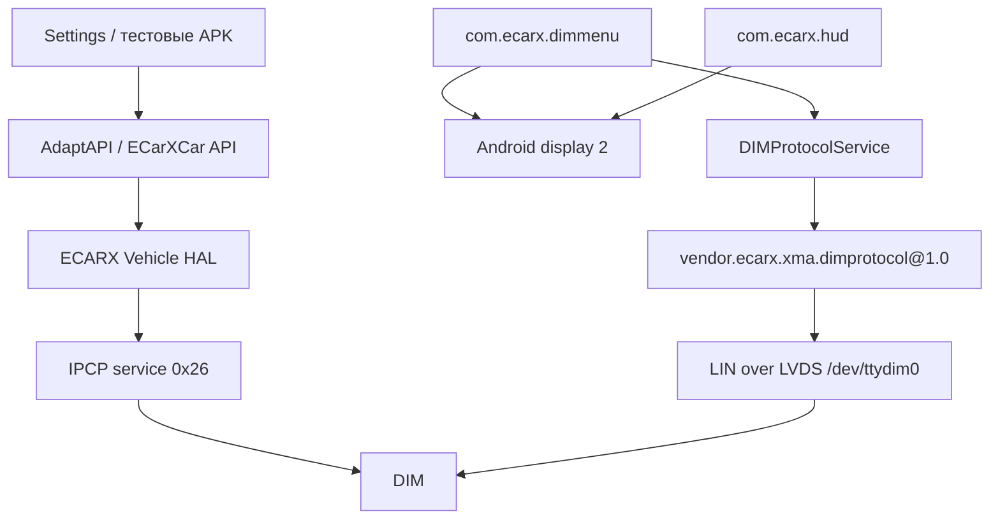

# ECARX KX11 HUD: проверяемая карта реализации по дампу от 2026‑07‑27

Статус документа: проверяемый технический отчёт по статическому и динамическому анализу; границы неизвестного отмечены явно.
Исследуемая сборка: `qti/kx11_high/kx11_high:9/20.24.10.23024.41151/539:userdebug/test-keys`.
Исследуемый архив: `ecarx-hud-system-20260727-010640.zip`.
SHA‑256 архива: `9bc62950e55910fc6eb59c99bf80439f7e7ac41f853b4c6c486977e14d062edd`.
Размер архива: `300729150` байт.

## 1. Главный вывод

В системе HUD нет одного доказанного «приложения, которое рисует всё». По
предоставленным файлам установлены как минимум четыре независимых программных
контура; owner постоянной числовой скорости остаётся за границей
доказанного кода:

1. **Android HUD (`com.ecarx.hud`)** запускает `HomeActivity` на Android
   display ID `2` и рисует навигацию, предупреждения, телефонный экран и
   красный AR/ACC marker обычными Android `View`/`SurfaceView`.
2. **Android DIM menu (`com.ecarx.dimmenu`)** создаёт на том же display
   отдельный прозрачный `FullMapPresentation`, переводит его в системный
   overlay type2038 и рисует full-map navigation/lane/popups.
3. **Vehicle HAL → IPCP → DIM** передаёт штатные автомобильные команды и
   статусы. Именно по этому пути уходит профильная маска `HudVisFctSetgReq`
   с 20 флагами `F00…F19` и `PEN`.
4. **DIMProtocol → LIN over LVDS → DIM** является отдельным транспортом для
   команд интерфейса приборного дисплея: вкладки, тема, карта, control center,
   громкость, HUD mode и т. п.
5. **Постоянное числовое значение скорости `0 km/h` не принадлежит найденной
   разметке и Java‑коду `com.ecarx.hud`**. В предоставленных файлах не найден
   его renderer и не найден отдельный публичный переключатель видимости.
   Возможные владельцы включают отсутствующую native библиотеку
   `libkx11_lib.so`, DIM/QNX/MCU либо аппаратный compositor; ни один из них
   не назначен owner без доказательства.

Фотография HUD с машиной и `0 km/h` сама по себе не устанавливает число
producer. Код устанавливает более узкую границу:

- красный `acc_r` marker, навигация и предупреждения имеют найденный Android
  path в `com.ecarx.hud`;
- белая ego‑машина/дорога с фото не совпадает с `acc_r`, а production
  `LanePressureView` не получает data и скрывается;
- числовой speed renderer отсутствует в найденных Java/resources, но может
  находиться в отсутствующей native части этого же приложения либо ниже.

Следовательно, результат «чёрный Android‑оверлей появился, но скорость осталась» нельзя интерпретировать как ошибку обычного Android z‑order. Он совместим с двумя независимыми случаями:

- скорость композится после Android/HWC другим producer;
- HUD является аддитивным оптическим дисплеем, где чёрный пиксель означает «не излучать», а не «закрасить нижний слой».

## 2. Правила доказательности

Чтобы не смешивать установленные факты и предположения, в документе используются уровни уверенности:

| Уровень | Значение |
|---|---|
| **A — доказано** | Совпадают два или более независимых источника: Java/resources, native‑дизассемблирование, runtime‑лог или фактическое наблюдение. |
| **B — подтверждено статически** | Однозначно следует из кода/ELF/ресурсов, но конкретная команда ещё не проверена на автомобиле. |
| **C — отрицательное доказательство** | Полный поиск по имеющимся слоям не нашёл реализации; вывод действует только в границах предоставленного набора файлов. |
| **D — неизвестно** | Необходимого файла, словаря или runtime‑трассы нет. Значение не присваивается «по похожести». |

Ключевой принцип: отсутствие имени `speed visibility` в Android API не доказывает, что такого управления нет в DIM firmware. Оно доказывает только, что такого публичного управления нет в исследованных Android/framework/native host‑слоях.

## 3. Объём дампа и воспроизводимость

Инвентаризация непосредственно по ZIP central directory, без подсчёта
созданных в ходе анализа каталогов/кэшей:

| Раздел | Файлы | Размер |
|---|---:|---:|
| `packages/` | 12 | 339765307 байт |
| `framework/` | 12 | 3670282 байт |
| `vendor-native/` | 155 | 51666516 байт |
| `report.txt` | 1 | 71431 байт |
| `hudlab-runtime.txt` | 1 | 13912 байт |
| **Всего** | **181** | **395187448 байт** |

Число `189`, полученное ранее через `find` в рабочем каталоге после
распаковки, включало восемь созданных анализатором файлов/каталогов и не
является числом членов исходного архива.

В `packages/` находятся 12 APK:

| Пакет | Размер APK |
|---|---:|
| `com.ecarx.hud` | 11262144 |
| `ecarx.dimprotocol.service` | 29174 |
| `com.ecarx.dimmenu` | 7864621 |
| `ecarx.powersomeip.service` | 58216 |
| `com.ecarx.sdk.openapi` | 3005711 |
| `ecarx.adaptapi.platform` | 2339956 |
| `ecarx.geea.platform.api.signal` | 1443566 |
| `ecarx.geea.platform.api.vf` | 1445417 |
| `com.ecarx.car` | 6816872 |
| `com.ecarx.car.multidisplay` | 16791 |
| `com.ecarx.providers.settings` | 70749 |
| `ecarx.settings` | 305412090 |

Также присутствуют 12 framework JAR, включая:

- `ecarx.car.jar`;
- `ecarx.adaptapi.jar`;
- `android.car.jar`;
- `car-frameworks-service.jar`;
- `ecarx.jar`;
- `ecarx.gkui.openapi.impl.jar`;
- `ecarx-theme-launcher-service.jar`.

### 3.1. Проверка целостности APK Settings

Исходный ZIP и его member `packages/ecarx.settings/base.apk` исправны:

- `unzip -t` завершился `No errors`;
- central-directory `file_size = 305412090`;
- compressed size `256503727`;
- CRC32 `ce172d46`;
- потоковое чтение member дало все `305412090` байт;
- SHA‑256 полного APK
  `4fe63822f44d6f6dfb77564d1b0f9b4aec9fb725c6e1a590862efc1c0ac570e5`;
- JADX извлёк 7692 исходных файла.

Выводы о `CarHudFragment`, `KanziManager` и `CarSettingActivity` основаны на
полном APK, потоково извлечённом из этого же проверенного ZIP.

### 3.2. Идентификация автомобиля и ОС

`report.txt` фиксирует:

| Поле | Значение |
|---|---|
| manufacturer | `QUALCOMM` |
| brand | `qti` |
| model | `KX11` |
| device/product | `kx11_high` |
| Android | 9, SDK 28 |
| build | `20.24.10.23024.41151` |
| build type | `userdebug/test-keys` |
| security patch | `2019-01-05` |

Основной экран в отчёте:

- display ID `0`;
- physical `1920×720`;
- app area `1760×720`;
- layer stack `0`.

В новом архиве нет полного `dumpsys display`/`SurfaceFlinger` для display ID `2`. Принадлежность HUD display ID `2` доказана непосредственно OEM‑кодом `BootBroadcastReceiver`, но его актуальный physical mode, HWC composition type и полный список слоёв этим архивом не зафиксированы.

## 4. Общая архитектура



Это не одна последовательная цепь. VHAL/IPCP и DIMProtocol/LIN существуют параллельно:

- `HudVisFctSetgReq` (`30816`) идёт через Vehicle HAL/IPCP;
- DIMProtocol opcode `31` идёт через отдельный HIDL HAL и `/dev/ttydim0`;
- Android‑графика `com.ecarx.hud` и отдельный overlay
  `com.ecarx.dimmenu/FullMapPresentation` композятся на display `2`.

Смешивать IPCP opcode `27` и DIMProtocol opcode `31` нельзя: это разные протоколы, разные транспорты и разные смыслы.

## 5. Android HUD: жизненный цикл, режимы и владелец графики

### 5.1. Запуск на display ID 2

`com.ecarx.hud.receiver.BootBroadcastReceiver.a(Context,int)` делает:

```java
ActivityOptions options = ActivityOptions.makeBasic();
options.setLaunchDisplayId(2);
options.setLaunchWindowingMode(5);
options.setSpliteScreenPositon(i);
startActivity(HomeActivity, options);
```

При `BOOT_COMPLETED` передаётся split position `1`. Это статически доказывает:

- штатное Android HUD запускается именно на display ID `2`;
- это не `Presentation`, а отдельная `Activity` с OEM‑параметрами multi‑display/windowing;
- ID `2` для этой сборки не вычисляется динамически в приложении, а зашит константой.

Уровень: **A** — исходный код APK и пользовательское подтверждение display ID.

### 5.2. Режимы HomeActivity

`HomeActivity.A()` выбирает фрагмент по значению `v7.p().o`:

| Значение | Фрагмент | Режим по API |
|---:|---|---|
| 1 | `EasyFragment` | Simple |
| 2 | `DriveFragment` | Intelligent drive |
| 3 | `GuideFragment` | Intelligent guide |
| 4 | `ARHUDFragment` | AR |

При этом автомобильный enum `DispModSetgReq` использует другую нумерацию:

| Значение команды | Имя в framework |
|---:|---|
| 0 | `IntellGude` |
| 1 | `IntellDrv` |
| 2 | `AR` |
| 3 | `Simple` |

Точное преобразование находится в
`com.ecarx.xui.adaptapi.hudinteraction.HUDInteractionImpl.convertHudDispMode`:

| PA/автомобильное значение | Внутренний callback mode | Фрагмент |
|---:|---:|---|
| 0 | 3 | Guide |
| 1 | 2 | Drive |
| 2 | 4 | AR |
| 3 и любое иное | 1 | Easy |

Следовательно, номер Android‑фрагмента нельзя отправлять напрямую как значение
Vehicle API.

### 5.3. Что рисует `com.ecarx.hud`

Разметка AR содержит:

- `carHUDIV`;
- `LanePressureView`;
- navigation turn icon;
- расстояние и единицу расстояния;
- location hint;
- AEB frame;
- ACC spacing;
- телефонный блок, имя контакта, время разговора, answer/hangup;
- навигационную `SurfaceViewAnimation`.

`EasyFragment`, `DriveFragment`, `GuideFragment` и `ARHUDFragment` не содержат TextView или ImageView для текущей числовой скорости.

Полнотекстовый поиск по ресурсам `res/layout`, ID, строкам и Java‑коду APK не обнаружил:

- `speed`;
- `km/h`/`kmh`;
- отдельного speed TextView;
- отдельной drawable цифр скорости.

Уровень вывода «число скорости не рисуется Java/layout‑слоем этого APK»: **C**, с высокой полнотой внутри APK.

### 5.4. AR target marker и неиспользуемый `LanePressureView`

`ARHUDFragment.s(short objID, short x, short y, short objStatus, short width)` показывает `carHUDIV`, только если:

```text
objStatus == 1 && objID == 12
```

Тогда:

- ставится drawable `R.drawable.acc_r`;
- геометрия задаётся через `t8.c(...)`;
- `ImageView` становится видимым.

Во всех остальных случаях `carHUDIV` скрывается.

Название `carHUDIV` вводит в заблуждение. Сам `acc_r.png` — прозрачный PNG
`648×58` с широкой красной дугой/полосой, а не белая пиктограмма ego‑автомобиля
с дороги на пользовательском фото. Поэтому код доказывает владельца именно
красного AR/ACC target marker, но **не** владельца белой машины и дороги.

`LanePressureView` существует в layout и умеет рисовать красный градиент по
`ADASLaneInfoBean`, однако в production `ARHUDFragment`:

- view скрывается в `C()` через `setVisibility(GONE)`;
- вызов `LanePressureView.a(ADASLaneInfoBean)` в APK отсутствует;
- обратного `setVisibility(VISIBLE)` для этого view не найдено.

Следовательно, наличие класса и layout не доказывает, что видимые на фото
штатные полосы рисует этот view.

`HUDInteractionImpl` подписывается на `SignalId_VehSpdLgtA = 31544`. При событии:

```java
vehicleSpeed = raw * 0.00391d;
```

Скорость передаётся в `InputVehicle`, а затем в JNI‑алгоритм вместе с:

- углом рулевого колеса;
- угловой скоростью руля;
- полосами ADAS;
- объектами ADAS;
- параметром высоты HUD;
- навигационными данными.

Эта скорость используется для расчёта геометрии/анимации AR. В Java‑слое она не преобразуется в текст `NN km/h`.

### 5.5. Native AR‑алгоритм и отсутствующая библиотека

В APK присутствует маленький wrapper `libnative-lib.so` размером 14024 байта. Он зависит от отсутствующей в дампе `libkx11_lib.so`.

Импортируемые функции:

- `Get_NAVI`;
- `InputData_NAVI`;
- `InputData_ADAS_LD`;
- `Get_ADAS_Obj`;
- `InputData_ADAS_Obj`;
- `EOL_Calibration`;
- `ARC_Global_Variable_Initializing`;
- `ARC_End`;
- `Get_ADAS_LD`.

Wrapper возвращает Java‑объекты с геометрией навигации, полос и ADAS‑предупреждений. Он сам не содержит renderer числовой скорости.

Без `libkx11_lib.so` нельзя полностью восстановить формулы AR‑проекции, калибровку и внутреннюю классификацию объектов. Однако отсутствие speed TextView в Android‑разметке от этого не меняется: native‑результат используется Java‑кодом для координат и статусов существующих Android views.

### 5.6. Реакция Android HUD на master active

При изменении HUD active presenter вызывает callback `HomeActivity.i()`. Метод `i()` пуст.

Следствия:

- изменение master active не закрывает `HomeActivity` в Android;
- оно может менять состояние физического HUD через автомобильный контроллер, но не уничтожает Android window;
- нельзя по наличию процесса/окна `com.ecarx.hud` делать вывод, что оптический HUD включён.

Калибровочный callback `HomeActivity.g(boolean)` временно делает root `ConstraintLayout` invisible/visible; это отдельная UI‑логика, а не общий master switch.

### 5.7. Второй Android producer: `com.ecarx.dimmenu`

`com.ecarx.dimmenu` — системное приложение с
`android:sharedUserId="android.uid.system"` и разрешением
`SYSTEM_ALERT_WINDOW`. `MainActivity` вызывает
`MainViewModel.initPresentation(this)`, который:

1. получает `DisplayManager.getDisplays()`;
2. выбирает `displayArr[2]`;
3. создаёт `FullMapPresentation`;
4. ставит прозрачный background;
5. после создания `Presentation` меняет его window type на
   `2038 = TYPE_APPLICATION_OVERLAY`;
6. выставляет `1920×720` для high-line либо `1280×480` для low-line.

В коде есть дефект проверки границ: проверяется `displays.length > 1`, после
чего без дополнительной проверки читается `displayArr[2]`. При массиве ровно
из двух элементов это `ArrayIndexOutOfBoundsException`. Дамп доказывает
задуманный индекс и hardcoded размеры, но не фактический порядок display array
и не измеренный physical mode HUD.

Это не единственный способ, которым сам `DimMenu` попадает на HUD.
`LauncherManager.startSplitApp()` также создаёт `ActivityOptions` с:

```text
launchDisplayId = 2
launchWindowingMode = 5
splitScreenPosition = high-line ? 2 : 1
activity = com.ecarx.dimmenu.MainActivity
flags = FLAG_ACTIVITY_NEW_TASK
```

То есть OEM запускает на display `2` и основную `MainActivity`, а уже внутри
неё создаёт второй window — `FullMapPresentation`. Это два window path одного
процесса, а не один `Presentation`.

Независимо от этого `CarInfo.getPresentationDisplay(...)` отображает оба OEM
типа `DISPLAY_TYPE_DIM=-2147483647` и `DISPLAY_TYPE_HUD=-2147483646` в
`DisplayManagerGlobal.getRealDisplay(2)`. Это подтверждает намерение OEM
использовать real display ID `2`; выбор `displayArr[2]` остаётся выбором по
индексу и требует runtime‑проверки порядка display array.

`FullMapPresentation` содержит `FullMapFragment`: navigation popup, lane-guidance
view, нижние media/call/WeChat popups и volume overlay. В его Java/layout/resource
части не найден renderer постоянного `0 km/h` или белого ego‑автомобиля.

Итого на display `2` статически доказаны два Android процесса и три window
path:

| Процесс | Window path |
|---|---|
| `com.ecarx.hud` | отдельная `HomeActivity`, launchDisplayId 2, OEM windowing mode 5 |
| `com.ecarx.dimmenu` | `MainActivity`, launchDisplayId 2, OEM windowing mode 5 |
| `com.ecarx.dimmenu` | отдельный `FullMapPresentation`, затем type 2038, 1920×720/1280×480 |

Статически определить относительный z‑order этих окон нельзя. В частности,
если пользовательский HUD overlay тоже имеет type2038, один только тип окна
не гарантирует положение выше OEM `FullMapPresentation`: важны токен,
подслой, время добавления и OEM WindowManager policy.

### 5.8. Полный signal transform pipeline `HUDInteractionImpl`

Это не renderer, а адаптер Vehicle/PA → callback для HUD‑приложения.
Он агрегирует сообщения до marker‑сигналов:

| Domain | Входы | Масштаб/преобразование | Callback trigger |
|---|---|---|---|
| vehicle | `VehSpdLgtA 31544` | `raw × 0.00391` | `ZZZVddmSignalEnd 31578` |
| vehicle | steering angle 31515 | `(short)raw × 0.0009765625` | `31578` |
| vehicle | steering speed 31516 | `(short)raw × 0.0078125` | `31578` |
| lane first/second start/end 28924…28927, 28933…28936 | offset | `raw − 30` | `ZZZAsdmSignalEnd 29153` |
| lane polynomial A | left 29058/29062, right 29074/29078 | `raw × 0.01 − 30` | `29153` |
| lane polynomial B | 29059/29063/29075/29079 | `raw × 0.001 − 1.6` | `29153` |
| lane polynomial C | 29060/29064/29076/29080 | `raw × 0.0001 − 0.1` | `29153` |
| lane polynomial D | 29061/29065/29077/29081 | `raw × 0.000001 − 0.001` | `29153` |
| front object lateral 29141 | offset | `raw × 0.1 − 12.7` | `29153` |
| front object longitudinal 29142 | offset | `raw − 30` | `29153` |
| HUD position 30934 | direct int | без масштаба | immediate height callback |
| following gap 29024 | direct int | без масштаба | immediate gap callback |

PA calibration payloads декодируются так:

- ARD300 (`PA33496`): первые 32 bytes → восемь big‑endian `int32`;
- ARD310 (`PA33497`): первые 36 bytes → девять big‑endian `int32 × 0.01f`;
- ARD311 (`PA33498`): первые 2 bytes big‑endian; `0x0301` означает calibration
  start, `0x0300` — calibration end.

Эта ветка объясняет данные AR‑геометрии и режимов, но не содержит API
visibility штатной числовой скорости.

### 5.9. Условия активации штатной navigation/AR графики

`com.ecarx.hud` не запускает native navigation calculation на каждом
навигационном событии. `NaviAPIManager` подписан на protocol IDs:

| NaviAPI protocol ID | Данные |
|---:|---|
| 1001 | navigation status |
| 1003 | selected route/distance |
| 3407 | guide info |
| 3418 | lane info |

Navigation считается active только если одновременно:

```text
mapType == 10
guideStatusVendor == 5
guideStatus not in {2=cruise, 3=no-guide, -1}
```

При неактивном состоянии guide info очищается. `InputNAVI` и JNI
`Get_NAVI` вызываются только пока флаг active=true и заполнены необходимые
vehicle/lane/navigation inputs. Для `mapType != 10` метод не обновляет флаг,
поэтому может сохранить предыдущее active‑состояние — это наблюдаемая
state-machine особенность, а не доказанное желаемое поведение.

Эти условия объясняют, почему штатные стрелки/полосы могут появляться и
исчезать независимо от наличия самого Android window. Они не управляют
постоянным speed widget.

### 5.10. Ошибка декодирования boolean function value

В `HUDAbleManager` функция:

```java
boolean decode(int value) {
    return value == 1 || value != 0;
}
```

алгебраически равна `value != 0`. Через неё декодируются как boolean как
минимум значения функций HUD active (`537985280`), AR (`654442752`) и
height/brightness adjustment (`654378240`). Поэтому специальное
`notavailable=255` ошибочно становится `true`. Это способно дать ложный
active/AR/adjustment state в UI `com.ecarx.hud`; к renderer числовой скорости
эта ошибка напрямую не привязана.

## 6. Vehicle API: идентификаторы, CB/PA и VHAL properties

### 6.1. Слои API

Цепочка Java для штатных функций:

```text
Settings/AdaptAPI
  → IFunctionConvertProxy
  → com.ecarx.xui.adaptapi.car.vehicle.HUD
  → ECarXCarVfhudManager / CarSignalManager
  → ECarXCarPropertyManager
  → Android Automotive Vehicle HAL
```

В ECARX API используются:

- **CB** — command/request из IHU;
- **PA** — status/feedback, обычно protobuf‑обёртка `PAIntType` или `PAByteType`;
- **SignalId** — прямые сигналы `CarSignalManager`.

Для area используется `1` (`VehicleArea_Global`).

### 6.2. VFHUD CB/PA

Все восемь CB уходят через IPCP service `0x88`, operation type
`1=SETREQUEST_NORETURN`, payload type `1`, с четырёхбайтовым big-endian
`int32` payload.

| Функция | CB ID | CB VHAL property | operation | PA ID | PA VHAL property |
|---|---:|---:|---:|---:|---:|
| HUD active | 32922 | `0x2140809A` | `0x0001` | 33489 | `0x217082D1` |
| illumination adjustment | 32923 | `0x2140809B` | `0x0002` | 33490 | `0x217082D2` |
| ergonomic adjustment | 32924 | `0x2140809C` | `0x0003` | 33491 | `0x217082D3` |
| image rotation/calibration | 32925 | `0x2140809D` | `0x0004` | 33492 | `0x217082D4` |
| reset settings/data | 32926 | `0x2140809E` | `0x0005` | 33493 | `0x217082D5` |
| snow mode | 32927 | `0x2140809F` | `0x0006` | 33494 | `0x217082D6` |
| AR active | 32928 | `0x214080A0` | `0x0007` | 33495 | `0x217082D7` |
| reboot | 32929 | `0x214080A1` | `0x0A11` | — | — |
| HUD display mode | 33267 | `0x214081F3` | — | 33906 | `0x21708472` |
| ARD300 data | — | — | — | 33496 | `0x217082D8` |
| ARD310 data | — | — | — | 33497 | `0x217082D9` |
| ARD311 data | — | — | — | 33498 | `0x217082DA` |
| HUD message end | — | — | — | 33891 | `0x21708463` |

В строках после reboot столбец `operation` неприменим; `CB33267` является
локальным module-handled property и разобран отдельно ниже.

Converter:

```text
vhal_v1_0_net_impl-lib.so
UtilsVehicleValue2CBIPCP::convertVehicleValue2CBIpcp
VA 0x199F5C
```

Case VA для CB `32922…32929`: `0x19C094`, `0x19C4D0`, `0x19C4DC`,
`0x19C4E8`, `0x19B7D4`, `0x19C0A0`, `0x19C4F4→0x19C6E0`,
`0x19C0AC`. Reboot operation — именно `0x0A11`, не `0x0011`.

Полная 20‑байтная IPCP v3 UDP datagram:

```text
00 88 OP_H OP_L 00 00 00 0C 88 OP_L 01 SS
03 01 01 00 VV VV VV VV
```

`VV…` — `int32` big-endian. Например AR active=1 при sequence=1:

```text
00 88 00 07 00 00 00 0C 88 07 01 01
03 01 01 00 00 00 00 01
```

PA `33489…33498` приходят не как восемь индивидуальных replies, а одним
aggregate: IPCP service `0x88`, operation `0x00C8`, payload length
`0x01CC=460`. Входной converter
`UtilsPAIPCP2VehicleValue::convertPAIpcp2VehicleValues` начинается по
`0x125B60`; predicate service/op/length — `0x125ED8…0x125EE8`.
Он не проверяет incoming operation-type/payload-type; предполагать их точные
wire bytes без passive PCAP нельзя.

| Raw offset | PA | Raw record |
|---:|---:|---|
| `0x000…0x060`, шаг `0x10` | 33489…33495 | 7 × `PAInt`, по 16 bytes |
| `0x070` | 33496 ARD300 | `PAByte`, 116 bytes |
| `0x0E4` | 33497 ARD310 | `PAByte`, 116 bytes |
| `0x158` | 33498 ARD311 | `PAByte`, 116 bytes |

`PAInt` = availability/data/status/format, четыре big-endian uint32/int32.
`PAByte` = availability at `+0`, 100 data bytes at `+8`, status at `+108`,
format at `+112`; `+4…+7` converter игнорирует.

Индивидуального functional CB→PA response/echo/correlation ID нет. Generic
`libipcp` transport ACK type `0x70` подтверждает доставку frame и освобождает
WFA для original op-type `1`, но после этого не запускается
WFR/application response. PA — последнее опубликованное состояние будущего
aggregate, а не подтверждение конкретного вызова и не доказательство
визуального эффекта.

Формат VHAL ID в исследуемой таблице:

- ECARX integer property: `0x21400000 + logical ID`;
- ECARX bytes property: `0x21700000 + logical ID`.

Для перечисленных строк это подтверждено конфигурационной таблицей native Vehicle HAL.

### 6.3. `CB_HUD_DispModSet` 33267 — локальный HUD module

В отличие от восьми VFHUD CB, `33267` не имеет wire case ни в обычном, ни в
CB IPCP converter. Его перехватывает
`vendor.ecarx.xma.automotive.vehicle_1.0-modules.so`:

```text
HUD::HUD             0x1FD68
HUD::init            0x1FFCC
HUD::init_pa         0x2017C
HUD::listener_signal 0x20240
CB lambda            0x2067C
```

Три связанные property:

| Роль | logical ID | full VHAL property |
|---|---:|---:|
| CB input | 33267 | `0x214081F3` |
| synthesized int output | 33278 | `0x214081FE` |
| PA effective mode | 33906 | `0x21708472` |

CB lambda хранит один boolean:

```text
requestedIntellGuide = (int32Values[0] == 1)
```

Это `cmp/cset/strb` по `0x2068C…0x20694`; любое значение, отличное от `1`,
становится `false`. Затем `listener_signal` пересчитывает итоговый mode.
Модуль слушает девять property: `carconfig158=29398`,
`LaneChgAutActvSts=28975`, `LaneKeepAidInfoSts=28977`, `LcmaOn=28979`,
`AsyEmgyLaneKeepAid=28918`, `AsyEmgyManoeuvreAidSts=28921`,
`CllsnMtgtnOnoffSts=28941`, PA AR active `33495` и PA HUD active `33489`.

Доказанный алгоритм:

1. initial `carconfig158=1 → mode1`, `carconfig158=4 → mode2`;
2. пока PA HUD active не равен `1`, новое значение обычно не публикуется;
3. для config4 и PA AR active=1 итог `mode2=AR`;
4. если активно LaneChg=1, LaneKeep=1, Lcma=2, emergency lane/manoeuvre=1
   или collision mitigation=1, итог `mode1=IntellDrv`;
5. в строго idle‑состоянии CB33267 value1 → `mode0=IntellGude`, любое другое
   → `mode3=Simple`;
6. итог одновременно пишется в 33278 (`0x20578…0x20588`) и PA33906
   (`0x2058C…0x205B0`).

Следовательно, `SUCCEED` для CB33267 может изменить локальный effective mode,
не отправив DIM ни одного IPCP сообщения.

Найден и штатный Java caller:
`NaviInteraction.notifyNavigationStatus(int status)` вызывает
`mHudManager.CB_HUD_DispModSet(status)` и передаёт status без
преобразования:

| status | `INavigationStatus` | Значение boolean в native HUD module |
|---:|---|---|
| 0 | `UNNAVI` | false |
| 1 | `SUCCEED` | true |
| 2 | `START` | false |
| 3 | `END` | false |
| 4 | `REROUTING` | false |
| 5 | `TUNNEL_ENTER` | false |
| 6 | `TUNNEL_END` | false |

Только `SUCCEED=1` проходит native проверку `value == 1`; все остальные
состояния дают false. Перед вызовом для `END=3` caller обнуляет distance to
destination и planned path deviation, а destination POI заменяет
sentinel‑координатами `lat=324000000`, `long=648000000`. Поэтому `CB33267` —
не скрытый «выключатель скорости», а часть жизненного цикла navigation/HUD
display mode.

### 6.4. Profile и ProfileTransfer

| Функция | CB | PA |
|---|---:|---:|
| запрос активного профиля | 33248 | 33845 |
| режим HUD профиля | 33278 | 33937 |
| `VehMdlClrReq` | 33284 | 33943 |

`PA_PSET_ActiveProfile = 33845` имеет VHAL property `0x21708435`.

Framework enum `ProfileId` допускает `0…13`:

- `0…11` — обычные профили;
- `12` — `ProfileCarsharing`;
- `13` — `ProfileDefault`.

`ProfileId.isValid(i)` возвращает `true` для полного framework диапазона
`0…13`. `PEN=15` отсутствует в framework enum и не доказан как допустимый
профиль.

`CB_VehMdlClrReq` не является доказанным выключателем AR‑машины HUD:

- он расположен в ProfileTransfer/PAC/vehicle surroundings domain;
- прямой signal `VehMdlClrReq` имеет ID `28910`, рядом с parking/vision сигналами;
- runtime‑тест CB `33284` дал `SUCCEED`, но PA `33943` остался `0`;
- Android `carHUDIV` управляется результатом ADAS‑алгоритма `objID/obj_status`, а не этим CB.

Поэтому использовать `VehMdlClrReq` как средство скрыть HUD‑машину нельзя без отдельного доказательства.

### 6.5. Расхождение версий ECARX SDK внутри APK и в boot framework

В `DimMenu.apk` упакованы собственные `ecarx.car.*` классы, но те же имена
классов присутствуют в `/system/framework/ecarx.car.jar`. Это не
взаимозаменяемые копии: их таблицы ID сдвинуты.

| API constant | Копия внутри `DimMenu.apk` | `/system/framework/ecarx.car.jar` |
|---|---:|---:|
| `Vfhud.CB_HUD_DispModSet` | 33260 | 33267 |
| `Vfhud.PA_HUD_DispModSet` | 33894 | 33906 |
| `Vfhud.PA_VFHUD_ActvSts` | 33482 | 33489 |
| `Vfhud.PA_VFHUD_ARActvSts` | 33488 | 33495 |
| `Vfhud.PA_ARD300/310/311` | 33489/33490/33491 | 33496/33497/33498 |
| `Profile.CB_RequestActiveProfile` | 33241 | 33248 |
| `Profile.PA_ActiveProfile` | 33833 | 33845 |
| `ProfileTransfer.CB_HudDispModSetgReq` | 33271 | 33278 |
| `ProfileTransfer.CB_Reboot` | 33267 | 33274 |
| `ProfileTransfer.CB_VehMdlClrReq` | 33277 | 33284 |
| `ProfileTransfer.PA_HudDispModSetgReq` | 33925 | 33937 |
| `ProfileTransfer.PA_VehMdlClrReq` | 33931 | 33943 |

Дамп содержит одновременно `ecarx.car.jar` и
`boot-ecarx.car.vdex`. Последнее является сильным runtime‑признаком того,
что системная копия `ecarx.car` входит в boot class path. Для одинаковых
полных имён Android использует parent/boot-first resolution, поэтому
ожидаемый runtime owner этих классов — boot framework, а не stale duplicate
из APK. Именно с текущими boot ID согласованы native VHAL table и runtime
ответы.

Граница доказательства: в архиве нет `/proc/<pid>/maps`, `cmd package
dump-profiles` либо ART class-loader trace процесса `com.ecarx.dimmenu`,
поэтому конкретный `Class` source для этого процесса не зафиксирован прямым
runtime‑снимком. Следовательно:

- ID из bundled APK нельзя автоматически использовать как runtime ID;
- для команд и HUD Lab применяются ID из boot framework, подтверждённые
  native property table;
- при следующем сборе дампа нужно снять class-loader/ART source, чтобы
  закрыть последнюю формальную неоднозначность.

### 6.6. Direct DIM/CEM signals

| SignalId | Имя | Тип VHAL | Property |
|---:|---|---|---:|
| 30788 | `HudDispActvReq` | int | `0x21407844` |
| 30789 | `HudRstForSetgAndData` | int | `0x21407845` |
| 30790 | `HudSnowModeReq` | int | `0x21407846` |
| 30811 | `HudAdjmtSwtSts` | bytes | `0x2170785B` |
| 30814 | `HudDispModSetgReq` | bytes | `0x2170785E` |
| 30816 | `HudVisFctSetgReq` | bytes | `0x21707860` |
| 30886 | `HudActvReq` | int/read status group | `0x214078A6` |
| 30887 | `HudActvSts` | int/read | `0x214078A7` |
| 30888 | `HudAdjmtCmplFb` | int/read | `0x214078A8` |
| 30889 | `HudSnowModeSts` | int/read | `0x214078A9` |
| 30890 | `HudSts` | int/read | `0x214078AA` |
| 30934 | `HudPosnUpldToDIMPosY` | int/read | `0x214078D6` |
| 30935 | `HudPosnUpldToDIMRot` | int/read | `0x214078D7` |
| 30936 | `HudPosnUpldToDIMllmn` | int/read | `0x214078D8` |
| 30937 | `NetDIMActvtPrio` | int/read | `0x214078D9` |
| 30938 | `NetDIMActvtResourceGroup` | int/read | `0x214078DA` |

`HudDispModSetgReq` — protobuf из двух полей:

1. mode;
2. PEN.

Допустимые mode: `0 IntellGude`, `1 IntellDrv`, `2 AR`, `3 Simple`.

### 6.7. Скорость: обнаруженные сигналы

| SignalId | Имя | Использование |
|---:|---|---|
| 30918 | `VehSpdExtdIndcnForUseInt` | read |
| 30919 | `VehSpdUnitForUseInt` | read |
| 30956 | `VehSpdAvgIndcdVeSpdIndcdUnit` | read |
| 30957 | `VehSpdAvgIndcdVehSpdIndcd` | read |
| 30958 | `VehSpdIndcdVeSpdIndcdUnit` | read |
| 30959 | `VehSpdIndcdVehSpdIndcd` | read |
| 31544 | `VehSpdLgtA` | read; AR input, scale `0.00391` |

В `CarSignalManager` для указанных indicated‑speed сигналов существуют getters, но нет соответствующих setters. Единственный похожий setter `setVehSpdLvl(29188)` относится к аудио/vehicle speed level domain и не является управлением видимостью скорости HUD.

Это доказывает:

- найденные speed signals являются источниками данных;
- подмена их значений не является штатным API скрытия speed widget;
- отдельного Android API `hide HUD speed` среди исследованных manager‑классов нет.

### 6.8. `CarHudService` — присутствующий, но не подключённый legacy code

В `com.ecarx.car` есть класс `CarHudService`, который из horizon messages
выводит два производных property:

| Logical ID | Данные |
|---:|---|
| 32257 | intersection/turn angle |
| 32258 | longitudinal slope |

Однако `IECarXCarImpl` не создаёт `CarHudService`, не включает его в
`mAllServices`, а глобальный поиск не находит другого constructor caller.
Следовательно, в исследуемой сборке это dead/unwired legacy code, а не
активный HUD producer. Кроме того, в slope branch построен property
`557874690`, но `toCarPropertyValue` ошибочно получает logical ID `32257`
вместо `32258`.

### 6.9. Native DID‑строки без доказанного control path

В `vendor.ecarx.xma.automotive.vehicle_1.0-modules.so` присутствуют строки:

```text
DID_LKV_ONOFF
DID_HUD_ONOFF
DID_FACEID_ONOFF
HudComponent init PA
signal setrequest
```

Это важные кандидаты для следующего анализа, но в предоставленном ELF/дампе
не восстановлены однозначные xref, числовой DID и caller, связывающие
`DID_HUD_ONOFF` со скрытием `0 km/h` или ego‑машины. Поэтому строка не
превращается в команду и не используется HUD Lab «по догадке».

## 7. Профильная маска `HudVisFctSetgReq`

### 7.1. Java/protobuf представление

`CarSignalManager.setHudVisFctSetgReq(...)` сериализует `ProtoHudVisFctSetgReq` и пишет bytes property `30816`, area `1`.

Protobuf содержит ровно 21 `int32`:

| Protobuf tag | Поле |
|---:|---|
| 1…20 | `hudVisFctSetgReqHudFct00` … `hudVisFctSetgReqHudFct19` |
| 21 | `hudVisFctSetgReqPen` |

OEM `CarSignalTestApp` подтверждает форму ввода:

```text
Struct[21]HudVisFctSetgReq
F00_F01_..._F19_PEN
```

Штатный экран теста:

```text
ecarx.geea.platform.api.signal.CarSignalBaseActivity
  → ecarx.geea.platform.api.signal.DIM_Fragment
```

Команда запуска:

```sh
am start -n ecarx.geea.platform.api.signal/.CarSignalBaseActivity \
  --es ':android:show_fragment' \
  ecarx.geea.platform.api.signal.DIM_Fragment
```

### 7.2. Native VHAL/IPCP представление

Для VHAL property `0x21707860` native converter формирует:

| Поле | Значение |
|---|---:|
| IPCP service | `0x26` |
| operation | `0x1B` = 27 |
| operation type | `1` = `SETREQUEST_NORETURN` |
| payload type | `1` |
| payload length | 21 |
| payload | 21 байт `F00…F19,PEN` |

То есть protobuf не отправляется в DIM «как есть». Native Vehicle HAL разбирает его и сужает каждое значение до одного байта:

```text
payload[0]  = F00
...
payload[19] = F19
payload[20] = PEN
```

Для `SETREQUEST_NORETURN` существует низкоуровневый IPCP transport
WFA/ACK: `ipcp_do_xmit` (`0x6090`, WFA path `0x6128…0x629c`) ждёт generic
operation type `0x70`, а `dispatch_handler` (`0x66a0…0x67c0`) снимает
ожидание. Этот ACK означает доставку IPCP frame; после него для original
op-type `1` не запускается WFR/application response. Incoming converter DIM
service `0x26` отдельно обрабатывает operation `32` с агрегированным
статусным payload, но operation `27` не имеет обратного echo/readback.
Поэтому успешный `setbytesProperty` и даже transport ACK не означают «DIM
применил маску» или «виджет исчез».

### 7.3. Связанный `HudDispModSetgReq` 30814

Это отдельная direct DIM command, не CB33267:

```text
VHAL property  0x2170785E
IPCP service   0x26
operation      0x001A
operation type 1 = SETREQUEST_NORETURN
payload type   1
payload        [mode, PEN]
converter VA   0x19D2B0…0x19D328
```

Оба protobuf int32 сужаются до младшего байта. Полная 18‑байтная UDP
datagram:

```text
00 26 00 1A 00 00 00 0A 26 1A 01 SS
03 01 01 00 MODE PEN
```

Она не связана с DIMProtocol opcode31: opcode31 является входным
UART/LIN‑callback `mHUDMode`, а 30814 — исходящий IPCP service0x26/op26.

### 7.4. Семантика F00…F19

Во всех исследованных слоях поля называются только `HudFct00…HudFct19`. Полнотекстовый поиск показывает эти имена лишь в:

- protobuf‑классах;
- generic test UI;
- converter/serialization code.

Нет:

- enum с названиями функций;
- строковой таблицы «Fxx = speed/navigation/media»;
- отдельного PA feedback по маске;
- документа DBC/ARXML;
- firmware dictionary.

Следовательно, соответствие `Fxx → визуальный элемент` в текущем дампе имеет уровень **D**. Назначать F09 скоростью только потому, что он тестировался, недопустимо.

## 8. IPCP native path

Ключевой ELF:

```text
vendor-native/_system_vendor_lib64/
  vendor.ecarx.xma.automotive.vehicle_1.0-impl-lib.so
```

SHA‑256:

```text
f33e214a7102409febb40abe8c09ec960903fd869765c5db6940be015c703c85
```

Из `.gnu_debugdata` восстановлены имена функций. Ключевые VA:

| VA | Функция |
|---:|---|
| `0x132628` | `EcarxIpcpComm::received_cb` |
| `0x132f6c` | `EcarxIpcpComm::txThread` |
| `0x1339e8` | `EcarxIpcpComm::findValidOperation` |
| `0x134ee8` | `EcarxIpcpComm::queueTxMsg` |
| `0x1395bc` | Vehicle HAL `set` |
| `0x139b54` | `setPropertyFromVehicle` |
| `0x13be78` | `setSignalGroup` |

Внутренний `ipcpValue` перед постановкой в очередь имеет:

| Offset | Тип | Смысл |
|---:|---|---|
| `0` | `uint16` | service |
| `2` | `uint16` | operation |
| `4` | `uint8` | operation type |
| `5` | `uint8` | payload type |
| `8` | pointer | payload |
| `16` | size | payload length |
| `24` | `char[16]` | peer IPv4 string |
| `40` | `uint16` | peer UDP port |

`queueTxMsg` → `txThread` → `build_ipcp_packet` → `ipcp_send`.

Для обычного Android/VHAL IPCP‑пути converter заполняет:

```text
local bind  = 198.18.34.15:50335
peer        = 198.18.34.1:50500
transport   = UDP
```

Доказательная цепочка:

- `EcarxIpcpComm::init_transport_conf` (`0x1337e8`) копирует строку
  `198.18.34.15`, записывает port `0xC49F = 50335` и transport type `2`;
- `libipcp.so::transport_layer_init` (`0x8bb0`) трактует type `2` как UDP;
- `UtilsVehicleValue2IPCP::convertVehicleValue2Ipcp` начиная с `0x19c808`
  в каждой сформированной записи копирует `198.18.34.1` и записывает
  `0xC544 = 50500`;
- `libipcp.so::socket_udp_send` (`0xf7dc`) передаёт эти peer address/port в
  `sendto`.

`build_ipcp_packet` (`libipcp.so`, `0x6e9c`) ставит protocol version `3`.
Перед `sendto` `ipcp_transport_send` (`0x9774`) переводит multi-byte поля
16‑байтного заголовка в network byte order. Заголовок на проводе:

| Offset | Размер | Значение |
|---:|---:|---|
| `0` | 2 | service, big endian |
| `2` | 2 | operation, big endian |
| `4` | 4 | `payload_length + 8`, big endian |
| `8` | 1 | service low byte |
| `9` | 1 | operation low byte |
| `10` | 1 | operation type |
| `11` | 1 | sequence, циклически `1…255,1…` (при rollover `0` не отправляется) |
| `12` | 1 | protocol version = `3` |
| `13` | 1 | operation type |
| `14` | 1 | payload type |
| `15` | 1 | флаг, для данного кадра `0` |
| `16` | N | payload |

Для signal `30816` точная UDP datagram имеет длину `37` байт:

```text
00 26 00 1B 00 00 00 1D 26 1B 01 SS 03 01 01 00
F00 F01 F02 F03 F04 F05 F06 F07 F08 F09
F10 F11 F12 F13 F14 F15 F16 F17 F18 F19 PEN
```

Где `SS` — изменяемый sequence byte. Все остальные 36 позиций фиксированы
структурой сообщения либо значениями команды. Пример «все единицы, PEN=13»
при `SS=01`:

```text
00 26 00 1B 00 00 00 1D 26 1B 01 01 03 01 01 00
01 01 01 01 01 01 01 01 01 01 01 01 01 01 01 01
01 01 01 01 0D
```

Это именно payload UDP к `198.18.34.1:50500`, без Ethernet/IP/UDP headers.
Повторять пакет «сырым» UDP сокетом не рекомендуется: штатный `libipcp`
ведёт sequence и service configuration, а operation `27` является
fire‑and‑forget.

Подтверждённые operation types:

| Код | Имя |
|---:|---|
| 0 | `REQUEST` |
| 1 | `SETREQUEST_NORETURN` |
| 2 | `SETREQUEST` |
| 3 | `NOTIFICATION_REQUEST` |
| 4 | `RESPONSE` |
| 5 | `NOTIFICATION` |
| 6 | `NOTIFICATION_CYCLIC` |
| `0x70` | `ACK` |
| `0xE0` | `ERROR` |

### 8.1. DIM operation map вокруг visual mask

Native config/converter сопоставляет:

| Signal | Имя | DIM operation |
|---:|---|---:|
| 30788 | `HudDispActvReq` | 7 |
| 30789 | `HudRstForSetgAndData` | 8 |
| 30790 | `HudSnowModeReq` | 9 |
| 30792 | `MmedHmiModStd` | 11 |
| 30800 | `SpeedWarnOnOffReq` | 19 |
| 30801 | `CourseDirFromNav` | 20 |
| 30803 | `DrvrDispSetg` | 21 |
| 30805 | `DrvrHmiBackGndInfoSetg` | 22 |
| 30807 | `DrvrHmiUsrIfSetg` | 23 |
| 30809 | `GlbRstForSetgAndData` | 24 |
| 30814 | `HudDispModSetgReq` | 26 |
| 30816 | `HudVisFctSetgReq` | 27 |
| 30837 | `IndcnUnit` | 28 |
| 30847 | `RstTripCompterData` | 29 |
| 30854 | `SetOfLang` | 30 |
| 30856 | `SpeedWarnSetReq` | 31 |

Incoming DIM operation `32` разворачивается в агрегированную группу статусов, включая диапазон DIM status signals `30859…30960`. Среди них:

- `HudActvReq/Sts`;
- `HudAdjmtCmplFb`;
- `HudSnowModeSts`;
- `HudSts`;
- position/rotation/illumination;
- indicated speed unit/value.

`HudVisFctSetgReq 30816` в incoming status list отсутствует, что ещё раз подтверждает отсутствие прямого feedback на маску.

Для вызова штатного Vehicle API собственная реализация этого framing не
нужна: приложение должно писать VHAL property. Wire format приведён здесь
для верификации passive packet capture и чтобы отличать доказанные байты от
предположений.

## 9. DIMProtocol: отдельный HAL и LIN over LVDS

### 9.1. Java/Binder/HIDL цепочка

```text
DimMenuInteraction
  → DIMProtocolManager
  → ecarx.dimprotocol.service.DIMProtocolService
  → DIMProtocolServiceImpl
  → vendor.ecarx.xma.dimprotocol@1.0::IDIMProtocol
  → vendor.ecarx.xma.dimprotocol_1.0-service
  → libuart.so
  → /dev/ttydim0
```

Native service:

```text
vendor-native/_vendor_bin/hw/
  vendor.ecarx.xma.dimprotocol_1.0-service
```

SHA‑256:

```text
b97a9e721ee17a7885ff3be6b5edbe52541d0e350deb803c24722f6f0990a1db
```

Он связан с:

- `vendor.ecarx.xma.dimprotocol@1.0.so`;
- `libuart.so`.

Ключевые native символы после извлечения `.gnu_debugdata`:

| VA | Функция |
|---:|---|
| `0x283c` | `msg_received_cb` |
| `0x2a30` | `error_cb` |
| `0x2c40` | `ack_cb` |
| `0x2d88` | `initLinoverlvdsStack` |
| `0x2e5c` | constructor |
| `0x3348` | `sendMessageToDIM` |
| `0x3dd8` | `subscribe` |
| `0x4310` | `main` |

`initLinoverlvdsStack` вызывает `linOverLVDS_init(device=1)`.

`libuart.so` сопоставляет устройства:

| Device | Назначение | tty |
|---:|---|---|
| 0 | CSDM | `/dev/ttycsdm0` |
| 1 | DIM | `/dev/ttydim0` |
| 2 | PSD | `/dev/ttypsd0` |
| 3 | CSD | `/dev/ttycsd0` |

### 9.2. LinOverLVDSMsg перед сериализацией

`sendMessageToDIM(msgType,len,opcode,data)` строит native structure:

| Offset | Поле | Значение для DIM |
|---:|---|---|
| 0 | source/device | `0` |
| 1 | message type | аргумент `msgType` |
| 4 | payload length | аргумент `len`/размер данных по реализации |
| 8 | destination | `8` |
| 10 | opcode | аргумент opcode |
| 16 | data pointer | указатель на payload |

### 9.3. Wire frame LIN over LVDS

`libuart.so` сериализует normal message в следующий порядок:

| Byte(s) | Смысл |
|---:|---|
| 0–1 | magic `79 6c` |
| 2 | source/device |
| 3 | message type |
| 4 | `payload length + 7` |
| 5 | destination |
| 6–7 | opcode, big‑endian |
| 8… | payload |
| последние 4 | CRC32, big‑endian, по header+payload |

Параметры retry/receive:

| Параметр | Значение |
|---|---:|
| ACK retry max | 3 |
| ACK retry interval | 200 ms |
| response retry max | 3 |
| response retry interval | 200 ms |
| receive data length | 128 |
| fixed send data length | 30 |

Обычные message types:

| Код | Имя |
|---:|---|
| 0 | REQUEST |
| 1 | RESPONSE |
| 2 | NOTIFY |
| 3 | ACK |
| 4 | ERROR |

Native transport также принимает специальные diagnostic types `0x3C`, `0x3D`, `0xA5`, `0xC3`. Их не следует использовать как штатные UI‑команды без отдельного протокола.

Это собственный ACK‑механизм LIN/LVDS, не IPCP ACK. `libuart.so::sendACK`
(`0xB2F8`) строит frame без payload:

```text
79 6C SRC 03 07 DST OP_H OP_L CRC0 CRC1 CRC2 CRC3
```

Parser `0xB540` направляет type3 в ACK branch `0xB910`; normal frame
автоматически подтверждается вызовом по `0xC3FC`. Matching использует
`destination<<16 | opcode` (`getPayloadId`, `0x8DEC`). Этот ACK подтверждает
приём LIN frame транспортом, но не означает, что DIM изменил графику.
`sendMessageToDIM` не ждёт ACK синхронно перед возвратом.

`msg_received_cb` передаёт вверх только сообщения с destination/address `8`, затем вызывает Java callback с opcode и data.

### 9.4. Известные DIMProtocol opcodes

Ниже указаны только значения, доказанные вызывающим или принимающим кодом.
У исходящих сообщений известен `msgType`; Binder callback входящих normal
frames получает уже только `opcode` и первый byte payload, поэтому исходный
wire `msgType` там не сохраняется.

| Opcode | Направление / msgType | Payload и фактическая реакция |
|---:|---|---|
| 1 | IHU→DIM, notify `2` | `notifyIHUReady`, payload `{1}` |
| 2 | DIM→IHU callback | theme value → `onThemeChanged(value)` |
| 3 | IHU→DIM, notify `2` или error `4` | результат переключения темы: `{1}` success, `{0}` failure |
| 4 | IHU→DIM request `0`; также DIM→IHU callback | исходящий tab value; входящий value → `onTabChanged(value)` |
| 5 | DIM→IHU callback | входящее событие без semantic name в коде; независимо от data вызывает ответ opcode `6` |
| 6 | IHU→DIM, response `1` | ответ на opcode `5`, payload `{0}` |
| 7 | DIM→IHU callback | full-map arbitration: `{0}` запрещает full map и переключает mode `1`; `{1}` разрешает FULL/AR в зависимости от сохранённого navi mode; `{2}` приказывает выйти из full map |
| 8 | IHU→DIM, notify `2` | `updateExtensionInfo` для action `33…36`; локально выбирает OFF/SIMPLIFY/FULL/AR и отправляет payload `{1}` |
| 10 | IHU→DIM, notify `2` | volume `0…N`; mute кодируется добавлением `100` |
| 11 | DIM→IHU callback | ready/ignition handshake: `{1}` вызывает `notifyIHUReady` и переводит local state в IGN_ON; `{2}` переводит его в IGN_OFF |
| 12 | IHU→DIM, request `0` | запрос темы, payload `{1}` |
| 13 | DIM→IHU callback | theme value → `onThemeChanged(value)` |
| 14 | IHU→DIM, request `0` | navigation family: OFF/SIMPLIFY `{2}`, FULL/AR `{1}` |
| 15 | IHU→DIM, notify `2` | control-center active type |
| 16 | DIM→IHU callback | control-center state: data `1→1`, `2→2`, `3/other→0` |
| 17 | IHU→DIM, notify `2` | turn-by-turn started `{1}` / stopped `{2}` |
| 18 | IHU→DIM, notify `2` | enter-control-center action |
| 19 | IHU→DIM, notify `2` | current wallpaper `1…3` |
| 20 | DIM→IHU callback | wallpaper: `0` holiday, `1…3` normal styles, `4` нормализуется в holiday `0` |
| 21 | DIM→IHU callback | volume-bar visibility: `{1}` hide, `{2}` show, other hide |
| 31 | DIM→IHU callback | первый byte становится `DIMProtocolServiceImpl.mHUDMode` |

JADX‑представление callback может выглядеть так, будто `case 4` проваливается
в `case 5`. Это артефакт декомпиляции. В raw DEX ветка opcode4 заканчивается
явным `goto` к выходу метода; response opcode6 отправляет только ветка
opcode5.

Opcode `14` вызывается не только UI. `PowerSomeIPServiceImpl` дважды посылает
request `destination=8, opcode=14, payload={2}` перед reboot flow:

- при подтверждении long-press reboot;
- при 10‑секундном удержании power soft key.

Это доказывает его смысл «вывести навигацию из FULL/AR family перед
перезагрузкой», а не управление постоянной скоростью.

`DIMProtocolServiceImpl` хранит `mHUDMode`, обновляет его только при received opcode `31` и первом байте payload.

В исследованном DIMProtocol code нет opcode с семантикой:

- hide speed;
- hide ego car;
- set F00…F19;
- disable base HUD widgets.

Отправка неизвестных opcode «наугад» не является допустимым следующим шагом: transport имеет retry/error и ведёт к реальному DIM controller.

### 9.5. Ловушка `settings put system`: это локальный simulator RX

`DIMProtocolServiceImpl.testRegisterObServer()` наблюдает тестовые ключи
`Settings.System`:

| Ключ | Локально симулируемый incoming opcode |
|---|---:|
| `switchTab` | 4 |
| `fullMap` | 7 |
| `dimcontrolcenter` | 16 |
| `dimwallpaper` | 20 |
| `hudmode` | 31 |
| `ihuready` | 11 |

Изменение этих ключей **не вызывает**
`IDIMHAL.sendMessageToDIM(...)`. Observer лишь вызывает
`IDIMProtocolServiceCallback.onReceived(opcode,data)` внутри Android, то
есть имитирует пакет, уже пришедший от DIM. Поэтому команда вида:

```sh
settings put system hudmode 1
```

может изменить локальное поведение/лог Android‑клиента, но не является
командой физическому HUD и не способна доказать изменение графики. Реально
персистентные state keys сервиса — `Settings.Global` `wallpaper`,
`festivalswitch` и `NaviMode`; они также не заменяют HAL send.

## 10. QNX/SOME/IP boundary

Это четвёртый отдельный IPC‑контур. Его нельзя смешивать ни с IPCP
`198.18.34.1`, ни с последовательным DIMProtocol.

### 10.1. Общая SOME/IP конфигурация

Первичный артефакт:

```text
vendor-native/_vendor_etc/vsomeip.json
```

Он задаёт:

```text
Android unicast = 198.18.34.15
remote peer     = 198.18.34.2
SD multicast    = 224.224.224.245:30490
routing         = vsomeipd
```

Объявленные applications:

| Application | Client ID |
|---|---:|
| `SwVersionReader` | `0x1118` |
| `PAS_SomeIPClient` | `0xBEEF` |
| `AVM_SomeIPClient` | `0x1314` |
| `PowerSomeIPClient` | `0x1122` |
| `SmartcoreUpdateClient` | `0xAADD` |
| `usbVsomeipServer` | `0xBBDD` |
| `DiagServicesClient` | `0xBBCC` |
| `QnxSlogSomeipClient` | `0x4231` |

Поле `services` в JSON пусто. Запись имени application в конфиге сама по
себе не доказывает, что соответствующий client запущен. В дампе есть
`vendor-native/_vendor_bin/vsomeipd`, но среди приложенных init rc не найден
rc, который его запускает.

### 10.2. PowerSomeIP

Init:

```text
vendor-native/_vendor_etc/init/
  vendor.ecarx.xma.powersomeip_1.0-service.rc
```

запускает от `root:system`, class `hal`:

```text
vendor-native/_vendor_bin/hw/
  vendor.ecarx.xma.powersomeip_1.0-service
```

Сервис регистрирует HIDL
`vendor.ecarx.xma.powersomeip@1.0::IPowerSomeIP/default` и создаёт vsomeip
application `PowerSomeIPClient` (`0x1122`). В ELF literal находится по
`0x56ca` и загружается в `init` по `0x3ed8…0x3edc`.

Доказанный контракт:

| service / instance | method/event | payload / действие |
|---|---|---|
| `0x00C9 / 1` | outgoing method `1` | один байт текущего Android power state, interface v1 |
| `0x00C9 / 1` | event `0x8001`, group `0x5555` | первый байт → HIDL callback `ScPwIVIMngrReqState` |
| `0x0259 / 1` | method `1…11` | part-number request/response по типу; payload part number |

Native evidence:

- `sendStatus` `0x3114` (service `0x00C9` по `0x31c0`, method `1` по
  `0x3214`, one-byte payload по `0x3290`);
- `onEvent` `0x3448` (разбор первого байта/callback `0x348c…0x3558`);
- `sendPartNumber` `0x3694`;
- `triggerPNSomeIP` `0x3964` (service `0x0259` по `0x3aa4`, instance `1`
  по `0x3ac0`, method берётся из type по `0x3adc`);
- `init` `0x3e88` (service `0x00C9`, event `0x8001`, group `0x5555` в
  диапазоне `0x4000…0x4204`).

Java package `ecarx.powersomeip.service` мостит callbacks в
`PowerManager.onQNXRequest` и публикует `ScPwIVIMngrCurState` /
`ScPartNumber`. Его manifest использует shared UID `android.uid.system`,
`persistent`, `directBootAware`, exported service action
`android.intent.action.START_POWERSOMEIP_SERVICE`.

### 10.3. PAS/AVM client

Init:

```text
vendor-native/_vendor_etc/init/
  vendor.ecarx.xma.pas_1.0-service.rc
```

запускает HIDL `vendor.ecarx.xma.pas@1.0::IPas/default`. Несмотря на имя
binary, он фактически создаёт vsomeip application `AVM_SomeIPClient`
(`0x1314`; literal `0x66a2`, load `0x4cd8…0x4ce0`), а не
`PAS_SomeIPClient` (`0xBEEF`). Использование application
`PAS_SomeIPClient` ни одним приложенным binary не доказано.

Доказанный контракт `service 0x0321 / instance 1`:

| Method/event | Payload / действие |
|---|---|
| event `0x8001` | первый байт → `onAvmError` |
| event `0x8002` | ровно 12 байт → `touchBlock`; обновляет `pas.touchblock.{appid,areaId,x,y,w,h}` |
| event `0x8003` | ровно 2 байта → `touchUnBlock(area)` |
| method `1` | AVM switch, payload `1/2` |
| method `2` | manufacturing test, payload `0…4` |
| method `4` | eCall start, payload argument |
| method `5` | eCall stop, payload `1` |
| method `6` | `notifyNaviStatus(1)`, payload `0x2710` |
| method `7` | `notifyNaviStatus(0)`, payload `1` |

Events используют group `0x5555`; handler зарегистрирован как
`ANY_METHOD`; исходящие сообщения имеют interface v1 и message type `1`.
Локальный timeout вызывает `touchUnBlock(0x0101)`; это не доказательство
отправки method `3`.

Native evidence:

- `on_message` `0x39d4`: проверка service/instance/event в
  `0x3a60…0x3b88`;
- `on_state` `0x446c`, `on_availability` `0x4508`;
- `sendMessageToQnx` `0x48b8`;
- `init` `0x4c74`: service `0x0321`, instance `1`, `ANY_METHOD=0xFFFF` по
  `0x4ec8…0x4ed0`; group/events request+subscribe по `0x4640…0x47d4`;
- wrappers `startAVM 0x5390`, `ecallStart 0x5470`, `ecallStop 0x54f4`,
  `notifyNaviStatus 0x5568`, `testMode 0x560c`;
- outgoing method/payload construction: eCall start `0x54bc…0x54d4`,
  stop `0x5534…0x554c`, navigation `0x55bc…0x55ec`, test
  `0x5678…0x5728`.

### 10.4. Что это доказывает и чего не доказывает

Строки binary прямо различают «event received from QNX» и отправку состояния
«to QNX», а конфиг задаёт peer `198.18.34.2`. Следовательно, Android↔QNX
boundary в машине существует и используется Power/AVM подсистемами.

Однако в архиве нет:

- QNX filesystem/image;
- QNX server binaries и server-side IDL;
- pcap или runtime SOME/IP log;
- QNX process list;
- compositor/HUD renderer со стороны QNX.

`vhal_v1_0_net_impl-lib.so` зависит от `libvsomeip` и содержит HUD protobuf
types, но только по этой зависимости нельзя присвоить HUD конкретные SOME/IP
service/method IDs. Также нельзя объявить QNX владельцем числовой скорости:
это остаётся одним из возможных отсутствующих нижних слоёв, но не
установленным owner.

## 11. Settings и Kanzi

### 11.1. Реальный control path

`CarHudFragment` использует `IFunctionConvertProxy`:

| Локальный function number | Полный AdaptAPI ID | UI |
|---:|---:|---|
| 31 | `0x20110100` / 537985280 | HUD active |
| 116 | `0x27010100` / 654378240 | height/brightness adjustment |
| 215 | `0x27020200` / 654443008 | AR |
| 33 | `0x27020100` / 654442752 | snow |

При переключении вызывается:

```java
iFunctionConvertProxy.setFunctionSwitched(1, localFunctionId, value)
```

Это реальная ветка управления автомобилем.

### 11.2. Параллельная ветка Kanzi

Тот же UI публикует RxBus events. `CarSettingActivity` передаёт их в `KanziManager`:

- `setHudSettings`;
- `setHudHeightAndBrightness`;
- `setHudAR`;
- `setHudSnow`.

`KanziManager` заполняет protobuf `VehicleBaseSettings.HUDSetting`:

- `isOpen`;
- `isOpenHeightAndBrightness`;
- `isOpenAR`;
- `isOpenHudSnow`;

и посылает command `3004` в embedded `ECarxKanziLib/KanziView`.

Это синхронизация графической анимации/визуализации Settings. Она не заменяет `IFunctionConvertProxy` и не доказывает третий канал управления DIM. В одном обработчике UI существуют две параллельные операции:

1. изменить реальную vehicle function;
2. обновить Kanzi‑визуализацию.

### 11.3. AdaptAPI: зарегистрированные и «мёртвые» selective IDs

`IHUD` объявляет:

| ID | Имя |
|---:|---|
| `0x27030100` | HUD display safety |
| `0x27030200` | HUD display media |
| `0x27030300` | HUD display navigation |
| `0x27030400` | HUD display BT phone |
| `0x27030500` | HUD display drive environment |

Но `HUD.buildFunctions()` регистрирует только:

- HUD active;
- calibration/image rotation;
- brightness adjustment;
- angle reset;
- snow;
- AR.

Пять selective IDs встречаются только как константы интерфейса и не добавляются в function registry. Runtime 0.13 подтверждает для них:

```text
support=notavailable
value=255
allowed=null
```

Следовательно, на этой сборке они не являются рабочим путём скрытия отдельных HUD‑элементов.

## 12. Разбор runtime HUD Lab 0.13

Главная ошибка предыдущей интерпретации: тест **не проверил** `F00…F19` на активном профиле автомобиля.

### 12.1. Что было известно в runtime

```text
PA_PSET_ActiveProfile = 13
getProfPenSts1() = -1
```

Резолвер версии 0.13 трактовал `ProfPenSts1=-1` как ошибку и не использовал PA fallback `33845=13`.

Поэтому все команды с формулировкой «active PEN» завершились до отправки:

```text
ERROR IllegalStateException:
PEN=-1 не является активным профилем (framework допускает 0…13)
```

Это относится к:

- active‑PEN visual mask HIDE;
- active‑PEN visual mask SHOW;
- автоматическому перебору;
- direct CEM HUD mode для active PEN;
- driver HMI UI profile commands.

### 12.2. Что реально ушло

Реально отправлены только команды с ручным `PEN=15`:

1. все `F00…F19 = 1`;
2. `F09 = 0`, остальные `1`;
3. восстановление всех `1`.

Пример protobuf для `F09=0`, `PEN=15`:

```text
080110011801200128013001380140014801500058016001680170017801800101
880101900101980101a00101a8010f
```

Пример всех единиц, `PEN=15`:

```text
080110011801200128013001380140014801500158016001680170017801800101
880101900101980101a00101a8010f
```

`PEN=15`:

- не равен runtime active profile `13`;
- не входит в framework `ProfileId`;
- не имеет доказанной поддержки DIM.

Поэтому отсутствие визуального эффекта F09 не говорит ничего о семантике F09 и не доказывает, что mask не работает.

### 12.3. Остальные runtime результаты

| Тест | Runtime |
|---|---|
| AdaptAPI HUD_ACTIVE | supported/active, value 1 |
| AdaptAPI HUD_AR_ENGINE | notavailable |
| VFHUD active PA33489 | Active / On |
| VFHUD AR active PA33495 | NotAvailable / Off |
| HUD mode PA33906 | Active / IntellDrv |
| ProfileTransfer mode CB33278 | команды `SUCCEED`; PA33937 data меняется, availability invalid |
| direct HudActvReq/Sts/HudSts | `-1` |
| DIM priority/resource | `-1/-1` |
| speed readout в HUD Lab | `-1 / 0 / 0` |
| CB33284 VehMdlClrReq | `SUCCEED`, PA33943 остаётся 0 |

`SUCCEED` у CB означает, что Java/VHAL принял set operation. Оно не доказывает отображаемый эффект, особенно если PA availability invalid или нет feedback.

## 13. Владельцы отображаемых элементов

| Элемент | Доказанный producer | Основание | Уверенность |
|---|---|---|---|
| Красный AR/ACC marker `acc_r` | Android `com.ecarx.hud`, `ARHUDFragment` | `carHUDIV`, `objID=12`, `obj_status=1`; PNG `648×58` | A |
| Белая ego‑машина и дорога на фото | **не установлен** | не совпадает с `acc_r`; отдельный renderer не найден | D |
| `LanePressureView` из `com.ecarx.hud` | Android view существует, но production‑вывод не доказан | fragment скрывает view; data setter/повторный show не вызываются | A для неиспользования найденным fragment |
| Навигационные стрелки/анимации | Android `com.ecarx.hud` | `SurfaceViewAnimation`, navigation views | A |
| Full-map navigation/lane/popups | Android `com.ecarx.dimmenu` | `FullMapPresentation` type2038 на `displayArr[2]`; OEM map HUD/DIM→real display2 | A для кода, B для runtime window без layer dump |
| HUD телефонный блок | Android `com.ecarx.hud` | AR layout и callbacks | A |
| Числовая скорость `0 km/h` | **не установлен** | renderer отсутствует в найденных Java/resources; `libkx11_lib.so`, layer trace и lower firmware отсутствуют | D |
| Базовые системные HUD widgets | **не установлен как единый producer** | могут быть Android, DIM/QNX или firmware в зависимости от элемента | D |
| Settings HUD animation | embedded KanziView | command 3004 | A |
| F00…F19 | DIM profile visual mask | protobuf + VHAL/IPCP | A для транспорта, D для семантики каждого F |

Важно: «машина на фото» и «скорость на фото» нельзя объединять в один слой только по визуальному соседству.

### 13.1. Полный sweep APK/host-native кандидатов

Проверка выполнялась не только по словам `speed`/`hud`, но и по:

- manifest Activity/Service/Presentation;
- `setLaunchDisplayId`, `DisplayManager`, `WindowManager`, `Surface`,
  `SurfaceView`, Canvas и layout resources;
- JNI exports/imports и ELF dependencies;
- Vehicle/HIDL/Binder/SOME‑IP/LIN transport paths;
- фактическим caller’ам, а не только наличию manager‑класса.

| Компонент | Доказанная роль | Вердикт для `0 km/h` / белой ego‑машины |
|---|---|---|
| `com.ecarx.hud` | `HomeActivity` на display2; navigation/AR/phone Android views | Java/layout/resources renderer не найден |
| `com.ecarx.hud/libnative-lib.so` | JNI bridge `Input/Get` ADAS/NAVI | EGL/GLES/Skia/Surface/ANativeWindow imports отсутствуют; renderer не доказан |
| отсутствующая `libkx11_lib.so` | dependency JNI bridge | не исключена; файла нет, внутренности неизвестны |
| `com.ecarx.dimmenu` | `MainActivity` + transparent `FullMapPresentation` type2038; navigation/lane/popups | постоянная скорость и белая ADAS‑дорога в layouts/code отсутствуют |
| `ecarx.dimprotocol.service` | Binder→HIDL→LIN `/dev/ttydim0` | transport, не renderer |
| `ecarx.powersomeip.service` | Android↔QNX power bridge; перед reboot посылает nav-off op14 | renderer отсутствует |
| `com.ecarx.car` | property/listener service | UI/Surface/Presentation path отсутствует; `CarHudService` не подключён |
| `com.ecarx.car.multidisplay` | persistent display/power service | UI component отсутствует |
| `ecarx.settings` | vehicle settings + Kanzi preview/settings animation | клиент control API, не display2 producer |
| `com.ecarx.providers.settings` | settings provider | renderer отсутствует |
| `ecarx.adaptapi.platform`, `com.ecarx.sdk.openapi` | API/framework clients | display2 renderer отсутствует |
| `ecarx.geea.platform.api.signal`, `ecarx.geea.platform.api.vf` | инженерные test UI | команды/чтение property, не штатный producer |
| Vehicle HAL/modules | signal conversion, local HUD mode state, IPCP | graphics imports/path отсутствуют |
| DIMProtocol native service + `libuart` | serialization/retry/ACK для LIN over LVDS | graphics path отсутствует |
| PAS/Power SOME/IP | доказанный Android↔QNX bridge | QNX HUD ownership из bridge не следует |

Архив содержит 12 целево собранных APK, а не полный список `/system`,
`/product`, `/vendor`, `/odm` приложений и runtime‑процессов. Поэтому
матрица исключает каждый предоставленный host‑кандидат, но не позволяет
исключить невыгруженный Android package, внешний DIM/MCU renderer, QNX
renderer или отдельную HWC plane.

## 14. Почему обычный overlay не гарантирует скрытие скорости

На одном Android display/layer stack `TYPE_APPLICATION_OVERLAY` должен
располагаться выше обычного application window, если:

- окно действительно добавлено на display `2`;
- оно не ограничено другим layer stack;
- stock content является SurfaceFlinger layer;
- HWC не выводит stock content в отдельную защищённую/аппаратную плоскость поверх;
- оптический HUD интерпретирует чёрный как непрозрачный цвет.

Ни одно из последних трёх условий не доказано новым дампом.

Кроме того, OEM `com.ecarx.dimmenu` сам превращает свой
`FullMapPresentation` в `TYPE_APPLICATION_OVERLAY (2038)`. Поэтому сравнение
«наш overlay против обычного Presentation» неприменимо: оба окна могут иметь
одинаковый type. Их относительный Z‑order зависит от порядка добавления,
WindowManager token/UID, OEM policy, trusted‑overlay атрибутов и HWC composition.
Статический APK‑код этого порядка не раскрывает.

У текущего проекта есть собственная политика:

- full display `1920×1080`;
- editable safe plane `x=0, y=720, w=728, h=190`;
- stock crop `x=0, y=720, w=808, h=266`;
- layer stack `2`.

Это параметры нашей реализации, а не OEM‑доказательство physical framebuffer display `2` в текущем архиве. Их надо подтвердить живым `dumpsys display` и SurfaceFlinger layer trace.

Если HUD оптически аддитивный, чёрный фон не закрывает уже нарисованную другим producer скорость. Чёрный пиксель просто не добавляет света. Поэтому полноэкранный чёрный overlay является корректным диагностическим тестом Android composition, но не универсальным способом «стереть» firmware HUD.

## 15. Отрицательные доказательства

Ниже перечислено, что проверено и не найдено.

### 15.1. Нет speed renderer в доступной Java/resource части `com.ecarx.hud`

Проверены:

- все layout XML;
- все view IDs;
- все Java‑классы;
- строки/resources;
- JNI wrapper imports/exports.

Найдено чтение скорости для AR‑расчёта, но не найден текстовый renderer.
Это отрицательное доказательство не распространяется на отсутствующую
`libkx11_lib.so`.

### 15.2. Нет публичного speed visibility API

Проверены:

- `CarSignalManager`;
- `ECarXCarVfhudManager`;
- `ECarXCarProfiletransferManager`;
- `IHUD`;
- `HUD.buildFunctions`;
- test APK XML/Fragments;
- DIMProtocol Java service;
- известные DIMProtocol opcode.

Найдено:

- чтение скорости;
- speed warning commands;
- visual mask F00…F19 без словаря.

Не найден отдельный `hide/show speed`.

### 15.3. Selective AdaptAPI constants не реализованы

Пять constants safety/media/navi/BT phone/drive environment объявлены, но не зарегистрированы; runtime `notavailable`.

### 15.4. Visual mask не имеет echo

IPCP operation 27 — `SETREQUEST_NORETURN`. Incoming operation 32 не содержит signal 30816. Поэтому status «маска применена» из Android прочитать нельзя.

### 15.5. Предыдущий F09 test невалиден

Команда была отправлена для `PEN=15`, активный профиль был `13`. Active profile scan не запускался.

## 16. Что нельзя узнать из этого архива

Поставленная цель «знать систему как автор» требует не только Android‑части. В архиве отсутствуют:

1. `libkx11_lib.so` — native AR algorithm.
2. Полные `/system`, `/product`, `/vendor` и `/odm`: архив содержит только
   12 выбранных APK и 155 выбранных native/config файлов, а не filesystem image
   и не полный package/process inventory.
3. Полный `/odm`, в том числе HUD/DIM/QNX‑specific binaries, configs, init scripts и firmware blobs.
4. Firmware/файловая система DIM controller.
5. QNX filesystem и процессы, если базовая скорость рисуется на стороне QNX.
6. DBC/ARXML/signal dictionary с расшифровкой `HudFct00…19`.
7. Полный live `dumpsys display` для display `2`.
8. SurfaceFlinger layer list/layer trace/HWC plane assignment во время отображения скорости.
9. Passive IPCP и LIN‑over‑LVDS trace, показывающий команды и ответы DIM во время штатных переключений.
10. `/proc/<pid>/maps`, `/proc/<pid>/fd`, live `$BOOTCLASSPATH` и ART
    class-loader trace процессов HUD/DIM/VHAL, чтобы увидеть фактически
    загруженные библиотеки/classes и открытые device nodes.
11. Содержимое отсутствующих vendor/QNX graphics services и compositor configuration.

Поэтому точный владелец `0 km/h` и таблица Fxx являются не «недоразобранным Java», а данными, которых физически нет в переданном наборе.

## 17. Безопасная следующая процедура характеризации

Цель следующего прогона — получить однозначное соответствие Fxx и установить, относится ли базовая скорость к profile mask.

### 17.1. Условия

- автомобиль неподвижен;
- селектор в `P`;
- тест не проводится в движении;
- не отправляются неизвестные opcode;
- не меняются speed values;
- не используется VFHUD reboot/reset;
- до начала фиксируется текущий HUD mode и active profile;
- ведётся непрерывное видео HUD с видимым временем или синхронными метками шага.

### 17.2. Определение PEN

Алгоритм:

1. прочитать `ProfPenSts1 = 30451`;
2. если значение в framework диапазоне `0…13`, использовать его;
3. иначе прочитать `PA_PSET_ActiveProfile = 33845`;
4. если PA data в `0…13`, использовать его;
5. иначе **не отправлять маску**.

Для зафиксированного runtime результатом должен быть `PEN=13`.

Не использовать fallback `15`.

### 17.3. Детерминированная последовательность

Для одного фиксированного mode:

1. отправить `F00…F19 = 0`, `PEN=13`; выдержка не менее 3–4 секунд;
2. отправить `F00…F19 = 1`, `PEN=13`; выдержка не менее 3–4 секунд;
3. для `i=0…19`:
   - все F = 1;
   - только `Fi = 0`;
   - выдержка не менее 3–4 секунд;
   - записать фото/видео и полный TX payload;
4. обязательно завершить `F00…F19 = 1`, `PEN=13`.

На stop/error/restart/close также выполнять best‑effort restore всех единиц для каждого
профиля, на который в текущем сеансе успешно отправлялась неединичная маска. При смерти
`ecarxcar_service` проход надо немедленно остановить, сохранить список затронутых PEN и
повторить restore сразу после переподключения. Во время автоматического прохода все ручные
HUD‑записи должны блокироваться: даже команда другого семейства может изменить mode, profile,
active или theme между шагами и сделать визуальное сравнение недетерминированным.

### 17.4. Интерпретация

| Результат all‑zero | Вывод |
|---|---|
| Исчезает скорость | Один или несколько F управляют speed; single‑off scan определит кандидата |
| Исчезает машина, скорость остаётся | Машина входит в mask, скорость — другой producer/функция |
| Не меняется ничего | Либо mask не применяется текущим DIM/profile/mode, либо базовые widgets ниже этого mask |
| Исчезает весь контент | Mask действует как общий visibility set; далее single‑off mapping |

Если all‑zero ничего не меняет, нельзя переходить к неизвестным DIMProtocol opcode. Следующий шаг — доказать владельца слоя.

### 17.5. Одновременный layer capture

До, во время и после all‑zero собрать:

```sh
dumpsys display
dumpsys window displays
dumpsys window windows
dumpsys activity activities
dumpsys SurfaceFlinger --list
dumpsys SurfaceFlinger
lshal
service list
ps -A -o USER,PID,PPID,NAME,ARGS
```

Желательно:

- SurfaceFlinger layer trace/Perfetto;
- screenshot display `2`, если OEM build позволяет;
- фото физического HUD в тот же момент;
- logcat tags `HUD`, `DIMProtocolServiceImpl`, VHAL/IPCP и `libuart`.

Сравнение screenshot display `2` и физического HUD является решающим:

- если скорость есть в screenshot, producer входит в Android composition;
- если в screenshot скорости нет, но она есть физически, producer находится после Android composition.

## 18. Точные артефакты для полного восстановления

### 18.1. Android/vendor/odm

Нужно извлечь без обрезания:

```text
/system/app/HUD/lib/arm64/libkx11_lib.so
/system/app/HUD/lib/arm/libkx11_lib.so
/system/lib64/libkx11_lib.so
/vendor/lib64/libkx11_lib.so
/odm/lib64/libkx11_lib.so
```

а также:

```text
/odm/**
/vendor/etc/init/**
/vendor/etc/vintf/**
/odm/etc/init/**
/odm/etc/vintf/**
/vendor/firmware/**
/odm/firmware/**
/system/etc/permissions/**
/vendor/etc/permissions/**
```

### 18.2. Live process state

Для процессов:

- `com.ecarx.hud`;
- `com.ecarx.dimmenu`;
- `ecarx.dimprotocol.service`;
- `vendor.ecarx.xma.dimprotocol_1.0-service`;
- `vendor.ecarx.xma.automotive.vehicle_1.0-service`;
- `surfaceflinger`;
- все QNX/SOME‑IP bridge processes.

Нужны:

```text
/proc/<pid>/maps
/proc/<pid>/cmdline
/proc/<pid>/status
/proc/<pid>/fd/*
```

`fd` особенно важен для проверки, кто реально открывает `/dev/ttydim0`, framebuffer/DRM nodes и IPC endpoints.

### 18.3. DIM/QNX

Для буквального знания семантики необходимы:

- DIM MCU firmware image;
- symbol/map/debug files, если имеются;
- SOME/IP service descriptions;
- DBC/ARXML;
- generated signal mapping sources;
- HUD profile dictionary;
- QNX process list и filesystem;
- конфигурация display/compositor/HUD renderer;
- штатная диагностическая документация `HudVisFctSetgReq`.

Без этих данных нельзя честно назвать F09 скоростью или присвоить владельца `0 km/h`.

## 19. Индекс первичных доказательств

### Внутри распакованного дампа

```text
analysis/ecarx-hud-system-20260727/report.txt
analysis/ecarx-hud-system-20260727/hudlab-runtime.txt
analysis/ecarx-hud-system-20260727/packages/com.ecarx.hud/base.apk
analysis/ecarx-hud-system-20260727/packages/ecarx.dimprotocol.service/base.apk
analysis/ecarx-hud-system-20260727/packages/com.ecarx.dimmenu/base.apk
analysis/ecarx-hud-system-20260727/packages/ecarx.powersomeip.service/base.apk
analysis/ecarx-hud-system-20260727/packages/com.ecarx.car/base.apk
analysis/ecarx-hud-system-20260727/packages/com.ecarx.car.multidisplay/base.apk
analysis/ecarx-hud-system-20260727/packages/ecarx.settings/base.apk
analysis/ecarx-hud-system-20260727/packages/ecarx.geea.platform.api.signal/base.apk
analysis/ecarx-hud-system-20260727/packages/ecarx.geea.platform.api.vf/base.apk
analysis/ecarx-hud-system-20260727/framework/system_framework/ecarx.car.jar
analysis/ecarx-hud-system-20260727/framework/system_framework/ecarx.adaptapi.jar
analysis/ecarx-hud-system-20260727/vendor-native/_system_vendor_lib64/
  vendor.ecarx.xma.automotive.vehicle_1.0-impl-lib.so
analysis/ecarx-hud-system-20260727/vendor-native/_system_vendor_lib64/libipcp.so
analysis/ecarx-hud-system-20260727/vendor-native/_system_vendor_lib64/libuart.so
analysis/ecarx-hud-system-20260727/vendor-native/_vendor_bin/hw/
  vendor.ecarx.xma.dimprotocol_1.0-service
analysis/ecarx-hud-system-20260727/vendor-native/_system_vendor_lib64/
  vendor.ecarx.xma.dimprotocol_1.0.so
```

### Воспроизводимые декомпилированные источники

```text
/tmp/ecarx-arch-src.EGRKzI/com.ecarx.hud/sources/
/tmp/ecarx-arch-res2.oHIvaP/com.ecarx.hud/resources/
/tmp/ecarx-arch-src.EGRKzI/ecarx.dimprotocol.service/sources/
/tmp/ecarx-arch-src.EGRKzI/com.ecarx.dimmenu/sources/
/tmp/ecarx-arch-src.EGRKzI/ecarx.powersomeip.service/sources/
/tmp/ecarx-arch-src.EGRKzI/com.ecarx.car/sources/
/tmp/ecarx-arch-src.EGRKzI/ecarx.geea.platform.api.signal/sources/
/tmp/ecarx-arch-res2.oHIvaP/ecarx.geea.platform.api.signal/resources/
/tmp/ecarx-framework-src/ecarx.car/sources/
/tmp/ecarx-framework-src/ecarx.adaptapi/sources/
/tmp/ecarx-framework-src/ecarx/sources/
/tmp/ecarx-settings-full-jadx/sources/
```

### Native reverse‑engineering artifacts

```text
/tmp/ecarx-vehicle-impl.debug.elf
/tmp/dim-service.debug.elf
/tmp/libuart.debug.elf
/tmp/convertVehicleValue2Ipcp.asm
/tmp/queueTxMsg.asm
/tmp/txThread.asm
/tmp/libipcp-build.asm
/tmp/libipcp-send.asm
/tmp/libipcp-types.asm
/tmp/init_transport_conf.asm
/tmp/libipcp-setup.asm
/tmp/libipcp-init-service-config.asm
/tmp/libipcp-setup-udp.asm
/tmp/libipcp-transport-send.asm
/tmp/libipcp-udp-send.asm
/tmp/ipcp2vehicle-dim.asm
/tmp/dim-send.asm
/tmp/dim-init.asm
/tmp/dim-msg-received.asm
/tmp/lvds-valid.asm
/tmp/lvds-sendimpl.asm
/tmp/ECARX_ARCH_ADDENDUM_RU.md
/tmp/ECARX_WIRE_ADDENDUM_RU.md
```

## 20. Матрица доказательств

Формат: конкретное утверждение → первичный артефакт/метод/offset →
уверенность. Offset является virtual address внутри указанного ELF, а не
file offset.

| Утверждение | Первичное доказательство | Уровень |
|---|---|---|
| В исходном ZIP 181 member / 395187448 uncompressed bytes | ZIP central directory `ecarx-hud-system-20260727-010640.zip`; SHA‑256 `9bc62950…062edd` | A |
| Основной Android display — ID0, physical 1920×720, app 1760×720 | `report.txt`, секции display/window | A |
| OEM HUD Activity запускается на display ID2 | `com.ecarx.hud` → `BootBroadcastReceiver.a()`: `ActivityOptions.setLaunchDisplayId(2)` | A |
| OEM HUD использует windowing mode5 / split mode1 | тот же `BootBroadcastReceiver.a()` | B |
| DimMenu `MainActivity` также запускается на display2 | `ApplicationObserver`→`LauncherManager.startSplitApp`: launchDisplayId2, windowingMode5, explicit MainActivity | A |
| В `HomeActivity` есть Easy/Drive/Guide/AR | `com.ecarx.hud` → `HomeActivity`, fragment switching; vehicle mode enum | A |
| Stock navigation active требует mapType10, vendorGuide5 и guide status не 2/3/−1 | `com.ecarx.hud` → `NaviAPIManager.m`; native navigation runner guarded тем же active flag | A |
| `HUDAbleManager` ошибочно трактует любое nonzero, включая 255, как true | `com.ecarx.hud` → `v7.r(int): value==1 || value!=0` | A |
| Красный `acc_r` marker Android показывает только при object ID12/status1 | `com.ecarx.hud` → `ARHUDFragment.s()`, `carHUDIV`, drawable `acc_r` 648×58 | A |
| Белая ego‑машина/дорога с фото не является найденным `acc_r` | сравнение ресурса `acc_r.png` и production fragment; отдельный renderer отсутствует | C |
| `com.ecarx.dimmenu` создаёт второй window на HUD/DIM display | `MainActivity`→`MainViewModel.initPresentation`: displayArr[2], `FullMapPresentation`, type2038, 1920×720/1280×480; `CarInfo` HUD/DIM→real display2 | A для static path |
| Android HUD читает скорость и масштабирует raw ×0.00391 для AR input | `com.ecarx.hud` → `HUDInteraction`, signal31544, call в `InputVehicle` | B |
| Numeric `0 km/h` не рисуется найденным Java/resources слоем `com.ecarx.hud` | полный поиск по decompiled sources, layout/view IDs, strings и resource table; renderer отсутствует | C |
| Native AR wrapper неполон без `libkx11_lib.so` | ELF UND imports wrapper: `Get_NAVI`, `InputData_NAVI`, `InputData_ADAS_LD`, `Get_ADAS_Obj`, `InputData_ADAS_Obj`, `EOL_Calibration`, `ARC_Global_Variable_Initializing`, `ARC_End`, `Get_ADAS_LD`; target SO отсутствует в архиве. `InputVehicle` — JNI entry wrapper, не UND import | A для отсутствия, D для внутреннего алгоритма |
| Profile active status читается сначала из signal30451, затем PA33845 | framework `CarSignalManager` / profile manager и код resolver HUD Lab | A |
| Runtime active PA profile был 13, а `ProfPen` был −1 | `hudlab-runtime.txt` | A |
| Предыдущий F09 test ушёл с PEN15, не PEN13 | `hudlab-runtime.txt`, TX protobuf records | A |
| VFHUD CB32922…32929 идут service0x88, ops1…7/0x0A11, payload int32 BE | `UtilsVehicleValue2CBIPCP::convertVehicleValue2CBIpcp` `0x199F5C`, cases `0x19B7D4/0x19C094…0x19C6E0` | A |
| VFHUD PA33489…33498 приходят aggregate op0xC8 длиной460 = 7×PAInt+3×PAByte | `UtilsPAIPCP2VehicleValue::convertPAIpcp2VehicleValues` `0x125B60`, predicate `0x125ED8…0x125EE8` | A |
| CB33267 обрабатывается локальным HUD module и сам не имеет IPCP packet | vehicle modules `HUD::listener_signal 0x20240`, CB lambda `0x2067C`; converter wire case отсутствует | A |
| Единственный functional caller CB33267 передаёт navigation status0…6 напрямую; только SUCCEED1 даёт native true | framework `NaviInteraction.notifyNavigationStatus`, `INavigationStatus`; module lambda `value==1` | A |
| Bundled DimMenu SDK IDs устарели относительно boot `ecarx.car` | сравнение одинаковых manager classes APK против framework; `boot-ecarx.car.vdex`; native table совпадает с boot IDs | B для runtime class source, A для различия таблиц |
| Signal30816 соответствует VHAL property `0x21707860`, area1 | signal framework config/resources + native VHAL mapping | A |
| Protobuf 30816 имеет tags1…20 для F00…F19 и tag21 для PEN | `ProtoHudVisFctSetgReq` generated class / descriptor | A |
| Native payload signal30816 — ровно 21 byte F00…F19,PEN | `UtilsVehicleValue2IPCP::convertVehicleValue2Ipcp`, branch 30816; native disassembly `/tmp/convertVehicleValue2Ipcp.asm` | A |
| Signal30816 → IPCP service0x26 / op27 / type1 / payload-type1 | та же native converter + `findValidOperation` `0x1339e8` | A |
| op27 — `SETREQUEST_NORETURN` | `libipcp.so` operation enum/branches и converter field | A |
| op-type1 получает IPCP transport ACK0x70, но не functional response/readback | `libipcp::ipcp_do_xmit` `0x6090/0x6128…0x629c`; `dispatch_handler` `0x66a0…0x67c0`; после ACK нет WFR для original op1 | A |
| Для op27 нет direct application response/echo | `EcarxIpcpComm::received_cb` `0x132628`: service0x26 принимает status op32; signal30816 отсутствует в unpack list | A |
| IPCP local UDP bind — `198.18.34.15:50335` | vehicle impl `init_transport_conf` `0x1337e8`; `libipcp.so::setup_udp_socket` `0x91c8` | A |
| IPCP peer для converter — `198.18.34.1:50500` | `UtilsVehicleValue2IPCP::convertVehicleValue2Ipcp` `0x19c808…`: packed IP literal + port `0xC544`; `socket_udp_send` `0xf7dc` | A |
| IPCP header — 16 bytes, version3, network byte order перед sendto | `libipcp.so::build_ipcp_packet` `0x6e9c`; `ipcp_transport_send` `0x9774` | A |
| Полный UDP datagram signal30816 — 37 bytes и шаблон `00 26 00 1B …` | арифметически однозначная композиция converter + `build_ipcp_packet` + endian conversion; offsets `0x6e9c/0x9774` | A |
| Signal30814 — service0x26/op26, 18-byte datagram, payload `[mode,PEN]` | converter `0x19D2B0…0x19D328` + тот же IPCP framing | A |
| IPCP и DIMProtocol — разные transports | разные HIDL/native chains, разные devices и framing: UDP против `/dev/ttydim0` | A |
| DIMProtocol native service открывает device1 = `/dev/ttydim0` | `vendor.ecarx.xma.dimprotocol_1.0-service::initLinoverlvdsStack` `0x2d88`; `libuart.so` device map | A |
| DIMProtocol normal frame начинается `79 6c`, opcode BE, завершается CRC32 BE | `libuart.so` normal send/valid frame disassembly (`/tmp/lvds-sendimpl.asm`, `/tmp/lvds-valid.asm`) | A |
| DIMProtocol ACK type3 подтверждает приём LIN frame, не визуальный эффект | `libuart::sendACK 0xB2F8`, parser `0xB540`, ACK branch `0xB910`, matching `getPayloadId 0x8DEC` | A |
| DIMProtocol retry: 3 × 200 ms; receive128; fixed send30 | `libuart.so` initialisation/constants | B |
| DIM op2/13 передают theme; op5 получает ответ op6; op21 управляет volume bar | framework `DimMenuInteraction.DIMProtocolServiceCallbackImpl`; raw DEX branch подтверждает отсутствие ложного fall-through op4→op5 | A |
| DIM op14 выбирает family OFF/SIMPLIFY против FULL/AR; op17 start/stop TBT; op8 extension mode | `DimMenuInteraction.switchNaviMode`, `NaviInteraction.notifyTurnByTurn*` / `updateExtensionInfo`; PowerSomeIP reboot callers op14 | A |
| `settings put system switchTab/fullMap/.../hudmode` симулирует RX только внутри Android | `DIMProtocolServiceImpl.SettingsObserver` вызывает app callbacks, но не `IDIMHAL.sendMessageToDIM` | A |
| В известных DIM opcodes нет hide speed / hide ego car / Fxx mask | Java `DIMProtocolServiceImpl`, `DimMenuInteraction`, `NaviInteraction`, native known dispatch | C |
| Settings HUD active/adjust/AR/snow идут через local functions31/116/215/33 | полная `ecarx.settings` → `CarHudFragment`, `IFunctionConvertProxy` | A |
| Kanzi command3004 несёт `isOpen`, adjustment, AR, snow | `CarSettingActivity` → `KanziManager` → `VehicleBaseSettings.HUDSetting` | A |
| Selective HUD IDs 0x27030100…0x27030500 объявлены, но не зарегистрированы | `IHUD` constants против `HUD.buildFunctions`; runtime `notavailable` | A |
| SOME/IP Android unicast/peer/SD — 198.18.34.15 / 198.18.34.2 / 224.224.224.245:30490 | `vendor-native/_vendor_etc/vsomeip.json` | A |
| Power client — application0x1122, service0x00C9/instance1, event0x8001/group0x5555 | `vsomeip.json`; `vendor.ecarx.xma.powersomeip_1.0-service` code/strings/message handlers | B |
| PAS binary фактически создаёт `AVM_SomeIPClient`0x1314, service0x0321 | `vsomeip.json`; `vendor.ecarx.xma.pas_1.0-service` constructor/handlers | B |
| Наличие QNX boundary доказано для Power/AVM, но не owner numeric speed | SOME/IP peer/config + binary logs `from QNX`/`to QNX`; отсутствие QNX filesystem/server/compositor | A для boundary, D для owner |
| Black Android layer не гарантирует оптическое удаление другого HUD producer | физика аддитивного HUD + owner numeric speed не локализован; не является утверждением о конкретном compositor | A для ограничения |
| Словарь F00…F19 отсутствует | полный поиск protobuf/framework/native/settings/dump; нет DBC/ARXML/firmware dictionary | C |
| Корректный следующий эксперимент — all-zero/all-one/single-off на active PEN13 с restore | следует из runtime active profile13 и точного one-way mask path; не требует неизвестных opcode | A |

## 21. Итоговая матрица знания

| Вопрос | Ответ | Уровень |
|---|---|---|
| Как штатный Android HUD попадает на HUD display? | `HomeActivity` запускается на display ID 2 через OEM ActivityOptions | A |
| Какие Android window paths доказаны на display2? | `com.ecarx.hud/HomeActivity`; `com.ecarx.dimmenu/MainActivity`; `com.ecarx.dimmenu/FullMapPresentation` type2038 | A для static path |
| Кто рисует красный `acc_r` marker? | `com.ecarx.hud` / `ARHUDFragment` | A |
| Кто рисует белую ego‑машину/дорогу с фото? | В предоставленном дампе не установлен; это не `acc_r` | D |
| Кто рисует числовую скорость? | В предоставленном дампе не установлен | D |
| Можно ли гарантированно стереть скорость чёрным Android overlay? | Нет, пока не доказано, что она в том же Android composition и что black opaque для оптики | A для ограничения |
| Как идёт visual mask? | Signal 30816 → VHAL `0x21707860` → IPCP service 0x26/op27 → 21 bytes | A |
| Что означает каждый Fxx? | В дампе словаря нет | D |
| Был ли F09 корректно проверен? | Нет; отправлен с PEN15 при active profile13 | A |
| Какой следующий корректный PEN? | 13 для данного runtime, с resolver `ProfPenSts1` → PA33845 | A |
| Есть ли selective safety/media/navi/BT/drive API? | Constants есть, registration нет, runtime notavailable | A |
| DIMProtocol и visual mask — одно и то же? | Нет; DIMProtocol идёт через HIDL/LIN, mask через VHAL/IPCP | A |
| Управляет ли `settings put system hudmode` физическим HUD? | Нет; это локальный RX simulator callback без HAL send | A |
| Можно ли пробовать неизвестные DIM opcode? | Технически transport позволит, но безопасных оснований нет | A |
| Что нужно сделать первым? | Полный all‑zero/all‑one/single‑off scan на PEN13 с restore и синхронной фиксацией | A |

Документ намеренно не подменяет отсутствующую DIM/QNX firmware догадками.
Корректный PEN13 scan покажет, управляет ли какой-либо наблюдаемый Fxx
скоростью в текущем profile/mode. Синхронный SurfaceFlinger screenshot/layer
trace и фото физического HUD затем отделят Android composition от producer
после Android; только совокупность этих наблюдений позволяет локализовать
owner.
