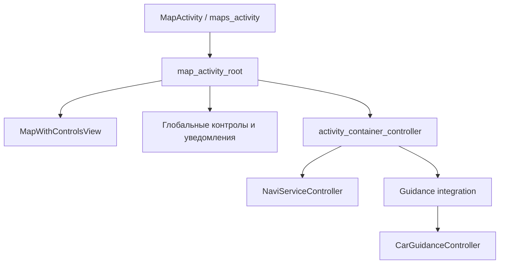
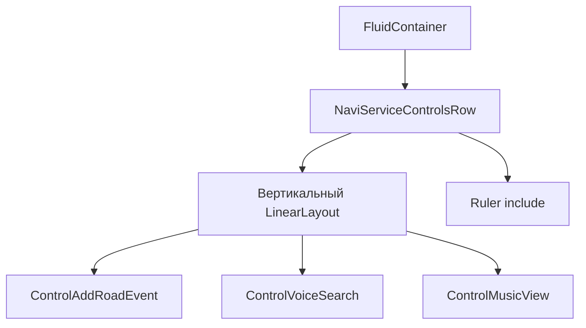
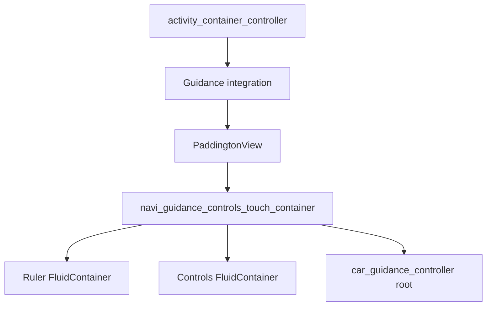

# Аудит UI-контейнеров Яндекс Навигатора 30.3.0

Дата фиксации: 03.09.2026. Статус: статическая карта завершена, аппаратные проверки KX11
остаются обязательными.

## Область аудита и исходная точка

Документ описывает полную исполняемую UI-цепочку экрана карты, которую меняет Natro:
`MapActivity`, свободный режим, активное ведение, верхние уведомления, штатные контролы,
оконный слой Natro и их динамические переходы. Поисковые карточки, настройки и прочие экраны
приложения, не являющиеся предками или соседями этих узлов, отмечены границами router-контейнеров
и намеренно не разбираются до внутренних элементов.

Аудит выполнен по точному baseline APK с SHA-256
`663018fb66074e001eed7caba8e33bee1bcf78f6798bc84949d253dcb348f27f`. Проверялись
декодированные layout-ресурсы и фактические классы из DEX. Декомпилированный код и ресурсы
Яндекса в git не добавляются; здесь сохранены только имена узлов, связи и выводы аудита.

## Общая исполняемая цепочка

`activity_container_controller` — динамический Conductor-host: свободный режим и Guidance не
обязаны существовать одновременно, а при transition старое и новое дерево могут кратко жить
рядом. Поэтому одиночный `Activity.findViewById()` не доказывает, что найден действующий экземпляр.

## Корень MapActivity и порядок слоёв

`MapActivity.onCreate()` раздувает `maps_activity`, вызывает `setContentView`, ставит listener
insets на корень и создаёт отдельные Conductor-router для основного экрана, модальных окон,
разрешений, Alice, in-app и верхних уведомлений.

Дети `map_activity_root` перечислены в реальном порядке от нижнего к верхнему:

| Узел | Назначение и владелец | Динамика | Допустимое вмешательство Natro |
|---|---|---|---|
| `maps_activity_memory_eater` | служебный нижний `FrameLayout` | постоянный | нет |
| `activity_search_map_view` | `MapWithControlsView`, основной `MapWindow` | постоянный после создания карты | только прозрачность внешней поверхности и разрешённые настройки основной карты |
| безымянный `PaddingtonView` → `controls_engine_container` | глобальный движок контролов карты | постоянный wrapper, содержимое динамическое | в окне заменить повторный top-inset у единственного ребёнка, восстановить в полном экране |
| `maps_activity_top_notification_container` | router верхних уведомлений | контроллер появляется поздно | корректировать только его `PaddingtonView` |
| `activity_container_controller` | главный Conductor-host | свободный режим/Guidance заменяются | сканировать по identity; не добавлять визуальные элементы непосредственно сюда |
| `maps_activity_modal_container` | модальные контроллеры | динамический | нет |
| `maps_activity_inapps_container` | in-app UI | динамический | нет |
| `permissions_router_container_id` | запросы разрешений | динамический | нет |
| `maps_activity_alice_container` | глобальный Alice UI | динамический | не использовать как якорь левых кнопок |
| debug/performance/object-inspector containers | диагностические слои Яндекса | опциональные | нет |

`controlLayer` Natro добавляется последним в `android.R.id.content`. Он остаётся
touch-прозрачным владельцем рамки, ручек перемещения/размера и кнопки закрытия. Кнопка режима
может находиться в нём только `GONE` во время замены штатного дерева; видимая координатная копия
запрещена.

## Кто реально добавляет верхний inset

`PaddingtonView` допускает ровно одного ребёнка. При добавлении ребёнка он:

1. запоминает исходный `paddingTop` ребёнка;
2. ставит listener insets именно на ребёнка;
3. при attach и каждом inset-pass устанавливает `basePaddingTop + root system top inset`;
4. на Android 9 читает `getRootWindowInsets()` заново, а не доверяет уже исправленному аргументу
   callback.

Из этого следуют два обязательных правила:

- отправить `WindowInsets` с нулевым top только внешнему root недостаточно;
- в оконном режиме нужно временно владеть listener каждого живого `PaddingtonView`-ребёнка,
  удерживать его исходный padding и находить новые экземпляры после Conductor transition.

В штатных layout `activity_container_controller` и безымянный корень `car_guidance_controller`
не имеют верхнего padding. Статический аудит контроллеров также не нашёл присваивания им
status-bar padding на основном дисплее KX11. Единственный подтверждённый повторяющийся штатный
механизм — `PaddingtonView`. Нулевые guards внешнего Conductor/root в текущем патче считаются
защитой от наблюдавшегося vendor/runtime-смещения, а не владельцами штатного отступа; их нельзя
расширять на внутренние 12 dp margins.

## Свободный режим

`NaviServiceController` раздувает `navi_service_controller` и устанавливается в основной router.
Его верхний уровень:

| Ветка | Содержимое |
|---|---|
| `PaddingtonView` → `paddings_container` | все основные контролы карты свободного режима |
| `promo_object_view_stub` | поздний promo overlay |
| `navi_service_over_eta` | toolbar, suggest/order, automatic free drive, ad, loader и guidelines |
| `navi_service_shutter` | нижняя shutter-панель |
| `navi_service_tooltip_container` | tooltip overlay |
| `gas_stations_search_container` | отдельный Conductor-router |
| `slave_container` | slave router |
| `parking_suggest_banner` | парковочный banner поверх shutter |

Внутри `paddings_container` находятся три независимые композиции:

- горизонтальная строка: `navi_service_interactive_ui_mode_container` (`FluidContainer`) и
  landscape toolbar;
- отдельный `FluidContainer`: back-control и `navi_service_vanishing_controls`;
- `navi_service_not_interactive_ui_mode_container`: правые `SpeedGroup` и next-camera.

Точная левая ветка свободного режима:

`NaviServiceControlsRow` при attach рекурсивно подписывается на `DesiredVisibility` штатных
контролов. Он показывает/скрывает их и сообщает `VISIBLE`, если видим хотя бы один. Добавленная
обычная кнопка Natro не реализует этот интерфейс и не меняет решение строки; как ребёнок
внутреннего `LinearLayout` она наследует итоговую видимость и движение всей строки.

## Активное ведение маршрута

Есть две поддерживаемые ветки интеграции:

- `CarGuidanceIntegrationController` раздувает `car_guidance_integration_master_controller`;
- `NaviGuidanceIntegrationController` раздувает `navi_guidance_integration_controller`
  непосредственно.

Master-вариант содержит `main_screen_container` и `slave_container`; в main включён тот же
`navi_guidance_integration_controller`. Оба варианта получают child-router на
`navi_guidance_controls_touch_container` и добавляют туда `CarGuidanceController` либо
`NaviGuidanceController`. Оба конечных контроллера используют один layout
`car_guidance_controller`.

Цепочка активного экрана:

У `navi_guidance_integration_controller` рядом с `PaddingtonView` находятся отдельные
`navi_guidance_search_container`, `navi_guidance_dialog_container` и
`guidance_transition_suggest_shutter`. Они не являются владельцами верхней карточки манёвра.

### Корень car_guidance_controller в landscape

Безымянный `ConstraintLayout` содержит следующие прямые ветки:

| Узел | Положение/роль |
|---|---|
| `speed_group` | top-right, штатные 12 dp сверху и справа |
| `navi_guidance_next_camera_view` | под `speed_group` |
| вложенный toolbar layout | правый toolbar и care tooltip |
| `guidance_order_dimming` | полноэкранное затемнение заказа |
| безымянный `FluidContainer` | status panel слева |
| `above_shutter_views_layout` | ETA, order, search, ad и onboarding над shutter |
| `transition_to_manual_button` | переход в ручное ведение |
| `contextmaneuverview` | top-left, штатные 12 dp со всех сторон |
| next-camera/faster-alternative/parking/care shutters | динамические перекрытия |
| `routes_horizontal_snippets_controller_container` | дочерний router сниппетов маршрута |

Карточка манёвра и группа скорости — разные прямые дети одного корня. Если обе одинаково
опущены, причина находится выше них; индивидуально двигать знак скорости или карточку нельзя.
Их 12 dp — штатная геометрия и должны сохраняться после удаления только глобального inset.

## Штатные Guidance-контролы и левый столбец

В landscape `navi_guidance_controls` содержит `toolbar_ghost` и
`navi_guidance_controls_container` (`FluidContainer`). В нём есть search ghost, левый
вертикальный vessel, speed ghost, traffic, parking, panorama, surge, zoom, position и
диагностические includes.

Точная структура левого vessel различается между layout-вариантами:

| Режим | Первый визуальный элемент | Второй | Следующий штатный |
|---|---|---|---|
| Guidance landscape (KX11) | `MapControlsFrameLayoutRect`, внутри него `ImageView#guidance_add_road_event` | прямой ребёнок `ControlVoiceSearch#guidance_open_voice_search` | отсутствует |
| Guidance portrait | прямой `ControlAddRoadEvent#guidance_add_road_event` | прямой `ControlVoiceSearch#guidance_open_voice_search` | `ControlMusicView` |
| свободный режим | прямой `ControlAddRoadEvent#navi_service_add_road_event` | прямой `ControlVoiceSearch#navi_service_open_voice_search` | `ControlMusicView` |

Поэтому проверка «два ID имеют одного непосредственного родителя» неверна для KX11. Валидный
алгоритм поднимает voice-control к вертикальному `LinearLayout`, проверяет, что предыдущий прямой
ребёнок сам является road-event либо содержит нужный ID, и проверяет ожидаемого предка
`navi_guidance_controls_container`, `navi_guidance_special_visibility_controls_container` или
`navi_service_vanishing_controls`.

## FluidContainer: почему важен правильный уровень

`FluidContainer` считает берега и конфликты только для прямых детей-vessel. Их layout params
задают `fleet_id`, режим `anchored`/`drifting_up`/`drifting_down`, heaviness, clearance и
игнорируемую тень. Во время перестройки контейнер применяет к vessel смещение, translation,
alpha, scale и итоговую visibility.

Следствия:

- добавлять кнопку Natro прямым ребёнком `FluidContainer` нельзя: она стала бы новым vessel со
  своим приоритетом и могла изменить раскладку;
- добавлять её во внутренний вертикальный `LinearLayout` безопасно: геометрией продолжает владеть
  существующий штатный vessel;
- глобальная координата `alice_fab`, ghost-view либо положение на экране не описывают этот
  lifecycle и больше не используются.

## Реализация кнопки режима после аудита

`FloatingWindowController` выполняет следующие операции:

1. по строковому имени создаёт фактический `MapControlsFrameLayoutRect`; прямой тип не попадает в
   verifier добавленного DEX;
2. применяет штатные `control_rect_padding` 4 dp и финальный размер иконки
   `control_rect_size` 48 dp — итоговый control равен штатным 56 dp;
3. рисует expand/collapse как вектор сразу в конечном размере, без промежуточного bitmap и
   масштабирования готового слоя;
4. находит все живые exact-pair кандидаты, предпочитает attached/shown дерево и вставляет один
   экземпляр сразу после voice-control, перед music-control;
5. не задаёт собственной координаты, alpha, scale, translation или пятиисекундного fade;
6. при замене controller отсоединяет старый экземпляр и подключает его к новому валидному rail;
7. если rail временно отсутствует, держит единственный экземпляр `GONE` в `controlLayer`.

Старые JSON-поля позиции, размера и opacity читаются только для wire-совместимости. UI больше не
предлагает менять свойства, которыми теперь обязан владеть штатный контейнер. Переключатель
видимости кнопки сохраняется.

## Верхние уведомления

Router `maps_activity_top_notification_container` поздно добавляет `TopNotificationController`.
Его layout — `PaddingtonView` с одним `TopNotificationContainerView#top_notification_container`.
У содержимого есть штатные 4 dp сверху и снизу; внутри расположены строка leading-icon/title/
trailing-icon и отдельное description. В окне удаляется только повторный system top inset, а
эти 4 dp сохраняются.

## Состояния и повторное подключение

| Событие | Что может замениться | Обязательная реакция Natro |
|---|---|---|
| запуск `MapActivity` | ещё нет controller tree | создать только безопасный overlay; кнопку держать `GONE` |
| вход в свободный режим | появляется `NaviServiceController` | найти exact service pair и вставить кнопку третьей |
| старт маршрута | free-drive уходит, Guidance приходит | заменить inset-listener по identity и переподключить кнопку |
| перестроение маршрута/transition | кратко возможны два дерева | предпочесть attached + shown; не хранить отсоединённый root |
| окно → полный экран | Activity обычно пересоздаётся | восстановить window/inset состояние; новая Activity найдёт новый rail |
| отключение кнопки в настройках | штатный rail остаётся | убрать кнопку в hidden parking, не оставлять пустой layout-слот |
| destroy | все callbacks и views становятся недействительны | снять callbacks/listeners и отсоединить единственный экземпляр |

## Постоянные границы против падений

Этот UI-аудит не разрешает возвращать ранее аварийные механизмы:

- внешний `OffscreenMapWindow` не создаёт Automotive `NavigationLayer` или отдельную
  `GuidanceCamera`;
- оконный type 2038 применяется только в конце `onResumeFragments` и не переотправляется из-за
  несвязанных настроек;
- ни кнопка, ни inset-fix не создают нативный map-layer и не трогают surface lifecycle;
- reflection создания штатной оболочки, rebind-poller, map-touch callback и inset callbacks
  изолированы `Throwable`/локальной аварийной границей;
- при невозможности доказать rail кнопка скрывается, а не добавляется в предположительный узел;
- запрещены отрицательные `translationY`, индивидуальный сдвиг верхних знаков и изменение
  штатных 12 dp/4 dp отступов.

## Что можно доказать статически и что остаётся KX11

Статически доказаны layout-иерархия, реальные владельцы inset, различие landscape road-event
wrapper, третий индекс кнопки, отсутствие собственного fade/координаты, границы `FluidContainer`
и отсутствие прямой зависимости добавленного DEX от класса Яндекса.

Только физический KX11 может подтвердить vendor WindowManager/insets, реальную анимацию темы,
touch hit-test через верхний прозрачный слой и отсутствие редкого transition race. До прохождения
`GATE-023`, `GATE-024`, 30-минутного `GATE-007` и DEX-проверки `GATE-021` сборку нельзя объявлять
финальной.
